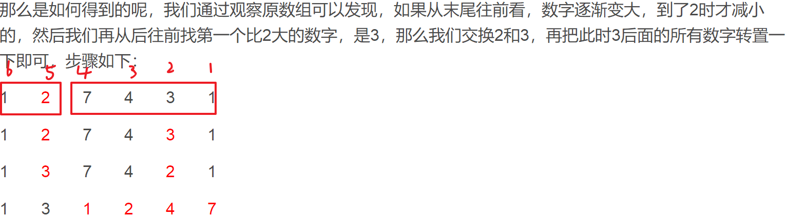

## 数组与矩阵

### 目录

**[打印矩阵](#打印矩阵)**

* [转圈打印矩阵](#转圈打印矩阵)
* [旋转正方形矩阵](#旋转正方形矩阵)
* [之字形打印矩阵](#之字形打印矩阵)

**[搜索](#搜索)**

* [行列有序矩阵搜索某数](#行列有序矩阵搜索某数)
* [数组中出现超过一半的数](#数组中出现超过一半的数)
* [数组中任一重复的数字](#数组中任一重复的数字)

**[子数组](#子数组)**

- [子数组的最大和](#子数组的最大和)
- [和为定值的最长子数组](#和为定值的最长子数组)

[**二维数组**](#二维数组)

- [合并区间](#合并区间)
- [最长递增链](#最长递增链)

**[其它](#其它)**

* [数组全排列的下一个排列](#数组全排列的下一个排列)


-----

### 打印矩阵

#### 转圈打印矩阵

[目录](#目录)

Q：给一个矩阵(二维数组)，要求顺时针从外到内转圈打印这个矩阵

A：顺时针打印一个"口"字型只用知道它的左上，右下坐标即可。转圈打印就相当于从外到内，若干个"口"子边框的打印，对于一行或一列要单独列出打印情况。

```java
public void clockwisePrintMatrix(int[][] matrix) {
    if (null == matrix || 0 == matrix.length || null == matrix[0] || 0 == matrix[0].length) {
        return;
    }
    int row = matrix.length;
    int col = matrix[0].length;
    clockwisePrintBorder(matrix, 0, 0, --row, --col);
}

private void clockwisePrintBorder(int[][] border, int leftUpX, int leftUpY, int maxRight, int maxDown) {
    // 打印完毕的条件
    if (leftUpX > maxRight || leftUpY > maxDown) {
        return;
    }
    // 考虑一横或一竖的特殊情况
    if (leftUpY == maxDown) {
        while (leftUpX <= maxRight) {
            System.out.println(border[leftUpX++][leftUpY] + " ");
        }
        return;
    }
    if (leftUpX == maxRight) {
        while (leftUpY <= maxDown) {
            System.out.println(border[leftUpX][leftUpY++] + " ");
        }
        return;
    }
    // 一般情况：打印矩形边框
    int curX = leftUpX;
    int curY = leftUpY;
    while (curY < maxRight) {
        System.out.println(border[curX][curY++] + " ");
    }
    while (curX < maxDown) {
        System.out.println(border[curX++][curY] + " ");
    }
    while (curX > leftUpX && curY > leftUpY) {
        System.out.println(border[curX][curY--] + " ");
    }
    while (curX > leftUpX) {
        System.out.println(border[curX--][curY] + " ");
    }
    // 继续打印内层矩形边框
    clockwisePrintBorder(border, ++leftUpX, ++leftUpY, --maxRight, --maxDown);
}
```


#### 旋转正方形矩阵

[目录](#目录)

Q：给一个方阵(二维数组arr)，将其顺时针旋转90°

A：从外边框ABCD考虑，顺时针旋转90°首先是4个端点交换位置：A->B，B->C，C->D，D->A。然后将A，B，C，D四个点分别在其边上往前走一步，再进行这样的步骤即可。因此分别将各个边框这样交换即可

```java
public static void printByROtatingOrder(int[][] arr) {
    if (arr == null || arr.length == 0 || arr[0] == null || arr[0].length == 0) {
        return;
    }

    int row = arr.length;
    int col = arr[0].length;
    process(arr, 0, 0, row - 1, col - 1);
}

public static void process(int[][] arr, int LUX, int LUY, int RDX, int RDY) {
    if (LUX > RDX || LUY > RDY) {
        return;
    }

    int i = 0;
    while (LUY + i < RDY) {
        int temp = arr[LUX][LUY + i];
        // D->A
        arr[LUX][LUY + i] = arr[RDX - i][LUY]; 
        // C->D
        arr[RDX - i][LUY] = arr[RDX][RDY - i]; 
        // B->C
        arr[RDX][RDY - i] = arr[LUX + i][RDY]; 
        // A->B
        arr[LUX + i][RDY] = temp;
        i++;
    }

    process(arr, LUX + 1, LUY + 1, RDX - 1, RDY - 1);
}
```


#### 之字形打印矩阵

[目录](#目录)

Q：给定一个矩阵(二维数组arr)，从矩阵的左上角开始，之字形绕着打印

A：用两个辅助点，去标记之字形的两个端点。由于之字形特点，打印顺序注意每次要调换

```java
public static void printByZigOrder(int[][] arr) {
    if (arr == null || arr.length == 0 || arr[0] == null || arr[0].length == 0) {
        return;
    }

    int row = arr.length;
    int col = arr[0].length;
    int p1X = 0, p1Y = 0, p2X = 0, p2Y = 0;
    boolean flag = true;
    while (p1X < row) {
        // 打印
        print(arr, p1X, p1Y, p2X, p2Y, flag);
        // 更新坐标和打印顺序
        flag = !flag;
        if (p1Y == col - 1) {
            p1X++;
        } else {
            p1Y++;
        }
        if (p2X == row - 1) {
            p2Y++;
        } else {
            p2X++;
        }
    }
}

public static void print(int[][] arr, int p1X, int p1Y, int p2X, int p2Y, boolean flag) {
    if (flag) {
        // p1 -> p2
        while (p1Y >= p2Y) {
            System.out.print(arr[p1X++][p1Y--]);
        }
    } else {
        // p2 -> p1
        while (p2Y <= p2Y) {
            System.out.print(arr[p2X--][p2Y++]);
        }
    }
}
```


### 搜索

#### 行列有序矩阵搜索某数

[目录](#目录)

Q：给一个矩阵arr和一个数num，arr每行每列都是升序，试判断num是在num中

A：利用有序性搜索。首先将num与右上角对比，如果比右上角大，则往下搜索;反之往左搜索。因此这样搜索只能往左走或往下走，时间复杂度是O(M+N)

```java
public static boolean hasNum(int[][] arr, int num) {
    if (arr == null || arr.length == 0 || arr[0] == null || arr[0].length == 0) {
        return false;
    }

    int x = 0;
    int y = arr[0].length - 1;

    while (x < arr.length && y > -1) {
        if (arr[x][y] > num) {
            y--;
        } else if (arr[x][y] < num) {
            x++;
        } else {
            return true;
        }
    }

    return false;
}
```


#### 数组中出现超过一半的数

[目录](#目录)

Q：给定一个数组，假定这个数组中某个数的出现次数超过了数组长度的一半，找出这个数

A：用num和count两个int变量，遍历数组即可实现。代码如下，思想是超过一半数抵消剩下的数，count还有多余

```java
public int findOverHalfNum(int[] arr) {
    if (arr.length == 1) {
        return arr[0];
    }
    int count = 0;
    int num = arr[0];
    for (int i = 1; i < arr.length; i++) {
        count = num == arr[i] ? count + 1 : count - 1;
    }
    return num;
}
```


#### 数组中任一重复的数字

[目录](#目录)

Q：已知数组(长度为n)中的元素大小范围是0~n-1，求找出这个数组中任意一个重复的数字。

A1：遍历数组，遇到arr[i]时，试图将arr[i]与索引为arr[i]的位置交换，交换前检查`arr[arr[i]] == arr[i]`是否成立，若成立，表明找到重复数字，不成立则交换位置。继续遍历

A2：用HashSet。A2简单，空间复杂度为O(N)，但是没有改变原数组。A1空间复杂度为O(1)，但是改变了原数组。

```java
public Integer findDuplicatedNumInArray(int[] arr) {
    if (null == arr || 0 == arr.length) {
        return null;
    }
    for (int i = 0; i < arr.length; i++) {
        if (arr[i] == i) {
            continue;
        } else if (arr[arr[i]] == arr[i]) {
            // 交换之前发现"坑已经被占了"
            return arr[i];
        } else {
            // 交换i和arr[i]两处的元素
            swap(arr, arr[i], i);
        }
    }
    return null;
}
```


### 子数组

#### 子数组的最大和

[目录](#目录)

Q：给一个数组，有正有负，求连续子数组的最大和

A：sum记录连续子数组的和，累加前检查sum是否小于0，小于0则从当前位置开始新的累加

```java
public int findMaxSequenceSum(int[] arr) {
    int res = 0;
    int sum = 0;
    for (int i = 0; i < arr.length; i++) {
        sum = sum < 0 ? arr[i] : sum + arr[i];
        res = Math.max(res, sum);
    }
    return res;
}
```


#### 和为定值的最长子数组

[目录](#目录)

Q：给定一个数组arr，和一个数num，求数组中累加和为num子数组最长的长度

A：用一个辅助数组sumArr去记录arr中每个元素从0位置开始的累加和，并将sumArr的结果存为一个map，key是累加和，value是这个累加和最早出现的位置。然后再遍历去寻找每个sum对应的num-sum在map中是否存在。注意map中还要存一个(0，-1)。即认为第一个累加和为0的位置是-1。

```java
public static int getLongestSubArr(int[] arr,int num){
    if(arr == null || arr.length == 0){
        return 0;
    }

    int[] sumArr = new int[arr.length];
    HashMap<Integer,Integer> map = new Hashmap<>();
    map.put(0,-1);
    int sum = 0;
    int index = 0;

    while(index < arr.length){
        sum += arr[index];
        sumArr[index] = sum;
        if(map.get(sum) == null){ // map只存sum第一次出现的位置
            map.put(sum,index);
        }
        index++;
    }
    index = 0;
    int res = 0;
    while(index < arr.length){
        int subSum = num - sumArr[index];
        if(map.get(subSum) != null){
            res = Math.max(res,index - map.get(subSum));
        }
        index++;
    }

    return res;
}
```

子问题1：奇偶个数相同的最长子数组

子问题2：0与1个数相同的最长子数组

子问题3：数组只含有0，1，2;包含1和2个数相同的最长子数组

A：这三个子问题的特点是子数组包含的元素个数相同，可以把奇数看作-1，偶数看作1;0看作-1;2看作-1;那么这三个问题都变成了求子数组和为0的最长子数组。

即求最长子数组问题，看看能不能把问题转化为求和为定值的最长子数组。


### 二维数组

#### 合并区间

[56.合并区间](https://leetcode-cn.com/problems/merge-intervals/)

[目录](#目录)

Q：给出一个区间的集合，请合并所有重叠的区间。

```
输入: [[1,3],[2,6],[8,10],[15,18]]
输出: [[1,6],[8,10],[15,18]]
解释: 区间 [1,3] 和 [2,6] 重叠, 将它们合并为 [1,6].
```

A：首先使用Arrays工具类对二维数组进行排序，排序比较器首先比较a[0]，再比较a[1]。两个区间 a 和 b 合并的依据是a[1] >= b[0]，合并后的区间0位置即a[0]，1位置是a[1]和b[1]的较大值，这一点需要注意。

使用双指针来保证所有区间合并成功，起初p1在0位置，p2在1位置，当 p1 和 p2 所在区间能合并时，合并区间到p1上，然后p2++；若不能合并时，p1来到p2位置，p2++；这样保证了从左到右所有能合并的区间都成功合并

```java
public int[][] merge(int[][] intervals) {
    Arrays.sort(intervals, (int[] a, int[] b) -> {int res = a[0] - b[0];
                                                  if (0 == res) {
                                                      res = a[1] - b[1];
                                                  }
                                                  return res;});
    // 为true时表明不在结果数组中(被合并的数组被标记为true)
    boolean[] flag = new boolean[intervals.length];
    // 记录两两合并的次数：每合并一次，结果数组中元素就会少一个
    int count = 0;
    int p1 = 0;
    int p2 = 1;
    while (p2 < intervals.length) {
        if (intervals[p1][1] >= intervals[p2][0]) {
            // 需要合并p2
            intervals[p1][1] = Math.max(intervals[p1][1], intervals[p2][1]);
            flag[p2] = true;
            count++;
            p2++;
        } else {
            // 不能合并时，p1到p2位置，p2再往前一步
            p1 = p2;
            p2++;
        }
    }
    // 得到合并后的结果
    int[][] res = new int[intervals.length - count][2];
    int index = 0;
    for (int i = 0; i < flag.length; i++) {
        if (!flag[i]) {
            // 未合并过的位置保留
            res[index++] = intervals[i];
        }
    }
    return res;
}
```


#### 最长递增链

[646.Maximum Length of Pair Chain(Medium)](https://leetcode.com/problems/maximum-length-of-pair-chain/description/)

[目录](#目录)

Q：给一个二维数组pairs，数组中每行是一对整数，且`pairs[i][0] < pairs[i][1]`，如果`pairs[i][1] < pairs[j][0]`，那么第j行就可以接在第i行后成为一个递增链，求最长的递增链长度。

```
Input：[[1，2]，[2，3]，[3，4]]
Output：2
Explanation：The longest chain is [1，2] -> [3，4]
```

A：首先对二维数组进行排序，排序的依据是根据二维数组的第二列从小到大排序，那么从第一行作为最长的递增链头开始，后面只用遍历行，找到某一行的第一列比当前递增链的链尾大，则更新链尾，并且递增链长度+1。

S：这里用正则表达式代替了Comparable的子类对象，简化了代码。

```java
public int findLongestChain(int[][] pairs) {
    if (pairs == null || pairs.length == 0) {
        return 0;
    }
    // 正则表达式表示的比较器
    Arrays.sort(pairs,(a, b) -> (a[1] - b[1]));
    int curRight = pairs[0][1];
    int res = 1;
    int i = 1;
    while(i < pairs.length){
        if(pairs[i][0] > curRight){
            res++;
            curRight = pairs[i][1];
        }
        i++;
    }
    return res;
}
```


### 其它

#### 数组全排列的下一个排列

[目录](#目录)

Q：给定一个int数组nums(元素范围0~9)，求这个数组的全排列中，比它"数组值"大的下一个排列，将数组变成下一个排列。("数组值"指的是将数组中所有的数看作一个整数的各个位，这个整数的值即"数组值")



解释一下上面的步骤：如果希望重新排列组合这些数，找到一个比当前数大的最小组合，那么第一步就是判断首先要增大哪一位? 这个位显然越低越好，那么为什么增大第5位数? 因为1~ 4位已经形成了最大排列，如果不增大第5位，再往低位找，不能通过增大1 ~4位中任何一位使组合数变的更大。所以从末尾往前看，第一个打破递增单调性的位就是需要增大的最低位。

因为希望这个组合最小，所以当然是从1~4位中寻找比第5大且最小的位与第5位交换。

交换之后，要想组合最小，当然是把剩下的数顺序排列。

```java
public void nextPermutation(int[] nums) {
    if (nums == null || nums.length < 2) {
        return;
    }

    int index = nums.length - 1;
    while (index - 1 >= 0 && nums[index - 1] >= nums[index]) {
        index--;
    }
    int start = index;
    if (start != 0) { // 如果整个数组都是倒序排列,就不用交换位置了
        index = nums.length - 1;
        while (nums[start - 1] >= nums[index]) {
            index--;
        }
        swap(nums, start - 1, index);
    }

    index = nums.length - 1;

    while (start < index) {
        swap(nums, start++, index--);
    }
}

public void swap(int[] nums, int i, int j) {
    nums[i] = nums[i] ^ nums[j];
    nums[j] = nums[i] ^ nums[j];
    nums[i] = nums[i] ^ nums[j];
}
```


