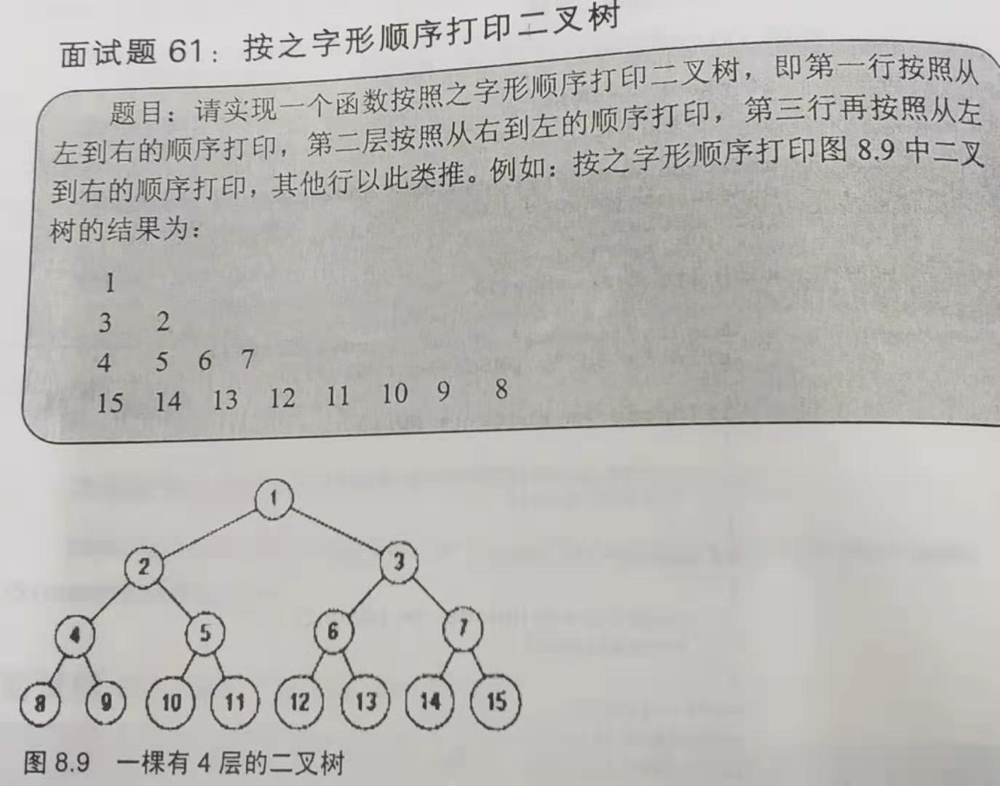
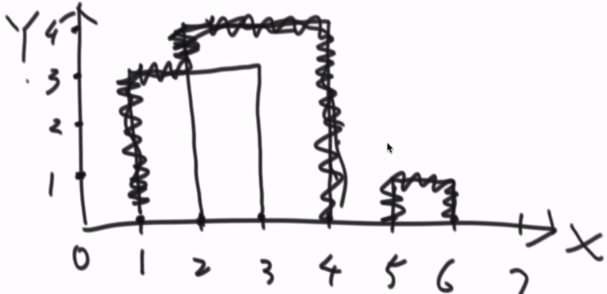

## 树

### 目录

**二叉树的遍历**

* [递归版](#递归版)
* [非递归版](#非递归版)
* [层遍历](#层遍历)
* [Morris遍历](#Morris遍历)
* [二叉树的最短路径](#二叉树的最短路径)

**二叉树的序列化和反序列化**

* [前序反序列化-递归](#前序反序列化-递归)
* [层遍历反序列化](#层遍历反序列化)
* [利用前序中序重建二叉树](#利用前序中序重建二叉树)

**二叉树的判断**

* [是否是平衡二叉树](#是否是平衡二叉树)
* [是否是搜索二叉树](#是否是搜索二叉树)
* [是否是完全二叉树](#是否是完全二叉树)
* [是否是对称二叉树](#是否是对称二叉树)
* [是否是搜索二叉树的后序遍历](#是否是搜索二叉树的后序遍历)

**二叉树的打印**

* [按层多行打印二叉树](#按层多行打印二叉树)
* [之字形打印二叉树](#之字形打印二叉树)

**其它**

* [求完全二叉树节点个数](#求完全二叉树节点个数)
* [寻找两个节点的最近公共祖先](#寻找两个节点的最近公共祖先)
* [数组大楼轮廓问题](#数组大楼轮廓问题)


----

### 递归版

[回到目录](#目录)

```java
public static void preOrder(Node head){
    if(head == null){
        return;
    }
    System.out.print(head.val + " ");
    preOrder(head.left);
    preOrder(head.right);
}

public static void midOrder(Node head){
    if(head == null){
        return;
    }    
    midOrder(head.left);
    System.out.print(head.val + " ");
    midOrder(head.right);
}

public static void lastOrder(Node head){
    if(head == null){
        return;
    }    
    lastOrder(head.left);
    lastOrder(head.right);
    System.out.print(head.val + " ");
}
```


### 非递归版

[回到目录](#目录)

非递归版不用系统压栈，需要自己在程序中决定什么时候压栈和弹栈, 以及什么时候打印

中序非递归: 有左孩子往左滑, 没有左孩子打印当前节点, 然后往右滑, 因为可能此时右孩子也是null, 所以每次还要检查当前节点是否是null, 若是, 则从栈中弹出一个节点并打印, 然后继续往右滑(栈中弹出节点的左子树都已经遍历完成)

```java
public static void preOrder(Node head){
    if(head == null){
        return;
    }  
    
    Stcak<Node> stack = new Stack<>();
    stack.push(head);
    while(!stack.isEmpty()){
        Node cur = stack.pop();
        System.out.print(cur.val + " ");
        if(cur.right != null){ // 先存右孩子，但是取出来是先取左孩子
            stack.push(cur.right);
        }
        if(cur.left != null){
            stack.push(cur.left);
        }
    }
}

public static void midOrder(Node head){
    if(head == null){
        return;
    }
    
    Stcak<Node> stack = new Stack<>();
    while(!stack.isEmpty() || head!=null){           
        if(head == null){
            head = stack.pop();
            System.out.print(head.val + " ");
            head = head.right;
            continue;
        }
        if(head.left != null){
            stack.push(head);
            head = head.left;
        } else {        
            System.out.print(head.val + " ");        
            head = head.right;        
        }
    }
}

public static void lastOrder(Node head){
    if(head == null){
        return;
    }  
    
    Stcak<Node> stack = new Stack<>();
    Stcak<Node> help = new Stack<>(); // 前序改成中右左遍历进栈，再弹栈就变成了左右中
    stack.push(head);
    while(!stack.isEmpty()){
        Node cur = stack.pop();
        help.push(cur);
        if(cur.left != null){ 
            stack.push(cur.right);
        }
        if(cur.right != null){
            stack.push(cur.left);
        }
    }    
    while(!help.isEmpty()){ // 弹栈变成后序
        System.out.print(help.pop().val + " ");
    }
}
```


### 层遍历

[回到目录](#目录)

前面的遍历都是深度优先遍历，层遍历是广度优先遍历，即从上到下，从左到右，遍历每一层

```java
public static void layerOrder(Node head){
    if(head == null){
        return;
    }
    
    Queue<Node> queue = new LinkedList<>();
    queue.offer(head);
    while(!queue.isEmpty()){
        Node cur = queue.poll();
        System.out.print(cur.val + " "); 
        if(cur.left != null){ // 队列按遍历顺序存储
            queue.offer(cur.left);
        }
        if(cur.right != null){
            queue.offer(cur.right);
        }        
    }
}
```


### Morris遍历

[回到目录](#目录)

递归版是JVM压栈，非递归版是程序自己压栈，目的都是能多次来到某个节点，递归版一个节点会访问三次：中左中右中；非递归版一个节点会访问两次：中左中右。Morris遍历是利用每个节点左子树的最右节点存储当前节点，通过判断mostRight==null还是等于自己来判断是第一次还是第二次来到当前节点。

Morris遍历也是“中左中右”的访问顺序，它不用压栈，节省了空间复杂度，但是每次访问节点都要获取左子树最右节点，增大了时间常数项(时间复杂度还是O(N))。适用于对空间有极高要求的硬件情况。

```java
public static void morris(Node head){
    if(head == null){
        return;
    }
    while(head != null){
        if(head.left != null){ 
            Node mostRight = getMostRight(head);
            if(mostRight == null){ 
                // 第一次来到当前节点:中左
                head = head.left;
            } else {
                // 第二次来到当前节点:中右
                head = head.right;
            }
        } else { 
            // 没有左子树，只会来到当前节点一次:中右
            head = head.right;
        }
    }
}
private static Node getMostRight(Node head) {
    Node left = head.left;
    while (null != left.right && left.right != head) {
        left = left.right;
    }
    if (null == left.right) {
        // 第一次来到当前节点,用mostRight暂存head
        left.right = head;
        return null;
    } else {
        // 第二次来到当前节点,还原mostRight
        left.right = null;
        return head;
    }
}
```


### 二叉树的最短路径

Q：给树的头节点，求它的最短路径

A：层遍历，第一个遇到左右孩子都是null的层的高度就是最短路径值

```java
public int minPath(TreeNode head) {
    if (null == TreeNode) {        
        return 0;
    }
    Queue<TreeNode> queue = new ArrayList<>();
    queue.offer(head);    
    // 路径的长度=路径节点的个数(包括头节点)
    int count = 1;
    int left = 1;
    int next = 0;
    while (!queue.isEmpty()) {
        TreeNode cur = queue.poll();
        left--;
        // 找到最短路径层
        if (null == cur.left && null == cur.right) {
            return count;
        }
        if (null != cur.left) {
            queue.offer(cur.left);
            next++;
        }
        if (null != cur.right) {
            queue.offer(cur.right);
            next++;
        }
        // 判断下一次循环是否到了下一层
        if (0 == left) {
            left = next;
            next = 0;
            count++;
        }
    }
    return count;
}
```


### 前序反序列化-递归

[回到目录](#目录)

```java
public static Node rebuildBT(String str){ // 假设是前序遍历的字符串
    if(str==null || str.length()==0){
        return null;
    }
    String[] strs = str.split("!");
    Queue<Node> queue = new LinkedList<>(); 
    for(int i=0; i<strs.length; i++){
        Node temp = strs[i]=="#" ? null : new Node(Integer.valueOf(strs[i]))
        queue.offer(temp);
    }
    return process(queue);
}

private static Node process(Queue<Node> queue){ // 递归版前序反序列化
    if(queue==null || queue.isEmpty()){
        return null;
    }    
    Node head = queue.poll();
    if(head != null){
        // 因为序列化时null节点也会存储,所以即使左右孩子是null也要还原
        head.left = process(queue);
        head.right = process(queue);
    }
    return head;
}
```

前序反序列化-非递归的思路：前序序列的特点是每一个节点的下一个节点一定是它的左孩子,但是右孩子不确定.因此每从序列中取出一个节点,可以立马确定它的左孩子(但是不要取出来),因为它的右孩子不能立刻确定,所以它需要压栈.但是如果从序列中取出来的节点是null,说明它的上一个节点(栈顶)的左孩子是null,则上一个节点的右孩子一定是当前队列的第一个,此时指定它的右孩子(但是不要取出来).
即根据序列特点,对序列中每一个节点进行逻辑判断,指定左右孩子关系.注意到指定左右孩子关系的时候,一定不能将其从序列中取出,因为它们也需要做同样的逻辑判断,去指定它们自己的左右孩子关系.


### 层遍历反序列化

[回到目录](#目录)

前序遍历反序列化时，因为左右节点可能是不相邻的，所以用队列存储所有节点，在递归求左子树时，就会将队列中用过的节点去掉；而层遍历反序列化时，由于左右孩子都是相邻的，所以用数组也可以。

```java
public static Node reconByLevelString(String str) { // 层遍历反序列化

    String[] values = str.split("!");
    int n = 0; 
    Node head = new Node(Integer.valueOf(values[n++]));
    Queue<Node> queue = new LinkedList<Node>(); // 队列记录重现了遍历的过程
    queue.offer(head);
    while(!queue.isEmpty()) {
        // 每一次指定左右孩子的时候已经将其从序列化中移出到队列中
        Node node = queue.poll();        
        node.left = generateNodeByStr(values[n++]);
        // null没有左右孩子,不用再入列
        if(node.left != null) {
            queue.offer(node.left);
        }
        node.right = generateNodeByStr(values[n++]);
        if(node.right != null) {
            queue.offer(node.right);
        }
    }
    return head;
}

private static Node generateNodeByStr(String str) {
    return str.equals("#") ? null : new Node(Integer.valueOf(str));
}
```


### 是否是平衡二叉树

[回到目录](#目录)

递归的方式去求二叉树的高度，如果是平衡的就返回正常高度，如果不是就返回-1

```java
public static int isBalanceTree(Node head){ // 返回-1不平衡，0是null，其他是平衡
    if(head == null){
        return 0;
    }
    
    int left = isBalanceTree(head.left);
    int right = isBalanceTree(head.right);
    if(left==-1 || right==-1 || Math.abs(left-right)>1){
        return -1;
    } else {
        return Math.max(left, right) + 1;
    }
}
```


### 是否是搜索二叉树

[回到目录](#目录)

A1：递归方式判断最简单

A2：可以将二叉树中序遍历，判断得到的数组是否是递增

```java
public static boolean isSearchTree(Node head){
    if(head == null){
        return true;
    }
    boolean flag =  head.left.val<head.val && head.val<head.right.val;
    return flag && isSearchTree(head.left) && isSearchTree(head.right);
}
```


### 是否是完全二叉树

[回到目录](#目录)

层遍历节点的过程中，如果某个节点的左孩子为null而右孩子非null，不是完全二叉树，如果左孩子为null或左右孩子都为null，则开启stage模式，后面所有遍历的节点，它的左右孩子都必须是null，否则也不是完全二叉树。

```java
public static boolean isAbsolutelyTree(Node head){
    if(head == null){
        return true;
    }
    
    Queue<Node> queue = new LinkedList<>();
    queue.offer(head);
    boolean flag = false;
    
    while(!queue.isEmpty()){
        Node cur = queue.poll();
        if(!flag){
            if(cur.left==null && cur.right!=null){
                return false;
            } else if(cur.left==null || cur.right==null) {
                flag = true;
            }
        } else {
            if(cur.left!=null || cur.right!=null){
                return false;
            } else {
                continue;
            }
        }
        if(cur.left != null){
            queue.offer(cur.left);
        }
        if(cur.left != null){
            queue.offer(cur.left);
        }        
    }
    
    return true;
}
```


### 是否是对称二叉树

[回到目录](#目录)

Q: 如果一棵树它和它的镜像树(所有子树左右孩子互换)完全一样,则该树是对称树

A: 用前序(中左右)方式遍历一棵树和中右左方式遍历一棵树得到的顺序如果是完全一样的,即为对称树


### 是否是搜索二叉树的后序遍历

[回到目录](#目录)

Q: 给定一个整数数组,数组中没有重复的元素,判断这个数组是否可以作为一颗搜索二叉树的后序遍历

A: 后序遍历的特点是遍历结果的最后一个节点就是头节点, 头节点前可以分成左子树和右子树两部分, 而根据搜索二叉树的特点, 左子树所有元素比头节点小, 右子树所有元素比头节点大。所以遍历这个数组, 以第一个比数组最后一位大的数为界, 这个数之前的部分就是左子树, 这个数之后的部分就是右子树, 从这个数开始到最后一个数之前的所有数都应该比最后一个数大, 否则就不满足。然后递归验证左子树部分和右子树部分的子数组。

```java
public boolean isSearchTreeLastOrder(int[] arr) {
    if (null == arr || arr.length < 2) {
        return true;
    }
    return isSearchTreeLastOrder(arr, 0, arr.length - 1);
}
private boolean isSearchTreeLastOrder(int[] arr, int start, int end) {
    if (null == arr || arr.length < 2 || start >= end) {
        return true;
    }
    int headValue = arr[end];
    int cur = start;
    while (cur < end) {
        if (arr[cur] < headValue) {
            cur++;
        } else if (arr[cur] == headValue) {
            // 搜索二叉树认为没有相等值
            return false;            
        } else {
            break;
        }
    }
    // 记录遍历时第一个比headValue大的位置(可能没有)
    int mark = cur;
    while (start < end) {
        if (arr[start] > headValue) {
            start++;
        } else {
            return false;
        }
    }
    // 递归验证左右子树部分是否也满足
    return isSearchTreeLastOrder(arr, start, mark - 1) && isSearchTreeLastOrder(mark, end - 1);
}
```


### 按层多行打印二叉树

[回到目录](#目录)

Q: 将二叉树按高度分行,打印成一行一行的格式

A: 其实就是层遍历,但是层遍历的时候要区分现在打印的层是否打印完,下一次开启新一层打印(换行)
用两个变量left和next分别记录当前行剩余的打印节点数和下一行需要的打印节点数。

```java
public void printBTByLinr(Node head) {
    if (null == head) {
        return;
    }
    Queue<Node> queue = new LinkedList<>();
    int left = 1;
    int next = 0;
    queue.offer(head);
    while (queue.size() != 0) {
        Node cur = queue.poll();
        System.out.println(cur.val + " ");
        left--;
        if (null != cur.left) {
            queue.offer(cur.left);
            next++;
        }
        if (null != cur.right) {
            queue.offer(cur.right);
            next++;
        }
        if (left == 0) {
            // 当前行打印完开始换行
            System.out.println();
            left = next;
            next = 0;
        }
    }
}
```


### 之字形打印二叉树

[回到目录](#目录)

Q:在按层多行打印二叉树的基础上,要求每一层的打印顺序和上一层的打印顺序相反,即是之字形打印



A: 用两个stack压栈和弹栈,每一层打印完时,交换压栈和弹栈指向,并且每一层先存左孩子还是先存右孩子和上一层相反.这就需要cur和next来标志这一层是否打印完,flag来标志和上一层存左右孩子顺序相反以及stack1和stack2弹栈压栈角色互换

```java
public static void printBTOrderedByZig(Node head) {
    if(head == null) {
        System.out.println("head is null.");
        return;
    }
    Stack<Node> popStack = new Stack<Node>();
    Stack<Node> pushStack = new Stack<Node>();
    popStack.push(head);
    // 决定入栈顺序是左右还是右左
    boolean flag = true;
    int cur = 1;
    int next = 0;
    while(!popStack.isEmpty() || !pushStack.isEmpty()) {

        Node curNode = popStack.pop();
        System.out.print(curNode.value + " ");
        if(flag) {
            if(curNode.left != null) {
                pushStack.push(curNode.left);
                next++;
            }
            if(curNode.right != null) {
                pushStack.push(curNode.right);
                next++;
            }
        } else {
            if(curNode.right != null) {
                pushStack.push(curNode.right);
                next++;
            }
            if(curNode.left != null) {
                pushStack.push(curNode.left);
                next++;
            }
        }
        cur--;
        if(cur == 0) { 
            System.out.println(); 
            cur = next;
            next = 0;
            // 换行时更换压栈顺序
            flag = !flag;
            // 换行时更换栈
            Stack<Node> temp = popStack;
            popStack = pushStack;
            pushStack = temp;
        }
    }
}
```


### 求完全二叉树节点个数

[回到目录](#目录)

Q：给定一个完全二叉树head，求其节点个数

A：一个树节点个数 = 左子树节点个数 + 1 + 右子树节点个数。首先求当前节点左子树的高度，然后求当前节点右子树的高度，如果右子树高度等于左子树高度，表明左子树是一颗满二叉树，它的节点个数可以直接通过高度计算出来；如果右子树高度小于左子树高度，表明右子树是一颗满二叉树，它的节点个数也可以通过高度计算出来。因此每次只用遍历一个节点即可，并且求完全二叉树所有子树高度只用看这个树子的“左臂”长度(而不用像求普通二叉树那样去递归)

```java
public static int getAbsoluteTreeNodes(Node head){
    if(head == null){
        return 0;
    }
    int left = getAbsoluteTreeHeight(head.left);
    int right = getAbsoluteTreeHeight(head.right);
    if(right < left){ 
        // 右子树是满二叉树
        return getFullTreeNodes(right) + getAbsoluteTreeNodes(head.left) + 1;
    } else { 
        // 左子树是满二叉树
        return getFullTreeNodes(left) + getAbsoluteTreeNodes(head.right) + 1;
    }
}
private static int getAbsoluteTreeHeight(Node head){
    if(head == null){
        reutn 0;
    }
    int res = 0;
    while(head != null){
        head = head.left;
        res++;
    }
    return res;
}
private static int getFullTreeNodes(int height){
    return Math.pow(2, height) - 1; // 等比数列求和公式
}
```


### 利用前序中序重建二叉树

[回到目录](#目录)

Q: 已知BT的前序遍历序列和中序遍历序列,重建这个二叉树(不含有重复数字)

A: 序列中不含有null的标记,所以一个序列不能还原整个二叉树。前序特点:数组的第一个值就是头节点, 找到中序数组中头节点的值,则这个值前面的就是左子树部分的中序数组, 后面就是右子树部分的中序数组。再在找到前序数组中找到左子树部分和右子树部分,则可递归求解

```java
public Node buildBTByPreAndMidOrder(int[] pre, int[] mid) {
    if (null == pre || pre.length == 0 || null == mid || mid.length == 0) {
        return null;
    } else if (pre.length == 1) {
        // 只有一个节点直接返回
        return new Node(pre[0]);
    }
    int headValue = pre[0];
    Node head = new Node(headValue);
    int headPos = 0;
    while (headPos < mid.length && mid[headPos] != headValue) {
        headPos++;
    }
    int[] leftChildpre;
    int[] leftChildmid;
    int[] rightChildpre;
    int[] rightChildmid;
    if (headPos == 0) {
        // 左孩子是null
        head.left = null;
        rightChildpre = Arrays.copyOfRange(pre, 1, pre.length);
        rightChildmid = Arrays.copyOfRange(mid, 1, mid.length);
        head.right = buildBTByPreAndMidOrder(rightChildpre, rightChildmid);
    } else if (headPos == mid.length - 1) {
        // 右孩子是null
        head.right = null;
        leftChildpre = Arrays.copyOfRange(pre, 1, pre.length);
        leftChildmid = Arrays.copyOfRange(mid, 0, mid.length - 1);
        head.left = buildBTByPreAndMidOrder(leftChildpre, leftChildmid);
    } else {
        // 正常情况,左右孩子都有
        int leftChildRightBorder = 1;
        // 寻找前序数组的左子树部分
        while (pre[leftChildRightBorder] != mid[headPos - 1]) {
            leftChildRightBorder++;
        }
        leftChildpre = Arrays.copyOfRange(pre, 1, leftChildRightBorder);
        leftChildmid = Arrays.copyOfRange(mid, 0, headPos);
        rightChildpre = Arrays.copyOfRange(pre, leftChildRightBorder + 1, pre.length);
        rightChildmid = Arrays.copyOfRange(mid, headPos + 1, mid.length);
        head.right = buildBTByPreAndMidOrder(rightChildpre, rightChildmid);
        head.left = buildBTByPreAndMidOrder(leftChildpre, leftChildmid);
    }
    return head;
}
```


### 寻找两个节点的最近公共祖先

[回到目录](#目录)

Q: 给一个树的头节点,和两个节点,寻找这两个节点的最近公共祖先(可能有节点不在树中.节点只有left和right)

A: 二叉树中, 从头节点到任何节点的路径都是唯一的, 找到这两个节点的路径链表(弹栈出来的路径是倒序), 问题就变成了求这两个路径链表的第一个公共节点, 使用set辅助空间或者快慢指针求链表公共节点即可.

```java
public Node findNearstCommonFatherNode(Node head, Node jack, Node pony) {
    if (null == head || null == jack || null == pony) {
        return null;
    }
    List<Node> jackPath = findPathList(head, jack);
    List<Node> ponyPath = findPathList(head, pony);
    if (null == jackPath || null == ponyPath) {
        return null;
    }
    Set<Integer> jackPathSet = new HashSet<>();
    for (Node node : jackPath) {
        jackPathSet.add(node.val);
    }
    for (Node node : ponyPath) {
        if (!jackPathSet.add(node.val)) {
            return node;
        }
    }
    // 如果能成功获取路径,是不会走到这一步的
    return null;
}
private List<Node> findPathList(Node head, Node son) {
    if (null == head || null == son) {
        return null;
    }
    Stack<Node> stack = new Stack<>();
    findPathList(head, son, stack);
    if (!stack.isEmpty()) {
        List<Node> list = new ArrayList<>();
        while (!stack.isEmpty()) {
            list.add(stack.pop());
        }
        return list;
    }
    return null;
}
private void findPathList(Node head, Node son, Stack<Node> stack) {
    if (null == head || null == son || null == stack) {
        return;
    }
    stack.push(head);
    if (head.val.equals(son.val)) {
        return;
    }
    if (null != head.left) {
        findPathList(head.left, son, stack);
    }
    if (null != head.right) {
        findPathList(head.right, son, stack);
    }
    stack.pop();
}
```


### 数组大楼轮廓问题

[回到目录](#目录)

Q：一个n行3列的二维数组,每行的三列分别表示一幢楼的开始和终止位置,以及高度,楼的位置都在x轴上.求给定二维数组输出的楼栋轮廓线。如图，大楼对应的二维数组为{{1,3,3},{2,4,4},{5,6,1}},输出轮廓为{{1,2,3},{2,4,4},{5,6,1}}

A：轮廓线其实就是高度变化线, 高度的变化是和所有楼栋的两个轮廓点有关的。新建一个内部类, 包含三个属性: 坐标, 高度, 上升or下降。一个楼栋数组可以转换成两个内部类对象, 将这些对象按照横坐标排序, 然后遍历这些对象, 分析什么时候最高高度发生了变化.

用两个TreeMap记录最大高度heightMap(高度, 出现次数)和轮廓点outlineMap(坐标, 高度), 遍历内部类对象时, 检查heightMap对比正在遍历的高度, 如果高度发生了变化就要在outlineMap中存储一个点, 并对heightMap中对应高度出现次数做正确的变化记录, 如果出现次数变为0, 要remove这个高度, 因为是通过heightMap是否为空, 判断轮廓线是不是降到了0.

使用TreeMap是因为, 它既有map的作用, 还能根据key排序, 能够O(logN)获取最值.



```java
public static TreeMap<Integer, Integer> getOutline(int[][] arr){
    if(arr == null || arr[0] == null || arr[0].length == 0) {
        return null;
    }
    int row = arr.length;
    BuildingPair[] buildings = new BuildingPair[2*row];
    for(int i = 0; i < row; i++) {
        buildings[2*i] = new BuildingPair(arr[i][0], arr[i][2], true);
        buildings[2*i + 1] = new BuildingPair(arr[i][1], arr[i][2], false);

    }
    // 按横坐标排序
    Arrays.sort(buildings, new BuildingPairComparator()); 
	// 高度map(高度,出现次数:上升+1,下降-1):默认按照key升序排列
    TreeMap<Integer, Integer> heightMap = new TreeMap<Integer,Integer>(); 
    // 轮廓点map(坐标,高度)
    TreeMap<Integer, Integer> outlineMap = new TreeMap<Integer,Integer>();
    for(int i = 0; i < buildings.length; i++) {
        int height = buildings[i].height;
        if(heightMap.size() != 0) { 
            int lastMaxHeigt = heightMap.lastKey(); 
            // 存进heightmap观察最大高度是否变化
            if(buildings[i].isUp) { 
                heightMap.put(height, heightMap.containsKey(height) ? heightMap.get(height)+1 : 1);
            } else if(heightMap.get(height) == 1){
                heightMap.remove(height);
            } else {
                heightMap.put(height, heightMap.get(height)-1);
            }
            int newMaxHeight = heightMap.size() != 0 ? heightMap.lastKey() : 0; 
            // 高度变化,是轮廓的节点,需要存储
            if(newMaxHeight != lastMaxHeigt) { 
                outlineMap.put(buildings[i].x, newMaxHeight);
            }
        } else {
            heightMap.put(height, 1);
            outlineMap.put(buildings[i].x, height);
        }
    }
	// 分析outlineMap提取轮廓线
    return getOutline(outlineMap);
}
// 辅助类:两个BuildingPair对象表示一幢楼的起落
public static class BuildingPair{
    int x;
    int height;
    boolean isUp;
    public BuildingPair(int x, int height, boolean isUp) {
        super();
        this.x = x;
        this.height = height;
        this.isUp = isUp;
    }
}
// 楼比较器,根据位置
public static class BuildingPairComparator implements Comparator<BuildingPair>{
    @Override
    public int compare(BuildingPair o1, BuildingPair o2) {
        if(o1.x != o2.x) {
            return o1.x - o2.x;
        }
        if(o1.isUp != o2.isUp) { 
            // 先落再升
            return o1.isUp ? -1 : 1;
        }
        return 0;
    }
}

public static int[][] getOutline(TreeMap<Integer,Integer> treeMap){ 
    if(treeMap == null) {
        return null;
    }
    int size = treeMap.size();
    int[][] res = new int[size-1][3];
    int index = 0;
    while(!treeMap.isEmpty()) {
        // 当前最左的拐点
        Entry<Integer, Integer> firstEntry = treeMap.pollFirstEntry(); 
        if(index < res.length) {
            res[index][0] = firstEntry.getKey(); // 开始位置
            res[index][2] = firstEntry.getValue(); // 高度
        }
        if(index > 0) {
            // 开始位置等于上一个区间的结束位置
            res[index-1][1] = firstEntry.getKey(); 
        }
        index++;
    }
    return res;
}
```
