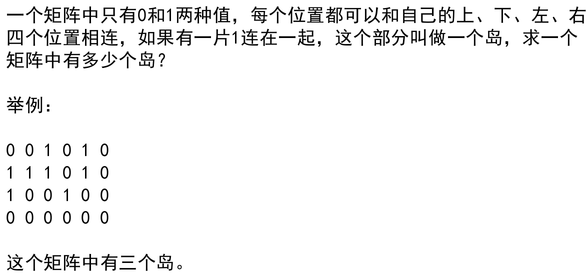
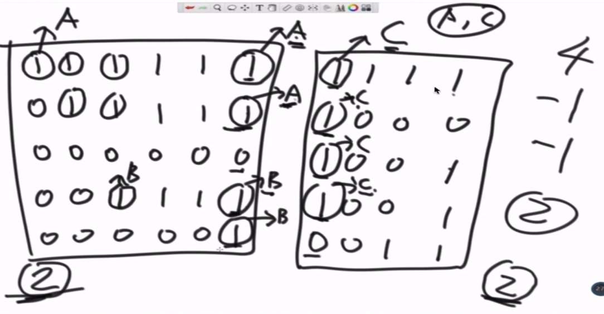
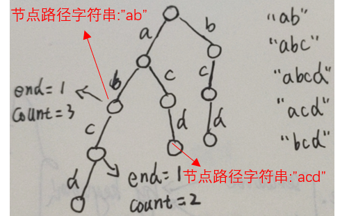
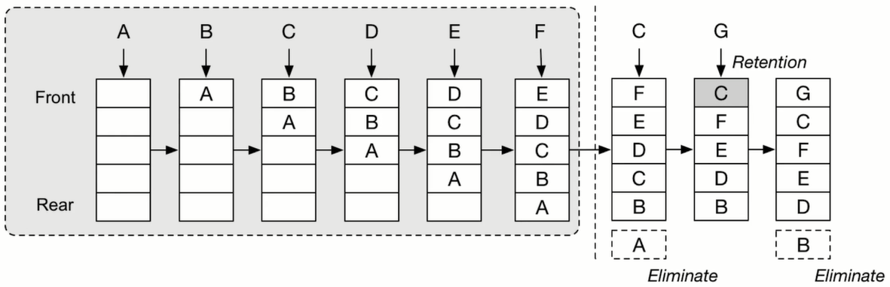
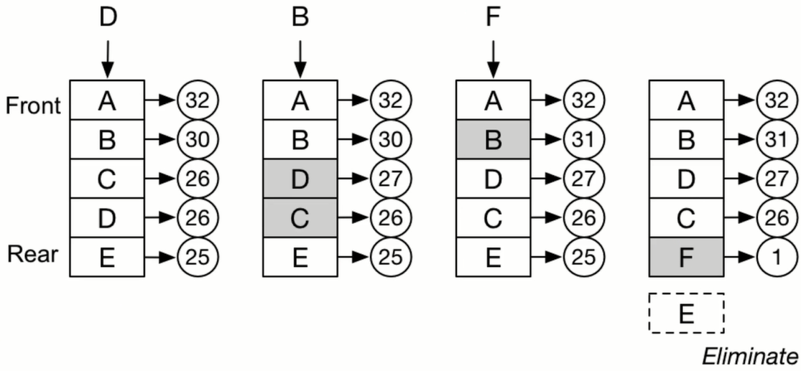

## 其他结构

### 目录

**并查集**

* [定义](#并查集-越查越简单)

* [岛问题](#岛问题)

**前缀树**

* [前缀树](#前缀树)

**LRU**

* [LRU的简单实现](#LRU的简单实现)

---

### 并查集-越查越简单

[返回目录](#目录)

并查集结构:头节点指向自己,其他节点有一个parent节点.对一个节点A不停找parent节点,直到parent节点就等于自己,这个节点是A的头节点.拥有相同头节点的节点是属于同一个集合.

合并规则:比较两个头节点挂的节点个数多少,将child节点个数少的头节点挂在多的头节点上,完成了集合的合并.

查询优化:每次查询后,都会将查询路径上所有节点都直接挂在头节点下，查询优化的存在使得"越查越简单".可以认为当查询和合并这两个操作量级逼近O(N)时,它们的平均时间复杂度只有O(1)

并查集类：并查集类包含两个hashmap成员变量,headMap<Node,Node>和countPool<Node,Integer>。用来存储每个节点的父节点,以及集合(key是它的头节点)中含有的节点个数。并查集类会提供`makeSets(List<Node> list)`，`unionSets(Node node1, Node node2)`，`isSameSet(Node node1, Node node2)`方法，makeSets方法是初始化集合的过程，每个节点自成一个集合，然后根据需要进行unionSets和isSameSet方法。


### 岛问题

[返回目录](#目录)



A：遍历这个矩阵，遇到1就开启感染模式，将这个1所在同一个“岛”的1都变成2，那么后续遍历时就不会重复计算

```java
public static int getIsland(int[][] arr) {
    if(arr == null || arr[0] == null) {
        return 0;
    }

    int row = arr.length;
    int column = arr[0].length;
    int res = 0;

    for(int i = 0; i < row; i++) {
        for(int j = 0; j < column; j++) {
            if(arr[i][j] == 1) {
                infect(arr, i, j, row, column);
                res++;
            }
        }
    }
    return res;
}

// 感染函数
private static void infect(int[][] arr, int i, int j, int row, int column) {
    if(i < 0 || i == row || j < 0 || j == column || arr[i][j] != 1 ) {
        return;
    }

    arr[i][j] = 2;
    infect(arr, i-1, j, row, column);
    infect(arr, i+1, j, row, column);
    infect(arr, i, j-1, row, column);
    infect(arr, i, j+1, row, column);
}
```

**岛问题的分布式计算**

当给的矩阵数据很大时,需要将矩阵进行分割做分布式计算,分布式计算内部还是采用感染函数的方式,但是需要处理不同分割矩阵的边界:即一个岛可能在两个分割矩阵里都算过了,这个时候需要采用并查集的结构.

首先将一个矩阵做成一个并查集(初始状态是各自成一个集合),当发现1,一样执行感染函数,不过这个时候不是将1改为2,而是将上下左右的1都和触发感染函数的1所在集合合并.这样同一个岛的1就都在一个集合里.

处理边界:如果两边都是1,而且不在同一个集合中,表明存在重复算,岛的数量-1,两个集合合并.如果两边都是1,发现确实也在一个合并的集合中,则跳过.如果两边不都是1,跳过.

就这样用并查集的 查 和 并,解决了边界"去重"的问题.




### 前缀树

[返回目录](#目录)

前缀树结构：节点路径上存储的是字符串的字符，节点本身存储一些其他信息：有多少次经过这个节点，有多少次以这个节点为字符串的结尾字符。一个节点可以分成多叉的节点路径，是通过HashMap来体现的。

前缀树意义：当要查询/统计大字符串集合中,前缀拥有某些特点的字符串时使用很方便.使用时将这些字符串构成一颗前缀树,然后即可查询各种不同的统计效果

增加: 从Root节点出发,根据字符串的第一位字符作为key查询当且节点的map中的value是不是null,如果不是表明当前字符出现过,将这个value对应的Node相关参数更新一下(经过的次数,结尾的次数);如果是null,就创建一个新的Node,和当前字符作为键值对put进当前节点的map,更新node参数.然后继续以Node为新的当前节点,重复上述操作:...
构造: 字符串集合都做一次增加
删除: 沿途将经过次数和最后一次结尾次数减1,如果发现某个经过次数/结尾次数是1,那么删除这个<k,v>对,后面就不用操作了

如下图, 为五个字符串构成的前缀树.



```java
public class PreStrTree {
    // 前缀树的Node
    public static class PreNode {
        // 存储构建前缀树过程中,等于该节点路径字符串的字符串个数
        public int end = 0;
        // 存储构建前缀树过程中,以该节点路径字符串为前缀的字符串个数
        public int count = 0;
        // 该节点的路径分支
        public HashMap<Character, PreNode> path = new HashMap<Character, PreStrTree.PreNode>();

    }

    // 前缀树的根节点
    public PreNode root = new PreNode();

    // 树上增加一系列字符串
    public void buildTree(List<String> source) {
        if (source == null) {
            return;
        }
        for (String each : source) {
            insert(each);
        }
    }

    // 树上增加一个字符串
    public void insert(String str) {
        if (str == null || str.length() == 0) {
            return;
        }
        PreNode cur = root;
        for (int i = 0; i < str.length(); i++) {
            char each = str.charAt(i);
            PreNode next = cur.path.get(each);
            if (next == null) {
                next = new PreNode();
                cur.path.put(each, next);
            }
            next.count++;
            cur = next;
        }
        cur.end++;
    }

    // 辅助函数:查询路径字符串的节点
    private PreNode searchNode(String str) {
        if (str == null || str.length() == 0) {
            return null;
        }
        PreNode cur = root;
        for (int i = 0; i < str.length(); i++) {
            char each = str.charAt(i);
            PreNode next = cur.path.get(each);
            if (next == null) {
                return null;
            } else {
                cur = next;
            }
        }
        return cur;
    }

    // 查询构建前缀树过程中,等于str的字符串出现次数
    public int search(String str) {
        if (str == null || str.length() == 0) {
            return 0;
        }
        PreNode preNode = searchNode(str);
        return null == preNode ? 0 : preNode.end;
    }

    // 查询构建前缀树过程中,以str为前缀的字符串出现次数
    public int searchPrefix(String str) {
        if (str == null || str.length() == 0) {
            return 0;
        }
        PreNode preNode = searchNode(str);
        return null == preNode ? 0 : preNode.count;
    }

    // 树上删除字符串
    public boolean delete(String str) {
        // 如果字符串不存在是不能删除的(不然破坏了其他字符串构建的前缀树)
        if (str == null || str.length() == 0 || search(str) == 0) {
            return false;
        }
        PreNode cur = root;
        for (int i = 0; i < str.length(); i++) {
            char each = str.charAt(i);
            PreNode next = cur.path.get(each);
            if (next == null) {
                return false;
            } else {
                if (next.count == 1) {
                    // 提前结束
                    cur.path.put(each, null);
                    return true;
                } else {
                    next.count--;
                    cur = next;
                }
            }
        }
        cur.end--;
        return true;
    }
}
```


### LRU的简单实现

[返回目录](#目录)

LRU的双向链表实现



LFU的双向链表实现



LRU：插入元素时，如果元素不存在则插到链表头部，如果存在，则将该元素调至链表头部，该元素之前的所有元素往后挪一位。如果链表满了，插入一个不存在的元素，会使链表尾部元素从缓存中剔除。

LFU：插入元素时，如果元素不存在，则插入链表尾部，并初始化其出现次数为1，如果插入前链表是满的，那么原链表尾部的元素会被剔除；如果元素存在，则它的出现次数+1，并根据出现次数调整它在链表中的位置。