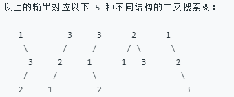

## 递归

### 目录

**[概念](#概念)**

* [Master公式](#Master公式)

**[基础递归问题](#基础递归问题)**

* [汉诺塔问题](#汉诺塔问题)
* [辅助空间O(1)反转栈](#辅助空间O(1)反转栈)
* [打印九宫格数字匹配的所有字符串](#打印九宫格数字匹配的所有字符串)

**[复杂递归问题](#复杂递归问题)**

- [复制粘贴字符串](#复制粘贴字符串)
- [n构成二叉搜索树](#n构成二叉搜索树)
- [n构成二叉搜索树II](#n构成二叉搜索树II)

---


### 概念

#### Master公式

[目录](#目录)

master公式是一个时间复杂度的递推公式,指的是当前规模(N)的任务拆分成若干个(a)**相同规模**(N/b)的子任务,每次任务还需进行一个复杂度为O(N^d^)的操作.


### 基础递归问题

#### 汉诺塔问题

[目录](#目录)

Q: 三个杆,有n个盘(小压大的顺序),要求将这n个盘从最左杆移动到最右杆(保持相同的顺序),要求移动过程中所有杆上的盘都只能小压大,不能大压小

A: 记三个杆为left, mid, right. 首先将left的n-1个盘移动到mid上, 这个操作和原问题的条件是一模一样的, 只是规模从n变成了n-1; 然后将left的最大盘移动到right上, 这一步是可以直接操作的; 最后将mid上n-1个盘移动到right上, 和原问题也是一样的条件, 只是规模变成了n-1.

```java
// 汉诺塔的递归非常美 -> 打印移动方法,返回总的移动步数
public static int movePlates(int N, String from, String help, String to) {
    if(N == 1) {
        System.out.println(from + "->" + to);
        return 1;
    }
    int step1 = movePlates(N-1, from, to, help);
    System.out.println(from + "->" + to);
    int step2 = movePlates(N-1, help, from, to);
    return step1 + 1 + step2;
}
```


#### 辅助空间O(1)反转栈

[目录](#目录)

Q: 将栈的元素顺序反转, 要求空间复杂度为O(1)

A: 不能用辅助栈,那么就用递归实现. 本质是利用了虚拟机帮你压栈

```java
// 递归:不断弹出最后一个元素,弹完开始存入
public static void reverse(Stack<Integer> stack) {
    if(stack.isEmpty()) {
        return;
    }
    int last = getLast(stack);
    reverse(stack);
    stack.push(last);
}
```


#### 打印九宫格数字匹配的所有字符串

[目录](#目录)

Q: 给定一个字符串str,每个字符范围是'2'~'9',打印整个字符串所有可能匹配的字母组合

A: 题目本身很简单,就是考察递归的写法.每个字符数字有3或4个选择的字母可以匹配,每个字符第一个可以匹配的字母由offset决定.(8对应了4个字母)

Example:

```
Input: "23"
Output: ["ad", "ae", "af", "bd", "be", "bf", "cd", "ce", "cf"].
```


```java
class Solution {
    public List<String> letterCombinations(String digits) {
        
        List<String> list = new ArrayList<>();
        if(digits == null || digits.length() == 0){
            return list;
        }
        
        char[] charArr = new char[digits.length()];        
        process(0, charArr, digits, list);
        
        return list;
    }
    
    public static void process(int p, char[] charArr, String str, List<String> list){
        if(p == str.length()){
            list.add(new String(charArr));
            return;
        }
        
        int offset = str.charAt(p) >= '8' ? 1 : 0;
        int n = str.charAt(p) == '7' || str.charAt(p) == '9' ? 4 : 3;
        
        for(int i = 0; i < n; i++){
            charArr[p] = (char)((str.charAt(p)-'2')*3 + 'a' + i + offset);
            process(p+1, charArr, str, list);
        }      
    }
}
```


### 复杂递归问题

复杂递归问题的问题规模分割需要经过一定的分析

#### 复制粘贴字符串

[目录](#目录)

[650. 2 Keys Keyboard](https://leetcode.com/problems/2-keys-keyboard/description/)

Q: 最开始只有一个字符 A，问需要多少次操作能够得到 n 个字符 A，每次操作可以复制当前所有的字符，或者粘贴

```
Input: 3
Output: 3
Explanation:
Intitally, we have one character 'A'.
In step 1, we use Copy All operation.
In step 2, we use Paste operation to get 'AA'.
In step 3, we use Paste operation to get 'AAA'.
```

A: 粘贴本质就是翻倍, 所以对于素数, 没有因子, 它只能一直复制粘贴, 它的次数就是素数本身. 对于非素数, 假设`n = i * j` 使i取最小, 则j最大, 将j个A复制i次, 即可得到n个A, 这样的次数是最少的(贪心, 为什么这样是最少的, 没有严格的证明)

根据贪心结论, 得到递推式: `dp[n] = i + dp[j]` 求n最小的因子i: i从2开始递增, n%i==0即得到最小因子

这里的动态规划虽然用了递归, 但是没有重复计算

```java
class Solution {
    public int minStepsOfCopyString(int n) {
        if(n == 1){
            return 0;
        }
        // 注意求n因子时,遍历到根号n而不是n
        for(int i = 2; i <= Math.sqrt(n); i++){
            if(n % i == 0){
                return minStepsOfCopyString(n / i) + i; 
            }
        }
        // 素数
        return n; 
    }
}
```


#### n构成二叉搜索树

[96.n构成二叉搜索树](https://leetcode-cn.com/problems/unique-binary-search-trees/)

[目录](#目录)

Q：给定一个整数 *n*，求以 1 ... *n* 为节点组成的二叉搜索树有多少种？

A：假设以 i 为头节点， 1 ~ i - 1 作为左子树(这是必须的，因为搜索二叉树左子树的所有节点都必须比它小，同样比它小的所有元素也必须只能出现在头节点的左子树中)，i + 1 ~ n作为右子树，记这种情况数为G[i]，可以发现求左子树和右子树的组成情况其实就是本问题，只是规模不一样，所以有以下递推式，这也是一种**分治**的思想

```
G[i] = dp[i-1] * dp[n-i];
```

在规模n的问题中，1~i都可以作为头节点，所以dp[i] = sum(G[j]) (j 取1 ~ n之间的所有数)，得到解法1

```java
public int numTrees1(int n) {
    if (0 == n || 1 == n) {
        return 1;
    }
    int res = 0;
    for (int i = 1; i <= n; i++) {
        res += numTrees(i - 1) * numTrees(n - i);
    }
    return res;
}
```

A2：以上方法非常简洁，但是会发现递归会求很多重复解，leetcode的时间也会很长。这是因为求G[i]时，dp[n-i]的规模是n-i，而n-i可能大于i，遇到了“未来”规模的问题，不得不递归。

如果保证n-i < i 是不是就很好了，所以多加一重内循环 j ，保证 j <= i，每次内循环都只求出dp[i]，就可以顺序求出1 ~ n的所有规模解，这就是递归与动态规划的不同。leetcode通过时间会很短

```java
public int numTrees(int n) {
    if (0 == n || 1 == n) {
        return 1;
    }
    int[] dp = new int[n + 1];
    dp[0] = 1;
    dp[1] = 1;
    for (int i = 2; i <= n; i++) {
        // 顺序求出规模小于n的此类问题
        for (int j = 1; j <= i; j++) {
            dp[i] += dp[j - 1] * dp[i - j];
        }
    }
    return dp[n];
}
```


#### n构成二叉搜索树II

[95.n构成二叉搜索树](https://leetcode-cn.com/problems/unique-binary-search-trees-ii/)

[目录](#目录)

Q：给定一个整数 *n*，求以 1 ... *n* 为节点组成的二叉搜索树有多少种，返回所有可能的列表

**示例**

```
输入: 3
输出:
[
  [1,null,3,2],
  [3,2,null,1],
  [3,1,null,null,2],
  [2,1,3],
  [1,null,2,null,3]
]
```



A：上一题只是求种数，只要规模是一样的，它们的答案是一样的，比如1 2 3 和 4 5 6 求出来的总数是一样的，但是是不同的树(其实也就存在一个偏移)，通过加shift，来使它们作为同一种问题。

另外求种数是比较好缓存的，但是求具体情况就不好用动态规划来逐个求缓存了，所以本题直接使用递归

```java
public List<TreeNode> generateTrees(int n) {
    List<TreeNode> res = new ArrayList<>();
    if (0 == n) {
        // 满足题目的要求
        return res;
    }
    return generateTrees(n, 0);
}

/**
     * @param n     这个问题的规模
     * @param shift 这个问题的第一个数与1的差值
     */
private List<TreeNode> generateTrees(int n, int shift) {
    List<TreeNode> res = new ArrayList<>();
    if (0 == n) {
        // 注意不是返回空列表，因为null也算在内
        res.add(null);
        return res;
    } else if (1 == n) {
        res.add(new TreeNode(1 + shift));
        return res;
    }
    for (int i = 1; i <= n; i++) {
        List<TreeNode> left = generateTrees(i - 1, shift);
        List<TreeNode> right = generateTrees(n - i, i + shift);
        for (TreeNode eachLeft : left) {
            for (TreeNode eachRight : right) {
                // 笛卡儿积
                TreeNode head = new TreeNode(i + shift);
                head.left = eachLeft;
                head.right = eachRight;
                res.add(head);
            }
        }
    }
    return res;
}
```


