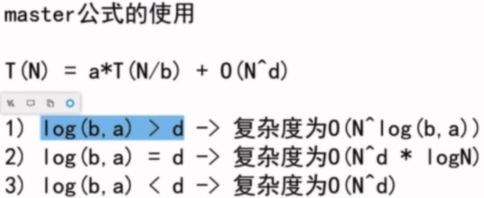
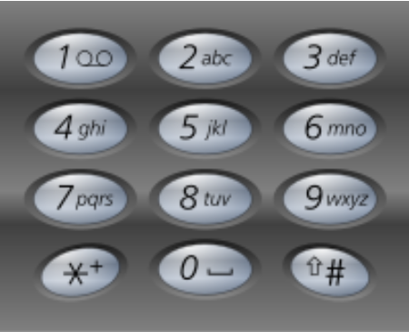

## 递归

### 目录

**[概念](#概念)**

* [Master公式](#Master公式)

**[基础递归问题](#基础递归问题)**

* [汉诺塔问题](#汉诺塔问题)
* [辅助空间O(1)反转栈](#辅助空间O(1)反转栈)
* [打印九宫格数字匹配的所有字符串](#打印九宫格数字匹配的所有字符串)


---


### 概念

#### Master公式

[目录](#目录)

master公式是一个时间复杂度的递推公式,指的是当前规模(N)的任务拆分成若干个(a)**相同规模**(N/b)的子任务,每次任务还需进行一个复杂度为O(N^d^)的操作.




### 基础递归问题

#### 汉诺塔问题

[目录](#目录)

Q: 三个杆,有n个盘(小压大的顺序),要求将这n个盘从最左杆移动到最右杆(保持相同的顺序),要求移动过程中所有杆上的盘都只能小压大,不能大压小

A: 记三个杆为left, mid, right. 首先将left的n-1个盘移动到mid上, 这个操作和原问题的条件是一模一样的, 只是规模从n变成了n-1; 然后将left的最大盘移动到right上, 这一步是可以直接操作的; 最后将mid上n-1个盘移动到right上, 和原问题也是一样的条件, 只是规模变成了n-1.

```java
// 汉诺塔的递归非常美 -> 打印移动方法,返回总的移动步数
public static int movePlates(int N, String from, String help, String to) {
    if(N == 1) {
        System.out.println(from + "->" + to);
        return 1;
    }
    int step1 = movePlates(N-1, from, to, help);
    System.out.println(from + "->" + to);
    int step2 = movePlates(N-1, help, from, to);
    return step1 + 1 + step2;
}
```


#### 辅助空间O(1)反转栈

[目录](#目录)

Q: 将栈的元素顺序反转, 要求空间复杂度为O(1)

A: 不能用辅助栈,那么就用递归实现. 本质是利用了虚拟机帮你压栈

```java
// 递归:不断弹出最后一个元素,弹完开始存入
public static void reverse(Stack<Integer> stack) {
    if(stack.isEmpty()) {
        return;
    }
    int last = getLast(stack);
    reverse(stack);
    stack.push(last);
}
```


#### 打印九宫格数字匹配的所有字符串

[目录](#目录)

Q: 给定一个字符串str,每个字符范围是'2'~'9',打印整个字符串所有可能匹配的字母组合

A: 题目本身很简单,就是考察递归的写法.每个字符数字有3或4个选择的字母可以匹配,每个字符第一个可以匹配的字母由offset决定.(8对应了4个字母)

Example:

```
Input: "23"
Output: ["ad", "ae", "af", "bd", "be", "bf", "cd", "ce", "cf"].
```



```java
class Solution {
    public List<String> letterCombinations(String digits) {
        
        List<String> list = new ArrayList<>();
        if(digits == null || digits.length() == 0){
            return list;
        }
        
        char[] charArr = new char[digits.length()];        
        process(0, charArr, digits, list);
        
        return list;
    }
    
    public static void process(int p, char[] charArr, String str, List<String> list){
        if(p == str.length()){
            list.add(new String(charArr));
            return;
        }
        
        int offset = str.charAt(p) >= '8' ? 1 : 0;
        int n = str.charAt(p) == '7' || str.charAt(p) == '9' ? 4 : 3;
        
        for(int i = 0; i < n; i++){
            charArr[p] = (char)((str.charAt(p)-'2')*3 + 'a' + i + offset);
            process(p+1, charArr, str, list);
        }      
    }
}
```


