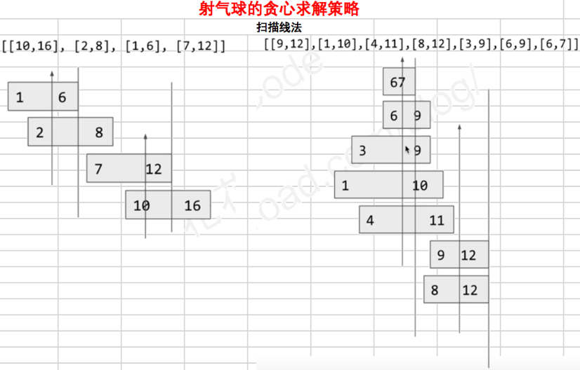

## 贪心

目光短浅,每次都选择局部的最优解

### 目录

* [求字符串集合自由组合的最小字典序](#求字符串集合自由组合的最小字典序)
* [哈夫曼编码问题](#哈夫曼编码问题)
* [用最少数量的箭引爆所有气球](#用最少数量的箭引爆所有气球)
* [分组差的最小值](#分组差的最小值)


----

### 求字符串集合自由组合的最小字典序 

[目录](#目录)

Q：给一个字符串集合,对这个集合中的字符串进行自由拼接,求字典序最小的拼接字符串

A：问题的核心在于提供一个有效的比较器，然后对字符串集合进行排序，即可得到最小的字典序。比较器不是通过字符串本身的字典序大小排序，而是根据这两个字符串正反组合的字典序大小进行排序。通过比较器的局部最小字典序，贪心得到了整个集合的最小字典序

```java
public static void getMinDictOrder(String[] strs){
    Arrays.sort(strs, new MinDictOrderComparator());
}
public static class MinDictOrderComparator implements Comparator<String>{
    @Override
    public boolean compare(String s1, String s2){
        return s1+s2 > s2+s1;
    }
}
```

子问题1：给一个数组，可以自由交换数组中不同元素的位置，使得整个数组拼起来的数字最小


### 哈夫曼编码问题

[目录](#目录)

Q：给定一群数字节点,两个数字节点的结合代价是这两个数字节点的和,让这群数字两两结合,结合成的数字节点继续放入群中两两结合,最终合成一个数字节点,问结合的最小代价是多少？
如[10,20,30] 10,20结合,得到的30再和30结合,总代价:90; 但是如果20和30结合,50再和10结合,总代价:110.

A：每次取出数组中最小的两个数进行组合 (只顾每次结合的代价最小,但是得到总的代价确实也是最小的)
将数组中的数全部装进小根堆(如果不是基本类型,则需要提供比较器)(java中堆就是PriorityQueue,提供比较器如果是升序就是小根堆,降序就是大根堆),每次连续弹出两次堆顶,即取出最小的两个数进行组合,再将结果offer到堆中.重复操作直到堆中只有一个数,得到最小代价.

```java
public static Integer getMinCost(int[] arr){
    if(arr==null || arr.length==0){
        return null;
    }
    PriorityQueue<Integer> smallHeap = new PriorityQueue<>();
    for(int i=0; i<arr.length; i++){
        queue.offer(arr[i]);
    }
    int cost = 0;
    while(queue.size() > 1){
        int temp = queue.poll() + queue.poll();
        res += temp;
        queue.offer(temp);
    }
    return queue.peek();
}
```

子问题1：黄金分割问题

长度为L的黄金, 切割成两部分时, 总会消耗长度为L的铜片, 现在要将黄金分给一群人, 假设每人获取的部分为[2,3,4,2,5,9], 问怎么样分切割黄金,消耗的铜片最小.


### 用最少数量的箭引爆所有气球

[452.用最少数量的箭引爆所有气球](https://leetcode-cn.com/problems/minimum-number-of-arrows-to-burst-balloons/)

[目录](#目录)

Q：在二维空间中有许多球形的气球。对于每个气球，提供的输入是水平方向上，气球直径的开始和结束坐标。由于它是水平的，所以y坐标并不重要，因此只要知道开始和结束的x坐标就足够了。开始坐标总是小于结束坐标。平面内最多存在104个气球。

一支弓箭可以沿着x轴从不同点完全垂直地射出。在坐标x处射出一支箭，若有一个气球的直径的开始和结束坐标为 xstart，xend， 且满足  xstart ≤ x ≤ xend，则该气球会被引爆。可以射出的弓箭的数量没有限制。 弓箭一旦被射出之后，可以无限地前进。我们想找到使得所有气球全部被引爆，所需的弓箭的最小数量。

```
输入:
[[10,16], [2,8], [1,6], [7,12]]

输出:
2

解释:
对于该样例，我们可以在x = 6（射爆[2,8],[1,6]两个气球）和 x = 11（射爆另外两个气球）。
```

A：以区间右边界排序，得到气球的新位置。第一支箭就射往第一个气球的右边界，记这个位置为shotEnd，因为后面的气球右边界>=shotEnd，所以只要后面的气球开始位置<=shotEnd，就表明它会被这支箭射中；若后面的气球开始位置>shotEnd，就新射一支箭，射这个气球的右边界，即shotEnd更新(射箭数+1)，继续遍历。



```java
public int findMinArrowShots(int[][] points) {
    if (points.length < 2) {
        return points.length;
    }
    Arrays.sort(points, (int[] a, int[] b) -> a[1] - b[1]);
    // 射出的第一箭用来射右边界最靠左的气球
    int shotEnd = points[0][1];
    int res = 1;
    // 因为后面的气球右边界都比前面射的end更靠右，所以只要后面的气球起始位置在end左边
    // 就表明这个气球是会被前面的箭射中的。反之，需要再射一箭，并更新end
    for (int i = 1; i < points.length; i++) {
        if (points[i][0] > shotEnd) {
            // 需要重新射一箭
            res++;
            shotEnd = points[i][1];
        }
    }
    return res;
}
```


### 分组差的最小值

Q：给一个数组，将这个数组分成两部分，使得两部分差值绝对值最小，返回这个最小值。

A：首先将数组排序，并求和得sum，分成的两部分有一部分和为sum/2，那么这两部分的差值绝对值肯定是最小的。因为sum可能为奇数可能为偶数，所以使用 (sum + 1) / 2 作为尝试部分累加和的最大值。有点类似背包的思想，正序累加一次，只要加上某个数的和仍小于(sum + 1) / 2 ，就可以将其加上，完成后求分成的两部分差。同样，逆序累加一次，对正序和逆序的结果求较小者，即是答案。为什么？我没想要严格的解释，指导的贪心思想是不断凑离(sum + 1) / 2最近的和

```java
public int process(int[] arr) {
    int n = arr.length;    
    int i = 0;
    long sum = 0;
    while (i < n) {
        sum += arr[i];
        i++;
    }
    Arrays.sort(arr);
    // 考虑到和为奇数时，凑一半或一半+1都可以
    long target = (sum + 1) / 2;
    i = 0;
    long cur = 0;
    while (i < n) {
        if (cur + arr[i] <= target) {
            cur = cur + arr[i];
        }
        i++;
    }
    long res = Math.abs(cur * 2 - sum);
    i = n - 1;
    cur = 0;
    while (i >= 0) {
        if (cur + arr[i] <= target) {
            cur = cur + arr[i];
        }
        i--;
    }
    res = Math.min(res, Math.abs(cur * 2 - sum));
    return (int)res;
}
```

