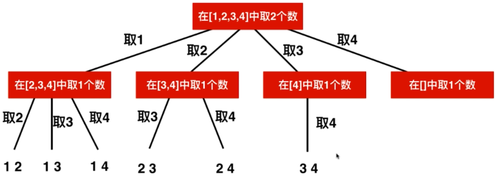

## 回溯

### 目录

**概念**

- [概念知识](#概念知识)

**基础**

- [括号生成](#括号生成)

**搜索**

- [二维字符矩阵搜索单词](#二维字符矩阵搜索单词)

**排列组合**

- [全排列II](#全排列II)
- [组合总数I](#组合总数I)
- [组合总数II](#组合总数II)


### 概念知识

[目录](#目录)

回溯法其实属于暴力搜索, 它和多重循环本质上很像, 区别是回溯法是用于不知道多重循环的层数的情况, 回溯法的表现形式是递归.

回溯法有关的问题可以分为排列和组合. 它们的常见模型是从数组中取出若干个数, 取出来的数要满足一定的条件.

排列特点是, 取出来的数的数量就等于数组的数量, 即要把数组全部取完, 所以相当于对数组进行排列.

组合特点是, 只从数组中取出来部分的数, 所以相当于从m个数中寻找n个数进行组合.

**回溯排列**


**回溯组合(不讲究顺序)**



另外, 在取数过程中, 对于同样取出来的一批数, 是否讲究顺序是一个要考虑的问题; 还有, 每个数是否能被取多次也是一个要考虑的问题. 

基于以上特点, 在考虑回溯问题时, 有以下需要注意:

- 回溯一般有哪些变量需要传递到下层?

  boolean flag (用于标记已选择的元素索引, 注意使用时需要回退状态) (非传递变量)

  - int[] arr(源数组)
  - int index(下一层开始遍历的位置, 如果要从0位置开始遍历, 则不需要)
  - int targetCount(组合要选择的元素总数, 如果是排列则不需要)
  - int count(到下一层时, 已经选择的元素数量. 如果元素栈或队列传递了, 这个就是它们的长度)
  - Stack stack(到下一层时, 已经选择的元素存栈, 如果最后不需要所有中间态, 则可以不传, 注意使用时需要回退状态)
  - int left(到下一层时, 已选择元素和 比 目标和值少的数量, 一般用于组合和为固定值时传递)

- 遍历元素时是从0开始, 还是从上一层提供的状态量开始?

  从0开始, 表示还可以选前面的元素, 适用于在乎顺序的回溯(排列一般是这样). 比如认为选ABC 和 CBA是不同结果的情况

  从上一层提供的状态量开始, 即不能再选前面的元素, 适用于不在乎顺序的回溯(组合有时候会不在乎顺序), 即AB 和 BA是同一个结果.

- 对于在乎顺序的回溯(从0开始遍历), 因为可以选前面的元素, 那如何判断当前元素有没有被前面层选中呢?

  自己添加一个布尔数组作为状态量, 如果flag[i]为false, 表明前面层没有选中, 当前层可以选arr[i]. 同时, 当前层若选了arr[i], 则要将flag[i]置位true. 如果是对于可以元素可以重复选择的情况, flag状态量就不需要了

- 如何将选中的数据传递给下一层? 

  可以用栈或者队列

- 如何在回溯时恢复状态?

  比如在选[1 2 3]时遍历, 第一个选的是1, 假设第一个选1的所有情况已经执行完毕, 系统回溯到了第一个选1的地方, 此时需要恢复改变的状态量. 比如选1时会将falg[0]=true, 那么现在回溯后准备第一个选2了, 选2之前需要将flag[1]=false; 再比如用于传递到下一层的栈或队列, 要将这个1弹出来.

- 组合和排列的最大区别是什么?

  最大区别是组合只选部分元素, 排列要选所有元素. 因此排列是天然讲顺序的, 也就是ABC和CBA不一样, 如果不讲顺序, 排列包含所有元素就只有一种结果了. 所以排列遍历一般是从0开始的, 需要flag状态量(如果不重复)来判断前面的元素是否被选取.  

- 组合什么时候要用剪枝优化?

  当组合不需要顺序的时候, 当前层遍历是从上一层遍历结束的地方开始遍历. 比如总共有10个元素, 一共要选4个元素. 上一层表示已经遍历到了第8个元素(但是是选中的第一个元素), 那么当前层就没必要选择了, 因为后面只有9和10可以选, 而加起来一共也就3个元素, 不满足要求. 也就是说, 在当前层要做判断后面的元素数量是否足够, 若不足够, 则直接剪掉.

- 源数组的值有没有相等值？

  这个都是可以的，看题目要求


### 二维字符矩阵搜索单词

[单词搜索](https://leetcode-cn.com/problems/word-search/)

[目录](#目录)

Q: 给定一个二维网格和一个单词，找出该单词是否存在于网格中。

单词必须按照字母顺序，通过相邻的单元格内的字母构成，其中“相邻”单元格是那些水平相邻或垂直相邻的单元格。同一个单元格内的字母不允许被重复使用。

```
// 举个栗子
board =
[
  ['A','B','C','E'],
  ['S','F','C','S'],
  ['A','D','E','E']
]

给定 word = "ABCCED", 返回 true.
给定 word = "SEE", 返回 true.
给定 word = "ABCB", 返回 false.
```

A: 使用回溯法. 整体思路是: 遍历整个二维数组, 以每个位置作为和单词第一个位置匹配开始进入搜索(递归过程). 

搜索过程: 首先当前进来的矩阵坐标位置要和单词index位置匹配, 就开始上右下左的搜索(递归). 但是上右下左搜索前, 需要检查上右下左新坐标是否越界 / 新坐标是否已被占用.

递归终止条件: 如果index到了单词最后一位, 则可以知道此次匹配尝试true or false

从这道题学到的一些做题技巧:

- 二维矩阵中上下左右移动, 使用辅助的二维数组, 就可以在一个for中实现. 而不是分成若干个if else
- 回溯中判断路径有没有走过, 使用全局的boolean数组, 要记得状态还原
- 做步骤多的算法题目, 一般会分成好几个方法. 有时候多个方法都需要用到的变量, 可以写成类的成员变量, 免得在方法中加参数, 比较麻烦.

```java
public class SearchWord {
    // Q:给一个二维字符数组和一个字符串，问字符串是否可以在二维数组中搜索到（leetcode-79）
    // A：二维的回溯，以二维数组中每个单词为起点尝试搜索单词，某次搜索到则成功返回

    private int row ;
    private int col;
    private boolean[][] steped;
    private int[][] d = new int[][]{{-1,0}, {0,1}, {1,0}, {0,-1}};
    public boolean exist(char[][] board, String word) {
        if (null == board || null == board[0] || board[0].length == 0) {
            return false;
        } else if (null == word || word.length() == 0) {
            return true;
        }
        row = board.length;
        col = board[0].length;
        steped = new boolean[row][col];
        for (int i = 0; i < board.length; i++) {
            for (int j = 0; j < board[0].length; j++) {
                if (search(board, word, 0, i, j)) {
                    return true;
                }
            }
        }
        return false;
    }

    private boolean search(char[][] board, String word, int index, int startX, int startY) {
        if (index == word.length() - 1) {
            return word.charAt(index) == board[startX][startY];
        }
        if (word.charAt(index) == board[startX][startY]) {
            steped[startX][startY] = true;
            // 当前满足继续上右下左的搜索
            for (int i = 0; i < 4; i++) {
                // 得到上下左右的坐标
                int newX = startX + d[i][0];
                int newY = startY + d[i][1];
                if (isValid(newX, newY) && !steped[newX][newY] &&
                        search(board, word, index + 1, newX, newY)) {
                    return true;
                }
            }
            steped[startX][startY] = false;
        }
        return false;
    }

    private boolean isValid(int x, int y) {
        if (x >= 0 && x < row && y >= 0 && y < col) {
            return true;
        } else {
            return false;
        }
    }
}
```


### 组合总数I

[组合总数I](https://leetcode-cn.com/problems/combination-sum/)

[目录](#目录)

Q：给定一个**无重复元素**的数组 `candidates` 和一个目标数 `target` ，找出 `candidates` 中所有可以使数字和为 `target` 的组合。

`candidates` 中的数字可以无限制重复被选取。所有数字（包括 target）都是正整数。解集不能包含重复的组合。 

**示例**

```
输入: candidates = [2,3,5], target = 8,
所求解集为:
[
  [2,2,2,2],
  [2,3,3],
  [3,5]
]
```

A：组合的长度是未知的，所以回溯的传递参数中需要使用ArrayList而不是数组。组合中每个数是可以重复选的，但是要求组合不重复(即不讲顺序)，所以每次循环取当前位置数时，是从上一次取的位置开始取。排序是为了剪枝

```java
public List<List<Integer>> combinationSum(int[] candidates, int target) {
    // 先排序,为了剪枝
    Arrays.sort(candidates);
    List<List<Integer>> res = new ArrayList<>();
    List<Integer> child = new ArrayList<>();
    process(candidates, res, child, 0, target);
    return res;
}

private void process(int[] arr, List<List<Integer>> res, List<Integer> child, int index, int left) {
    if (left == 0) {
        List<Integer> trueChild = new ArrayList<>(child.size());
        trueChild.addAll(child);
        res.add(trueChild);
        return;
    }
    for (int i = index; i < arr.length; i++) {
        if (left - arr[i] < 0) {
            // 剪枝,如果比较小的数加上都超过了,后面更不用看了
            break;
        }
        child.add(arr[i]);
        // 下一次递归的index=i,也就是下一次开始选数的位置是这一次选中的位置
        // 保证了同一个数可以选多次,但是不会"回头选"
        process(arr, res, child, i, left - arr[i]);
        // list不同于数组,add操作是追加不是覆盖,所以记得remove
        child.remove(child.size()-1);
    }
}
```


### 组合总数II

[组合总数II](https://leetcode-cn.com/problems/combination-sum-ii/)

[目录](#目录)

Q：给定一个数组 candidates 和一个目标数 target ，找出 candidates 中所有可以使数字和为 target 的组合。candidates 中的每个数字在每个组合中只能使用一次。

所有数字（包括目标数）都是正整数。解集不能包含重复的组合。 

**示例**

```
输入: candidates = [10,1,2,7,6,1,5], target = 8,
所求解集为:
[
  [1, 7],
  [1, 2, 5],
  [2, 6],
  [1, 1, 6]
]
```

A：与[组合总数I](#组合总数I)的区别有两个：1.源数组中可以有重复的元素 2.每个元素只能取一次。为了保证2，每次循环开始就从上一次开始的下一个位置遍历，即保证了每个元素最多选一次。再比如示例中源数组有两个1，答案组合中有[1 1 6]，即两个1是可以都选的，并不是被选了两次，是满足条件1的。

但是以上讨论还不能解决一个问题：比如遍历到第一个1时，会找到[1 7]这个组合，遍历到第二个1时又会找到[1 7]这种组合，那怎么去重呢？如果是把所有组合都找出来再去重，会浪费很多时间。最好是在找的时候就过滤掉。

所以这样规定，相同的元素如果只使用一部分，那我们**只能从左往右连续取**，不能隔开取，这样避免了重复的情况。为什么呢？比如源数组排序后是[1 1 1 2 3 4 5 6]要凑7。为了将三个相同的1区分开，使用a1 b1 c1来描述它们。只使用一个1时，按照我们的规则只能选[a1 7]，选b1时因为a1没选所以不能选，所以不会存在[b1 7]的重复组合，同理c1也是。 只使用两个1时，按照规则只能选[a1 b1 5]，不会出现[b1 c1 5]的重复组合。依次类推，所以**只能从左往右连续取**的规则，消除了重复的情况。

那怎么在编程时实现这个规则呢？添加一个辅助的布尔数组，用于纪录源数组位置是否在组合中被使用，每次循环add前检查前一个元素和当前元素是否相等，如果相等必须要前一个元素在组合中使用过，才能add，否则就不能add，需要丢弃这类组合情况。

```java
boolean[] used;

public List<List<Integer>> combinationSum2(int[] candidates, int target) {
    // 先排序,为了剪枝
    Arrays.sort(candidates);
    // 记录在递归的过程中元素是否使用过,为了满足题目的条件
    used = new boolean[candidates.length];
    List<List<Integer>> res = new ArrayList<>();
    List<Integer> child = new ArrayList<>();
    process(candidates, res, child, 0, target);
    return res;
}

private void process(int[] arr, List<List<Integer>> res, List<Integer> child, int index, int left) {
    if (left == 0) {
        List<Integer> trueChild = new ArrayList<>(child.size());
        trueChild.addAll(child);
        res.add(trueChild);
        return;
    } else if (index == arr.length) {
        // 找到了最后累加和都达不到
        return;
    }
    for (int i = index; i < arr.length; i++) {
        if (left - arr[i] < 0) {
            // 剪枝,如果比较小的数加上都超过了,后面更不用看了
            break;
        } else if ((i > 0) && (arr[i - 1] == arr[i]) && !used[i - 1]) {
            // 当前元素和前面元素相等,并且当前递归组合中,前面相等元素并未使用,那连着相等的元素也不能使用
            continue;
        }
        child.add(arr[i]);
        // 标记使用过
        used[i] = true;
        // 下一次递归的index=i + 1,也就是下一次开始选数的位置只能是这一次选中位置的后一位开始,保证了不重复且有序
        process(arr, res, child, i + 1, left - arr[i]);
        // list不同于数组,add操作是追加不是覆盖,所以记得remove
        child.remove(child.size() - 1);
        // 还原
        used[i] = false;
    }
}
```


### 全排列II

[全排列II](https://leetcode-cn.com/problems/permutations-ii/)

[目录](#目录)

Q：给定一个可包含重复数字的序列，返回所有不重复的全排列。

A：为了不得到重复的排列，和[组合总数II](#组合总数II)一样，在循环中指定当前位置前，要判断当前元素是否是重复元素，如果是重复元素，必须它前面的元素已经在排列中使用过，它才能”出场"使用。

即对于重复元素，用的时候一定要拉上前面的重复元素，为了做到这一点，需要对数组进行排序，并加一个全局布尔数组，标记元素是否在当前排列中用过。

```java
boolean[] exist;

public List<List<Integer>> permuteUnique(int[] nums) {
    List<List<Integer>> res = new ArrayList<>();
    if (nums.length == 0) {
        return res;
    }
    // 排序的作用：重复元素相邻，可以找到彼此
    Arrays.sort(nums);
    exist = new boolean[nums.length];
    int[] child = new int[nums.length];
    process(res, child, nums, 0);
    return res;
}

private void process(List<List<Integer>> res, int[] child, int[] nums, int index) {
    if (index == nums.length) {
        List<Integer> childList = new ArrayList<>();
        for (int each : child) {
            childList.add(each);
        }
        res.add(childList);
        return;
    }
    for (int i = 0; i < nums.length; i++) {
        // 这个元素没有用在前面组合
        if (!exist[i]) {
            // 当前元素可以使用的情况1
            boolean situation1 = i == 0 || nums[i] != nums[i - 1];
            // 当前元素可以使用的情况2
            boolean situation2 = i > 0 && nums[i] == nums[i - 1] && exist[i - 1];
            if (situation1 || situation2) {
                child[index] = nums[i];
                exist[i] = true;
                process(res, child, nums, index + 1);
                // 使用完需要返回状态
                exist[i] = false;
            }
        }
    }
}
```


### 括号生成

[目录](#目录)

Q：给出 *n* 代表生成括号的对数，请你写出一个函数，使其能够生成所有可能的并且**有效的**括号组合。

A：相当于有2n个位置，每个位置只能填左括号或右括号。填右括号时有条件：已经添加的左括号个数 < 已经添加的右括号。注意剪枝！

```java
public List<String> generateParenthesis(int n) {
    List<String> res = new ArrayList<>();
    if (n == 0) {
        return res;
    }
    char[] resChar = new char[n * 2];
    process(res, resChar, 0, 0, 0, n);
    return res;
}

private void process(List<String> res, char[] resChar, int leftUse, int rightUse, int index, int n) {
    // 剪枝(提交结束递归)
    if (leftUse == n || rightUse == n) {
        char same = leftUse == n ? ')' : '(';
        for (int i = index; i < n * 2; i++) {
            resChar[i] = same;
        }
        res.add(new String(resChar));
        return;
    }
    if (rightUse < leftUse) {
        // 只有已经用的右括号少于已经用的左括号时,当前位置才可能使用右括号
        resChar[index] = ')';
        process(res, resChar, leftUse, rightUse + 1, index + 1, n);
    }
    resChar[index] = '(';
    process(res, resChar, leftUse + 1, rightUse, index + 1, n);
}
```


