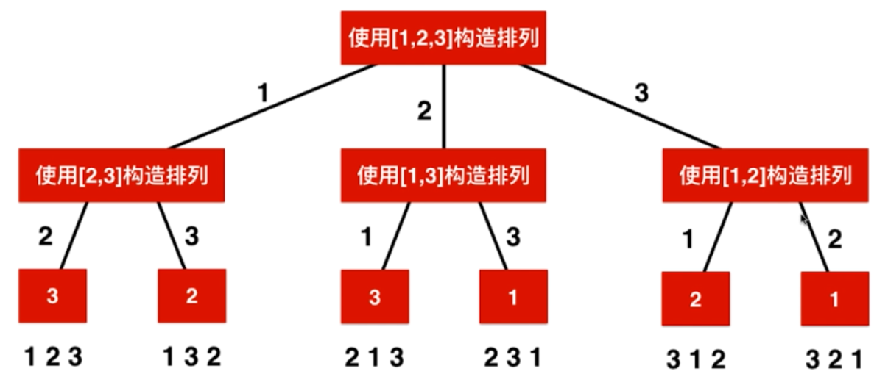

## 回溯

### 目录

[**概念**](#概念)

- [概念](#概念)

[**基础**](#基础)

- [括号生成](#括号生成)
- [和为定值的二叉树路径](#和为定值的二叉树路径)

[**搜索**](#搜索)

- [二维字符矩阵搜索单词](#二维字符矩阵搜索单词)

[**排列组合子集**](#排列组合子集)

- [全排列II](#全排列II)
- [第k个排列](#第k个排列)
- [组合总和I](#组合总和I)
- [组合总和II](#组合总和II)
- [组合总和III](#组合总和III)
- [子集II](#子集II)


----

### 概念

[目录](#目录)

回溯法其实属于暴力搜索, 它和多重循环本质上很像, 区别是回溯法是用于不知道多重循环的层数的情况, 回溯法的表现形式是递归.

回溯法有关的问题可以分为排列和组合. 它们的常见模型是从数组中取出若干个数, 取出来的数要满足一定的条件.

排列特点是, 取出来的数的数量就等于数组的数量, 即要把数组全部取完, 所以相当于对数组进行排列.

组合特点是, 只从数组中取出来部分的数, 所以相当于从m个数中寻找n个数进行组合.

**回溯排列**



**回溯组合(不讲究顺序)**


另外, 在取数过程中, 对于同样取出来的一批数, 是否讲究顺序是一个要考虑的问题; 还有, 每个数是否能被取多次也是一个要考虑的问题. 

基于以上特点, 在考虑回溯问题时, 有以下需要注意:

- 回溯一般有哪些变量需要传递到下层?

  boolean flag (用于标记已选择的元素索引, 注意使用时需要回退状态) (非传递变量)

  - int[] arr(源数组)
  - int index(下一层开始遍历的位置, 如果要从0位置开始遍历, 则不需要)
  - int targetCount(组合要选择的元素总数, 如果是排列则不需要)
  - int count(到下一层时, 已经选择的元素数量. 如果元素栈或队列传递了, 这个就是它们的长度)
  - Stack stack(到下一层时, 已经选择的元素存栈, 如果最后不需要所有中间态, 则可以不传, 注意使用时需要回退状态)
  - int left(到下一层时, 已选择元素和 比 目标和值少的数量, 一般用于组合和为固定值时传递)

- 遍历元素时是从0开始, 还是从上一层提供的状态量开始?

  从0开始, 表示还可以选前面的元素, 适用于在乎顺序的回溯(排列一般是这样). 比如认为选ABC 和 CBA是不同结果的情况

  从上一层提供的状态量开始, 即不能再选前面的元素, 适用于不在乎顺序的回溯(组合有时候会不在乎顺序), 即AB 和 BA是同一个结果.

- 对于在乎顺序的回溯(从0开始遍历), 因为可以选前面的元素, 那如何判断当前元素有没有被前面层选中呢?

  自己添加一个布尔数组作为状态量, 如果flag[i]为false, 表明前面层没有选中, 当前层可以选arr[i]. 同时, 当前层若选了arr[i], 则要将flag[i]置位true. 如果是对于可以元素可以重复选择的情况, flag状态量就不需要了

- 如何将选中的数据传递给下一层? 

  可以用栈 队列 链表 或 数组

- 如何在回溯时恢复状态?

  比如在选[1 2 3]时遍历, 第一个选的是1, 假设第一个选1的所有情况已经执行完毕, 系统回溯到了第一个选1的地方, 此时需要恢复改变的状态量. 比如选1时会将falg[0]=true, 那么现在回溯后准备第一个选2了, 选2之前需要将flag[1]=false; 再比如用于传递到下一层的栈或队列, 要将这个1弹出来.

- 组合和排列的最大区别是什么?

  最大区别是组合只选部分元素, 排列要选所有元素. 因此排列是天然讲顺序的, 也就是ABC和CBA不一样, 如果不讲顺序, 排列包含所有元素就只有一种结果了. 所以排列遍历一般是从0开始的, 需要flag状态量(如果不重复)来判断前面的元素是否被选取.  

- 组合什么时候要用剪枝优化?

  当组合不需要顺序的时候, 当前层遍历是从上一层遍历结束的地方开始遍历. 比如总共有10个元素, 一共要选4个元素. 上一层表示已经遍历到了第8个元素(但是是选中的第一个元素), 那么当前层就没必要选择了, 因为后面只有9和10可以选, 而加起来一共也就3个元素, 不满足要求. 也就是说, 在当前层要做判断后面的元素数量是否足够, 若不足够, 则直接剪掉.

- 源数组的值有没有相等值？

  这个都是可以的，看题目要求


### 基础

#### 括号生成

[目录](#目录)

Q：给出 *n* 代表生成括号的对数，请你写出一个函数，使其能够生成所有可能的并且**有效的**括号组合。

A：相当于有2n个位置，每个位置只能填左括号或右括号。填右括号时有条件：已经添加的左括号个数 < 已经添加的右括号。注意剪枝！

```java
public List<String> generateParenthesis(int n) {
    List<String> res = new ArrayList<>();
    if (n == 0) {
        return res;
    }
    char[] resChar = new char[n * 2];
    process(res, resChar, 0, 0, 0, n);
    return res;
}

private void process(List<String> res, char[] resChar, int leftUse, int rightUse, int index, int n) {
    // 剪枝(提交结束递归)
    if (leftUse == n || rightUse == n) {
        char same = leftUse == n ? ')' : '(';
        for (int i = index; i < n * 2; i++) {
            resChar[i] = same;
        }
        res.add(new String(resChar));
        return;
    }
    if (rightUse < leftUse) {
        // 只有已经用的右括号少于已经用的左括号时,当前位置才可能使用右括号
        resChar[index] = ')';
        process(res, resChar, leftUse, rightUse + 1, index + 1, n);
    }
    // 只要左括号没有填充完，随时可以填左括号
    resChar[index] = '(';
    process(res, resChar, leftUse + 1, rightUse, index + 1, n);
}
```


#### 和为定值的二叉树路径

[目录](#目录)

Q: 打印和为定值的路径, 路径:根节点到叶节点所经过的所有节点

A: 其实就是遍历寻找二叉树所有路径的过程, 只是在遍历到叶节点时, 需要验证是否和为定值, 所以需要一个stack存储当前路径, 当离开这个节点时, stack弹出这个节点.
即stack实时更新当前路径,当记录到叶节点时,统计路径和.决定是否打印

```java
public void printAllPathInBT(Node head, int target) {
    if (null == head) {
        return;
    }
    Stack<Node> stack = new Stack<>();
    printAllPathInBT(head, stack, target);
}
private void printAllPathInBT(Node head, Stack<Node> stack, int left) {
    if (null == head) {
        return;
    }
    stack.push(head);
    left -= head.val;
    // 到达了叶子节点,且和为指定值,需要打印当前路径
    if (null == head.left && null == head.right && left == 0) {
        Stack<Node> temp = new Stack<>();
        while (!stack.isEmpty()) {
            temp.push(stack.pop());
        }
        while (!temp.isEmpty()) {
            // 打印并还原stack
            System.out.println(temp.peek().val + " ");
            stack.push(temp.pop());
        }
    }
    // 没达到叶子节点,先打印左子树符合条件的路径
    if (null != head.left) {
        printAllPathInBT(head.left, stack, left);
    }
    // 没达到叶子节点,再打印右子树符合条件的路径
    if (null != head.right) {
        printAllPathInBT(head.right, stack, left);
    }
    // 递归出节点时还原进节点前的状态
    stack.pop();
    left += head.val;
}
```


### 搜索

#### 二维字符矩阵搜索单词

[79.单词搜索](https://leetcode-cn.com/problems/word-search/)

[目录](#目录)

Q: 给定一个二维网格和一个单词，找出该单词是否存在于网格中。

单词必须按照字母顺序，通过相邻的单元格内的字母构成，其中“相邻”单元格是那些水平相邻或垂直相邻的单元格。同一个单元格内的字母不允许被重复使用。

```
board =
[
  ['A','B','C','E'],
  ['S','F','C','S'],
  ['A','D','E','E']
]

给定 word = "ABCCED", 返回 true.
给定 word = "SEE", 返回 true.
给定 word = "ABCB", 返回 false.
```

A: 使用回溯法. 整体思路是: 遍历整个二维数组, 以每个位置作为和单词第一个位置匹配开始进入搜索(递归过程). 

搜索过程: 首先当前进来的矩阵坐标位置要和单词index位置匹配, 就开始上右下左的搜索(递归). 但是上右下左搜索前, 需要检查上右下左新坐标是否越界 / 新坐标是否已被占用.

递归终止条件: 如果index到了单词最后一位, 则可以知道此次匹配尝试true or false

从这道题学到的一些做题技巧:

- 二维矩阵中上下左右移动, 使用辅助的二维数组, 就可以在一个for中实现. 而不是分成若干个if else
- 回溯中判断路径有没有走过, 使用全局的boolean数组, 要记得状态还原
- 做步骤多的算法题目, 一般会分成好几个方法. 有时候多个方法都需要用到的变量, 可以写成类的成员变量, 免得在方法中加参数, 比较麻烦.

```java
public class SearchWord {
    // Q:给一个二维字符数组和一个字符串，问字符串是否可以在二维数组中搜索到（leetcode-79）
    // A：二维的回溯，以二维数组中每个单词为起点尝试搜索单词，某次搜索到则成功返回

    private int row ;
    private int col;
    private boolean[][] steped;
    private int[][] d = new int[][]{{-1,0}, {0,1}, {1,0}, {0,-1}};
    public boolean exist(char[][] board, String word) {
        if (null == board || null == board[0] || board[0].length == 0) {
            return false;
        } else if (null == word || word.length() == 0) {
            return true;
        }
        row = board.length;
        col = board[0].length;
        steped = new boolean[row][col];
        for (int i = 0; i < board.length; i++) {
            for (int j = 0; j < board[0].length; j++) {
                if (search(board, word, 0, i, j)) {
                    return true;
                }
            }
        }
        return false;
    }

    private boolean search(char[][] board, String word, int index, int startX, int startY) {
        if (index == word.length() - 1) {
            return word.charAt(index) == board[startX][startY];
        }
        if (word.charAt(index) == board[startX][startY]) {
            steped[startX][startY] = true;
            // 当前满足继续上右下左的搜索
            for (int i = 0; i < 4; i++) {
                // 得到上下左右的坐标
                int newX = startX + d[i][0];
                int newY = startY + d[i][1];
                if (isValid(newX, newY) && !steped[newX][newY] &&
                        search(board, word, index + 1, newX, newY)) {
                    return true;
                }
            }
            steped[startX][startY] = false;
        }
        return false;
    }

    private boolean isValid(int x, int y) {
        if (x >= 0 && x < row && y >= 0 && y < col) {
            return true;
        } else {
            return false;
        }
    }
}
```


### 排列组合子集

#### 全排列II

[全排列II](https://leetcode-cn.com/problems/permutations-ii/)

[目录](#目录)

Q：给定一个可包含重复数字的序列，返回所有不重复的全排列。

A：为了不得到重复的排列，和[组合总数II](#组合总数II)一样，在循环中指定当前位置前，要判断当前元素是否是重复元素，如果是重复元素，必须它前面的元素已经在排列中使用过，它才能”出场"使用。

即对于重复元素，用的时候一定要拉上前面的重复元素，为了做到这一点，需要对数组进行排序，并加一个全局布尔数组，标记元素是否在当前排列中用过。

```java
boolean[] exist;

public List<List<Integer>> permuteUnique(int[] nums) {
    List<List<Integer>> res = new ArrayList<>();
    if (nums.length == 0) {
        return res;
    }
    // 排序的作用：重复元素相邻，可以找到彼此
    Arrays.sort(nums);
    exist = new boolean[nums.length];
    int[] child = new int[nums.length];
    process(res, child, nums, 0);
    return res;
}

private void process(List<List<Integer>> res, int[] child, int[] nums, int index) {
    if (index == nums.length) {
        List<Integer> childList = new ArrayList<>();
        for (int each : child) {
            childList.add(each);
        }
        res.add(childList);
        return;
    }
    for (int i = 0; i < nums.length; i++) {
        // 这个元素没有用在前面组合
        if (!exist[i]) {
            // 当前元素不可以使用的情况：前面相等元素未使用
            boolean flag = i > 0 && nums[i] == nums[i - 1] && !exist[i - 1];     
            if (!flag) {
                child[index] = nums[i];
                exist[i] = true;
                process(res, child, nums, index + 1);
                // 使用完需要返回状态
                exist[i] = false;
            }
        }
    }
}
```


#### 第k个排列

[60.第k个排列](https://leetcode-cn.com/problems/permutation-sequence/)

[目录](#目录)

Q：给出集合 `[1,2,3,…,n]`，其所有元素共有 *n*! 种排列。返回第k个排列。

- 给定 *n* 的范围是 [1, 9]。
- 给定 *k* 的范围是[1,  *n*!]

**示例**

```
按大小顺序列出所有排列情况，并一一标记，当 n = 3 时, 所有排列如下：
"123"
"132"
"213"
"231"
"312"
"321"
输入: n = 3, k = 3
输出: "213"
```

A：使用回溯时会传递index，表示当前排列已经选到了第index位，那么剩下的排列数还有num = (n - index - 1)!种，如果num >= k，表示第k个排列就在index选定后，后面的排列中。反之，表明index位选定当前元素，剩下的排列找不到第k个排列，所以要舍弃剩下的排列，k变少，然后将index位选下一个可选值。

可以说这种回溯充分利用了剪枝，速度也很快！

```java
boolean[] exist;
public String getPermutation(int n, int k) {
    if (1 == n) {
        return "1";
    }
    // 多用1个位置
    exist = new boolean[n + 1];
    return process("", n, k, 0);
}

private String process(String res, int n, int k, int index) {
    if (index == n - 1) {
        // 最后只剩下一位
        for (int i = 1; i <= n; i++) {
            if (!exist[i]) {
                // 找出唯一剩下没用过的那个数
                return res + i;
            }
        }
    }
    for (int i = 1; i <= n; i++) {
        // index位选定后，剩下的排列数
        int left = nMulti(n - index - 1);
        // 当前元素没使用过
        if (!exist[i]) {            
            if (left >= k) {
                // 后面的排列数大于需要的排列数
                exist[i] = true;
                return process(res + i, n, k, index + 1);
            } else {
                // 剪枝，跳过无效的排列
                k -= left;
            }
        }
    }
    return res;
}

private int nMulti(int i) {
    int res = 1;
    while (i > 0) {
        res *= i--;
    }
    return res;
}
```


#### 组合总和I

[39.组合总和I](https://leetcode-cn.com/problems/combination-sum/)

[目录](#目录)

Q：给定一个**无重复元素**的数组 `candidates` 和一个目标数 `target` ，找出 `candidates` 中所有可以使数字和为 `target` 的组合。

`candidates` 中的数字可以无限制重复被选取。所有数字（包括 target）都是正整数。解集不能包含重复的组合。 

**示例**

```
输入: candidates = [2,3,5], target = 8,
所求解集为:
[
  [2,2,2,2],
  [2,3,3],
  [3,5]
]
```

A：组合的长度是未知的，所以回溯的传递参数中需要使用ArrayList而不是数组。组合中每个数是可以重复选的，但是要求组合不重复(即不讲顺序)，所以每次循环取当前位置数时，是从上一次取的位置开始取。排序是为了剪枝

```java
public List<List<Integer>> combinationSum(int[] candidates, int target) {
    // 先排序,为了剪枝
    Arrays.sort(candidates);
    List<List<Integer>> res = new ArrayList<>();
    List<Integer> child = new ArrayList<>();
    process(candidates, res, child, 0, target);
    return res;
}

private void process(int[] arr, List<List<Integer>> res, List<Integer> child, int index, int left) {
    if (left == 0) {
        List<Integer> trueChild = new ArrayList<>(child);        
        res.add(trueChild);
        return;
    }
    for (int i = index; i < arr.length; i++) {
        if (left - arr[i] < 0) {
            // 剪枝,如果比较小的数加上都超过了,后面更不用看了
            break;
        }
        child.add(arr[i]);
        // 下一次递归的index=i,也就是下一次开始选数的位置是这一次选中的位置
        // 保证了同一个数可以选多次,但是不会"回头选"
        process(arr, res, child, i, left - arr[i]);
        // list不同于数组,add操作是追加不是覆盖,所以记得remove
        child.remove(child.size()-1);
    }
}
```


#### 组合总和II

[组合总和II](https://leetcode-cn.com/problems/combination-sum-ii/)

[目录](#目录)

Q：给定一个数组 candidates 和一个目标数 target ，找出 candidates 中所有可以使数字和为 target 的组合。candidates 中的每个数字在每个组合中只能使用一次。

所有数字（包括目标数）都是正整数。解集不能包含重复的组合。 

**示例**

```
输入: candidates = [10,1,2,7,6,1,5], target = 8,
所求解集为:
[
  [1, 7],
  [1, 2, 5],
  [2, 6],
  [1, 1, 6]
]
```

A：与[组合总数I](#组合总数I)的区别有两个：1.源数组中可以有重复的元素 2.每个元素只能取一次。为了保证2，每次循环开始就从上一次开始的下一个位置遍历，即保证了每个元素最多选一次。再比如示例中源数组有两个1，答案组合中有[1 1 6]，即两个1是可以都选的，并不是被选了两次，是满足条件1的。

但是以上讨论还不能解决一个问题：比如遍历到第一个1时，会找到[1 7]这个组合，遍历到第二个1时又会找到[1 7]这种组合，那怎么去重呢？如果是把所有组合都找出来再去重，会浪费很多时间。最好是在找的时候就过滤掉。

所以这样规定，相同的元素如果只使用一部分，那我们**只能从左往右连续取**，不能隔开取，这样避免了重复的情况。为什么呢？比如源数组排序后是[1 1 1 2 3 4 5 6]要凑7。为了将三个相同的1区分开，使用a1 b1 c1来描述它们。只使用一个1时，按照我们的规则只能选[a1 7]，选b1时因为a1没选所以不能选，所以不会存在[b1 7]的重复组合，同理c1也是。 只使用两个1时，按照规则只能选[a1 b1 5]，不会出现[b1 c1 5] 或 [a1 c1 5]的重复组合。依次类推，所以**只能从左往右连续取**的规则，消除了重复的情况。

那怎么在编程时实现这个规则呢？添加一个辅助的布尔数组，用于记录源数组位置是否在组合中被使用，每次循环add前检查前一个元素和当前元素是否相等，如果相等必须要前一个元素在组合中使用过，才能add，否则就不能add，需要丢弃这类组合情况。

```java
boolean[] used;

public List<List<Integer>> combinationSum2(int[] candidates, int target) {
    // 先排序,为了剪枝
    Arrays.sort(candidates);
    // 记录在递归的过程中元素是否使用过,为了满足题目的条件
    used = new boolean[candidates.length];
    List<List<Integer>> res = new ArrayList<>();
    List<Integer> child = new ArrayList<>();
    process(candidates, res, child, 0, target);
    return res;
}

private void process(int[] arr, List<List<Integer>> res, List<Integer> child, int index, int left) {
    if (left == 0) {
        List<Integer> trueChild = new ArrayList<>(child.size());
        trueChild.addAll(child);
        res.add(trueChild);
        return;
    } else if (index == arr.length) {
        // 找到了最后累加和都达不到
        return;
    }
    for (int i = index; i < arr.length; i++) {
        if (left - arr[i] < 0) {
            // 剪枝,如果比较小的数加上都超过了,后面更不用看了
            break;
        } else if ((i > 0) && (arr[i - 1] == arr[i]) && !used[i - 1]) {
            // 当前元素和前面元素相等,并且当前递归组合中,前面相等元素并未使用,那连着相等的元素也不能使用
            continue;
        }
        child.add(arr[i]);
        // 标记使用过
        used[i] = true;
        // 下一次递归的index=i + 1,也就是下一次开始选数的位置只能是这一次选中位置的后一位开始,保证了不重复且有序
        process(arr, res, child, i + 1, left - arr[i]);
        // list不同于数组,add操作是追加不是覆盖,所以记得remove
        child.remove(child.size() - 1);
        // 还原
        used[i] = false;
    }
}
```


#### 组合总和III

[216.组合总和III](https://leetcode-cn.com/problems/combination-sum-iii/)

[目录](#目录)

Q：找出所有相加之和为 ***n*** 的 **k** 个数的组合**。**组合中只允许含有 1 - 9 的正整数，并且每种组合中不存在重复的数字。所有数都是正整数，要求组合不能有重复解

**示例**

```
输入: k = 3, n = 9
输出: [[1,2,6], [1,3,5], [2,3,4]]
```

A：这是一个标准的回溯，包含了源数组和目标数组，源数组指针和目标数组指针。还包含了两个常见的剪枝：1.源数组剩下元素数量少于目标数组剩下需要的元素数量；2.源数组(已排序)当前元素就已经大于组合和剩余值

因为源数组和目标组合中都要求没有重复元素，所以不用考虑重复问题，比较简单

```java
public List<List<Integer>> combinationSum3(int k, int n) {
    List<List<Integer>> res = new LinkedList<>();
    // 源数组：组合从源数组中取数
    int[] src = new int[9];
    for (int i = 0; i < src.length; i++) {
        src[i] = i + 1;
    }
    // 组合数组：已经组合长度时使用
    int[] dest = new int[k];
    process(res, src, dest, 0, 0, n);
    return res;
}

/**
     * @param srcIndex 源数组循环开始的地方：上一次选中位置的下一个位置
     * @param destIndex 组合数组当前要选择元素的位置
     * @param left 组合和剩下值
     */
private void process(List<List<Integer>> res, int[] src, int[] dest, int srcIndex, int destIndex, int left) {
    if (destIndex == dest.length) {
        if (left == 0) {
            List<Integer> child = new ArrayList<>();
            for (int each : dest) {
                child.add(each);
            }
            res.add(child);
        }
        return;
    }
    // 剪枝1：如果源数组剩下的元素数量已经少于目标数组需要的元素数量就没必要继续了
    for (int i = srcIndex; i <= src.length - (dest.length - destIndex); i++) {
        // 剪枝2：如果当前的数就大于剩下的数，后面没必要继续了
        if (src[i] > left) {
            break;
        }
        dest[destIndex] = src[i];
        process(res, src, dest, i + 1, destIndex + 1, left - src[i]);
    }
}
```


#### 子集II

[子集II](https://leetcode-cn.com/problems/subsets-ii/)

[目录](#目录)

Q：给定一个可能包含重复元素的整数数组 ***nums***，返回该数组所有可能的子集（幂集），要求子集不能重复

A：求子集模式不同于求排列组合，排列组合求解相当于给了k个位置，我们每次填一个位置，因为每个位置都可以选多个数，所以回溯的递归中有循环。但是求子集相当于针对源数组中的每个位置，可以做两个选择：选当前元素/不选当前元素，所以求子集在回溯的递归中是没有循环体的，不要混淆！

同样，为了避免不出现重复子集，需要排序源数组+辅助布尔数组+判断相同的前一个元素是否被使用过

注意虽然没有循环，但是每次有两个选择，所以辅助布尔数组和childList都仍需要恢复状态，不然就会混乱。

```java
boolean[] exist;

public List<List<Integer>> subsetsWithDup(int[] nums) {
    List<List<Integer>> res = new ArrayList<>();
    List<Integer> child = new ArrayList<>();
    // 排序为了避免结果出现重复集合
    Arrays.sort(nums);
    exist = new boolean[nums.length];
    if (nums.length == 0) {
        return res;
    }
    process(res, child, nums, 0);
    return res;
}

private void process(List<List<Integer>> res, List<Integer> child, int[] nums, int index) {
    if (index == nums.length) {
        List<Integer> temp = new ArrayList<>(child);
        res.add(temp);
        return;
    }
    // 1.不选当前元素肯定是ok的
    process(res, child, nums, index + 1);
    // 2.选当前元素（考虑重复元素捆绑使用条件）
    boolean flag = index > 0 && nums[index] == nums[index - 1] && !exist[index - 1];
    if (!flag) {
        // 前面相同元素用过后面才能用
        exist[index] = true;
        child.add(nums[index]);
        process(res, child, nums, index + 1);
        // 仍要恢复状态
        child.remove(child.size() - 1);
        exist[index] = false;
    }
}
```

