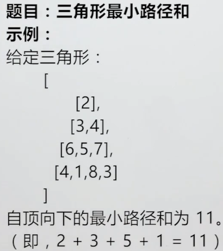
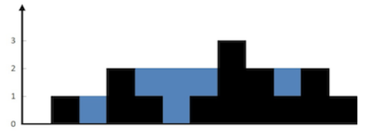
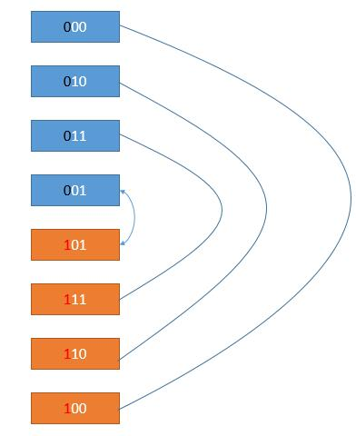

## 动态规划

递归和动态规划的特点都是，将大问题化成小问题去求解，只不过动态规划会存储中间过程的结果（类似于缓存了结果的递归），因此避免了很多的重复计算，时间复杂度往往会更小。

### 目录

**[概念](#概念)**

**[斐波那契数列](#斐波那契数列)**

- [爬楼梯](#爬楼梯)
- [强盗抢劫](#强盗抢劫)
- [强盗抢劫-环形街区](#强盗抢劫-环形街区)
- [母牛生产](#母牛生产)

**[矩阵路径](#矩阵路径)**

- [矩阵的最小路径和](#矩阵的最小路径和)
- [矩阵的总路径数](#矩阵的总路径数)

**[简单DP](#简单DP)**

- [分割整数的最大乘积](#分割整数的最大乘积)
- [按平方数分割整数](#按平方数分割整数)
- [n个骰子所有和的次数统计](#n个骰子所有和的次数统计)
- [三角形二叉树的最小路径](#三角形二叉树的最小路径)
- [接雨水](#接雨水)

**[子数组](#子数组)**

- [等差递增子数组个数](#等差递增子数组个数)
- [子数组的最大乘积](#子数组的最大乘积)

**[最长子序列](#最长子序列)**

- [最长递增子序列](#最长递增子序列)
- [最长摆动子序列](#最长摆动子序列)

**[双序列问题](#双序列问题)**

- [最长公共子序列](#最长公共子序列)

- [删除两个字符串的字符使它们相等](#删除两个字符串的字符使它们相等)
- [最长公共子串](#最长公共子串)
- [编辑字符串使它们相等](#编辑字符串使它们相等)

**[其它](#其它)**

- [鸡蛋掉落判断碎蛋层高](#鸡蛋掉落判断碎蛋层高)
- [数字字母解码](#数字字母解码)
- [格雷码](#格雷码)

**[经典DP](#经典DP)**

* [股票交易问题](#股票交易问题)
* [背包问题](#背包问题)


---

### 概念

[目录](#目录)

**什么样的题目适合使用动态规划？**

一般是以下三种，因为DP一般就求一个结果值。

- 最大值/最小值
- 是否可行
- 方案总数

**动态规划的一般步骤**

- 确定dp[i]或`dp[i][j]`代表的含义(基础一步, dp含义弄错了不利于得到它的递推式)
- 根据dp表示的含义, 得到它的递推式(关键, 也是最难的一步)，检查不同方式得到的递推式右边值，对整体结果会不会有影响(检查后效性)
- 弄清楚题目要求的结果怎么由dp得到(动手之前需要思考的问题, 结果不一定是dp[0]或`dp[n1][n2]`)
- dp的basecase有哪些, 必须确定好basecase, 才能使用递推式逐步得到结果的dp值

**无后效性**：如果给定某一阶段的状态，则在这一阶段以后过程的发展不受这阶段以前各段状态的影响。

比如dp[i] = dp[i - 1] + dp[i - 2]，意思就是确定了dp[i - 1]和dp[i - 2]后，就可以确定dp[i]，而dp[i-1] 和 dp[i-2]本身是由什么过程确定的，不会影响dp[i]的结果。

**最优子结构**：大问题的**最优解**可以由小问题的**最优解**推出，这个性质叫做“最优子结构性质”。


### 斐波那契数列

#### 爬楼梯

[70. Climbing Stairs(Easy)](https://leetcode.com/problems/climbing-stairs/description/)

[目录](#目录)

Q: 有N阶楼梯, 每次只能上一阶或两阶, 问一共有多少种走法?

A: 假设dp[i]表示上到第i阶的时候, 有dp[i]种走法, 那么可以得到递推公式:

`dp[i] = dp[i-1] + dp[i-2]`

即到达第i阶楼梯的时候, 可以是走一阶到达, 也可能是走两阶到达.dp[n]就是答案

```java
class Solution {
    public int climbStairs(int n) {
        if(n < 3){
            return n;
        }
        int[] dp = new int[n+1];
        dp[1] = 1;
        dp[2] = 2;
        for(int i=3; i<=n; i++){
            dp[i] = dp[i-1] + dp[i-2];
        }
        return dp[n];
    }
}
```

S: 以上初始化了一个长度为n+1长度的数组, 是为了将dp的下标i表示为楼梯的数量, 便于理解.

**优化空间复杂度**

从递推公式可以看出, 每个dp只依赖其前两个连续的值, 因此用两个变量即可存储前面的信息, 而不用数组. 因此可以将空间复杂度从O(N)优化到O(1)

````java
class Solution {
    public int climbStairs(int n) {
        if(n < 3){
            return n;
        }        
        int pre1 = 1;
        int pre2 = 2;
        int cur = 0;
        for(int i=3; i<=n; i++){
            cur = pre1 + pre2;
            pre1 = pre2;
            pre2 = cur;
        }
        return cur;
    }
}
````


#### 强盗抢劫

[198. House Rubber(Easy)](https://leetcode.com/problems/house-robber/description/)

[目录](#目录)

Q: 抢劫一排住户, 但是不能抢劫相邻住户, 已知住户数量为n, 和住户财产int数组nums, 求最大抢劫财产

A: 用dp[i]表示抢劫到第i住户时能获取的最大抢劫财产, 递推公式为

`dp[i] = max{dp[i-1], dp[i-2]+nums[i]}`

它要么是没抢劫第i家的财产dp[i-1], 要么是抢劫了第i家后的财产`dp[i-2]+nums[i]`。 答案为dp[n]

```java
class Solution {
    public int rob(int[] nums) {
        if(nums==null || nums.length==0){
            return 0;
        } else if(nums.length == 1){
            return nums[0];
        } else if(nums.length == 2){
            return Math.max(nums[0], nums[1]);
        }
        int pre1 = nums[0];
        int pre2 = Math.max(nums[0], nums[1]);
        int cur = 0;
        for(int i=2; i<nums.length; i++){ // 从第三家开始抢到第i家
            cur = Math.max(pre2, pre1+nums[i]);
            pre1 = pre2;
            pre2 = cur;
        }
        return cur;
    }
}
```


#### 强盗抢劫-环形街区

[213. House Robber II(Medium)](<https://leetcode.com/problems/house-robber-ii/description/>)

[目录](#目录)

Q: 用户不再是一排, 而是一个环, 即nums数组的最后一个元素和第一个元素是相邻的

A: 即最后一个住户为L, 第一个住户为F, L和F有三种可能: L被抢,F没被抢; L没被抢,F被抢; L和F都没被抢. 即它们之中至少一个没被抢, 假设L没被抢, 那么问题就相当于求`0~n-2`范围内的条形街区, 假设F没被抢,那么问题就相当于求`1~n-1`范围内的条形街区, 在两者之中取一个最大值即可.

````java
class Solution {
    public int rob(int[] nums) {
        if(nums==null || nums.length==0){
            return 0;
        }
        int n = nums.length;
        if(n == 1){
            return nums[0];
        }
        return Math.max(rob(nums, 0, n-2), rob(nums, 1, n-1));
    }
    private static int rob(int[] nums, int first, int last){
        int pre1 = 0;
        int pre2 = 0;        
        
        for(int i=first; i<=last; i++){
            int cur = Math.max(pre1, pre2+nums[i]);
            pre2 = pre1;
            pre1 = cur;
        }
        return pre1;
    }
}
````


#### 母牛生产

[目录](#目录)

Q: 已知有一头成熟母牛,每年都可以生一头小牛,小牛从出生那年开始算, 三年后开始也会每年生一头牛.求N年后有多少头牛

A：用dp[i]表示第i年牛的数量, 它的递推式为

`dp[i] = dp[i-1] dp[i-3]`

即今年牛的数量由去年"老牛" + 今年"新生牛"组成, 而今年所有"新生牛"的数量等于三年前所有牛的数量. (k年后开始生牛, 就是dp[i-k])

```java
public static int cowNumber(int n) {
    if (n < 4) {
        return n;
    }
    // 为了和年份保持一致,多取一位
    int[] dp = new int[n + 1];
    dp[1] = 1;
    dp[2] = 2;
    dp[3] = 3;
    for (int i = 4; i <= n; i++) {
        // 三年后开始生牛就是i-3
        dp[i] = dp[i - 1] + dp[i - 3];
    }
    return dp[n];
}
```


### 矩阵路径

#### 矩阵的最小路径和

[64. Minimum Path Sum(Medium)](https://leetcode.com/problems/minimum-path-sum/description/)

[目录](#目录)

Q：给一个二维数组grid, 一个点从左上角移动到右下角, 只能右移和下移, 求经过的最短路径和

A：`do[i][j]`表示grid的第i行第j列, 走到右下角的最短路径和. 它的递推公式为:

`dp[i][j] = Math.min(dp[i+1][j], dp[i][j+1]) + grid[i][j]`

即要么从下边走, 要么从右边走, 结果就是`dp[0][0]`, 需要从后往前求解. 而在最后一行或最后一列的元素都只有一种走法,因此`dp[n-1][j]和dp[i][n-1]`是可以求的已知条件

````java
class Solution {
    public int minPathSum(int[][] grid) {
        if(grid==null || grid.length==0 || grid[0]==null || grid[0].length==0){
            return 0;
        }
        int row = grid.length;
        int col = grid[0].length;
        if(row == 1){
            int res = 0;
            for(int i=0; i<col; i++){
                res += grid[0][i];
            }
            return res;
        }
        if(col == 1){
            int res = 0;
            for(int i=0; i<row; i++){
                res += grid[i][0];
            }
            return res;
        }        
        int[][] dp = new int[row][col];
        // 初始化:计算最后一行和最后一列的dp
        dp[row-1][col-1] = grid[row-1][col-1];
        for(int i=col-2; i>=0; i--){
            dp[row-1][i] = grid[row-1][i] + dp[row-1][i+1];
        }
        for(int i=row-2; i>=0; i--){
            dp[i][col-1] = grid[i][col-1] + dp[i+1][col-1]; 
        }
        // 递推关系式
        for(int i=row-2; i>=0; i--){
            for(int j=col-2; j>=0; j--){
                dp[i][j] = Math.min(dp[i+1][j], dp[i][j+1]) + grid[i][j];
            }
        }
        return dp[0][0];
    }
}
````

**空间复杂度优化**: 从递推公式可以看出, 当前的最优值取决于右边和下边, 而求二维dp时是求了一行, 再求上一行, 求每行时, 是从后往前求的. 所以可以将dp降为一维, 递推式变为:

`dp[j] = Math.min(dp[j], dp[j+1]) + grid[i][j]`

式中第一个dp[j]其实表示的是`dp[i-1][j]`, 即还没有更新的dp[j], 而dp[j+1]因为在求dp[j]之前已经求过了, 所以它表示的是`dp[i][j+1]`, 就这样实现了空间复杂度从二维到一维的降维. 这样做的本质是"覆盖式"存储, 每次存一个dp, 其实就丢掉了之前求出来但是对后面无帮助的dp.

````java
class Solution {
    public int minPathSum(int[][] grid) {
        if(grid==null || grid.length==0 || grid[0]==null || grid[0].length==0){
            return 0;
        }
        int row = grid.length;
        int col = grid[0].length;
        if(row == 1){
            int res = 0;
            for(int i=0; i<col; i++){
                res += grid[0][i];
            }
            return res;
        }
        if(col == 1){
            int res = 0;
            for(int i=0; i<row; i++){
                res += grid[i][0];
            }
            return res;
        }        
        int[] dp = new int[col];
        // 初始化    
        dp[col-1] = grid[row-1][col-1];
        for(int i=col-2; i>=0; i--){
            dp[i] = grid[row-1][i] + dp[i+1];
        }
        // 递推关系式
        for(int i=row-2; i>=0; i--){
            // dp的最后一列直接更新
            dp[col-1] += grid[i][col-1]; 
            for(int j=col-2; j>=0; j--){
                dp[j] = Math.min(dp[j], dp[j+1]) + grid[i][j];
            }
        }
        return dp[0];
    }
}
````


#### 矩阵的总路径数

[Unique Paths(Medium)](https://leetcode.com/problems/unique-paths/description/)

[目录](#目录)

Q: 统计从矩阵的左上角移动到右下角的可能路径总数, 要求只能往右移或下移. 并且矩阵中为非0值的位置不能走

A: 假设这个矩阵为MxN维度, 如果没有其他条件, 可以用排列组合来求, 即在M+N-2的总步数中, 选出M-1步往右走,即答案为C(M+N-2, M-1). 但是如果有其他条件, 比如矩阵中某些位置有"石头", 即不能通行. 此时用`dp[i][j]`表示从第i行j列走到右下角的可能路径总数.它的递推式为:

`dp[i][j] = dp[i][j+1] + dp[i+1][j] (grid[i][j]==0, 即当这个位置没有"石头"时)`
`dp[i][j] = 0 (grid[i][j]!=0, 即当这个位置有"石头"时,通过它不能走到右下角)`

````java
// 节省了空间复杂度
public static int pathNumberInMatrix(int[][] arr) {
    if (null == arr || null == arr[0] || arr[0].length == 0) {
        return 0;
    }
    int m = arr.length;
    int n = arr[0].length;
    int[] dp = new int[n];
    // 初始化最后一行的dp值
    dp[n - 1] = 1;
    for (int i = n - 2; i >= 0; i--) {
        dp[i] = arr[m - 1][i] != 0 ? 0 : dp[i + 1];
    }
    // 从倒数第二行开始遍历
    for (int i = m - 2; i >= 0; i--) {
        // 每一行的最后一列可以直接求
        dp[n - 1] =   arr[i][n - 1] != 0 ? 0 : dp[n - 1];
        for (int j = n - 2; j >= 0; j--) {
            dp[j] = arr[i][j] != 0 ? 0 : dp[j] + dp[j + 1];
        }
    }
    return dp[0];
}
````


### 简单DP

这类问题的规模分割思想比较直接，因此容易得出递推式。

#### 分割整数的最大乘积

[343. Integer Break(Medium)](https://leetcode.com/problems/integer-break/description/)

[目录](#目录)

Q: 给一个正整数n, 将其分割成若干个正整数的和, 求分割后若干个正整数的最大乘积. 如10 = 3+3+4, 最大乘积36

A: 假设dp[i]表示i被分割成若干个正整数后的最大乘积, 有以下递推式:

`dp[i] = Math.max(j*dp[i-j], j*(i-j)) (当i>j)`

对于每个i, j可以选`1~i-1`, 在这些dp中选取一个最大值, 即是要求值. 注意每个`j*dp[i-j]`都要和`j*(i-j)`比较取较大, 因为i可能就分割成 j 和 i-j, i-j 不再需要分割

```java
class Solution {
    public int integerBreak(int n) {
        if(n < 3){
            return 1;
        }
        int[] dp = new int[n+1];                
        for(int i=2; i<=n; i++){
            for(int j=1; j<i; j++){
                dp[i] = Math.max(dp[i], Math.max(j*dp[i-j], j*(i-j)));
            }
        }
        return dp[n];
    }
}
```


#### 按平方数分割整数

[279. Perfect Squares(Medium)](https://leetcode.com/problems/perfect-squares/description/)

Q: 将整数n分成若干个平方数的和, 求最小的分割数量. 如 13 = 4 + 9, 则最小分割数量为2

A: 用dp[i]表示i能被分成若干个平方数和的最小分割数量, 则有以下递推式:

`dp[i] = Math.min(dp[i], dp[i-j]+1) (j是不大于i的平方数)`

第二层循环开始遍历的地方从根号i + 1开始递减(而不是从n)，达到一定的剪枝效果。

```java
public int numSquares(int n) {
    if (1 == n) {
        return 1;
    }
    int[] dp = new int[n + 1];
    Arrays.fill(dp, Integer.MAX_VALUE);
    dp[1] = 1;
    for (int i = 2; i <= n; i++) {
        for (long j = (long)(Math.sqrt(i) + 1); j >= 1; j--) {
            long square = j * j;
            if (i > square) {
                // 当前要求的数比平方数大，可以尝试
                dp[i] = Math.min(dp[i], 1 + dp[(int) (i - square)]);
            } else if (i == square) {
                // 等于，直接找到break
                dp[i] = 1;
                break;
            }
        }
    }
    return dp[n];
}
```


#### n个骰子所有和的次数统计

[目录](#目录)

Q: 投n个骰子,每个骰子的点数为1~6,求它们和的所有可能性,以及每种可能发生的次数

A: 用`dp[i][j]`表示投i个骰子, 点数为j时的可能发生次数, 易知`i<=j<=6*i`, 且有以下递推式:

`dp[i][j] = sum{dp[i-1][j-k]} (k:1~6 但是要求i-1 <= j-k <= 6(i-1))`

即考虑最后一个骰子为k点, 则前面i-1个骰子的为j-k点时的所有可能结果, 都是满足`dp[i][j]`的.

```java
public static int[] getSumTimes(int n){
    if(n <= 0){
        return null;
    }
    // 骰子点数范围:n~6n,数组大点是为了保持索引和骰子数一致
    int[][] dp = new int[n+1][6*n+1]; 
    // base-case
    for(int i=1; i<=6*n; i++){ 
        dp[1][i] = 1;
    }
    for(int i=2; i<=n; i++){
        for(int j=i; j<=6*i; j++){
            for(int k=1; k<=6; k++){
                if(j-k < i-1 || j-k > 6*(i-1)){
                    break;
                }
                dp[i][j] += dp[i-1][j-k];
            }
        }
    }
    // 整理结果
    int[] res = new int[5*n+1]; 
    for(int i=n; i<=6*n; i++){
        res[i-n] = dp[n][i];
    }
    return res;
}
```

**优化空间复杂度**

从递推关系式可以知道,每个dp值只与它的上一维度dp值有关,而上面的dp求出了所有的维度.所以是O(N^2)
可以通过旋转二维数组,将其降低到O(N),即只用一个2*n的二维数组.其中一行存现在的数,另一行存上次的数,记得每次存现在的数时得清除上上次的数,不然可能会影响正确结果值

这里是使用旋转数组来优化空间复杂度, 用了两个一维数组, 其实用一个一维数组可以进一步减少空间的使用.即消除i这个维度, 每次求`dp[i][j]`时按j从大往小求, 因为`dp[i][j]`依赖的`dp[i-1][j-k]`, 所以从大往小求时, 一维的dp[j-k]其实是还没有更新的(相当于`dp[i-1][j-k]`), 而目前更新的dp[j]就覆盖了上一个dp[j], 相当于`dp[i][j]`

```java
public static int[] getSumTimes(int n){
    if(n <= 0){
        return null;
    }
	// 骰子点数范围:n~6n,数组大点是为了保持索引和骰子数一致
    int[][] dp = new int[2][6*n+1]; 
    // base-case
    for(int i=1; i<=6*n; i++){ 
        dp[0][i] = 1;
    }
    // 表示当前正在填充的数组维度
    int flag = 0; 
    for(int i=2; i<=n; i++){
        flag =  1 - flag; 
        for(int j=i; j<=6*i; j++){
            // 当前正在填充的数组先清零再填充,避免残留影响
            dp[flag][j] = 0; 
            for(int k=1; k<=6; k++){
                if(j-k < i-1 || j-k > 6*(i-1)){
                    break;
                }
                // flag 和 1-flag表示现在和上一次
                dp[flag][j] += dp[1-flag][j-k]; 
            }
        }
    }
    int[] res = new int[5*n+1]; 
    for(int i=n; i<=6*n; i++){
        res[i-n] = dp[flag][i];
    }
    return res;
}
```


#### 三角形二叉树的最小路径

[120. Triangle](https://leetcode.com/problems/triangle/)

[目录](#目录)

Q：给一个二维数组arr，可以认为其是一个满二叉树构成的数组(无对应节点的位置值为0)，求从“满二叉树”的头节点遍历到叶节点的所有路径中，路径和的最小值。如图，6和5就是3能走的两个路径，5和7是4能做走的两个路径。



A1：`dp[i][j]`表示从二叉树头节点到(i,j)位置处的最小路径和, 可以得到它的递推式为:对最终的`dp[n][j]`求最小值, 即是结果

```
dp[i][j] = Math.min(dp[i-1,j-1], dp[i-1][j]) + arr[i][j]; (i>=1,j>=1)
```

```java
public static int minPathSumOfArrayBT(int[] arr) {
    if (null == arr || arr.length == 0) {
        return 0;
    }
    int row = arr.length;
    // 最大的列数,即最后一行的列数
    int maxCol =  arr[row - 1].length;
    int[][] dp = new int[row][maxCol];
    // dp的basecase:所有行的第一列,它们的路径和只有一种情况
    // 所有行的最后一列,它们的路径和也只有一种情况
    dp[0][0] = arr[0][0];
    for (int i = 1; i < row; i++) {
        // 当前行的列长度
        int curCol = arr[i].length;
        dp[i][0] = dp[i - 1][0] + arr[i][0];
        dp[i][curCol - 1] = dp[i - 1][curCol - 2] + arr[i][curCol - 1];
    }    
    for (int i = 1; i < row; i++) {
        int curCol = arr[i].length;
        // 为了先检查后循环,使用while而不是for
        int j  = 1;
        while (j < curCol - 1) {
            dp[i][j] = Math.min(dp[i - 1][j - 1], dp[i - 1][j]) + arr[i][j];
        }
    }
    // 获取结果
    int minPah = Integer.MAX_VALUE;
    for (int i = 0; i < maxCol; i++) {
        minPath = Math.min(minPath, dp[row - 1][i]);
    }
    return minPath;
}
```


#### 接雨水

[42.接雨水](https://leetcode-cn.com/problems/trapping-rain-water/)

[目录](#目录)

Q：给定 *n* 个非负整数表示每个宽度为 1 的柱子的高度图，计算按此排列的柱子，下雨之后能接多少雨水。



上面是由数组 [0,1,0,2,1,0,1,3,2,1,2,1] 表示的高度图，在这种情况下，可以接 6 个单位的雨水（蓝色部分表示雨水）

A：范围查询是容易遗漏和重复的，按列求解可以避免这个问题。遍历每一列，找到这一列左边最高的柱子和右边最高的柱子，左右两边最高柱子的较小值如果大于当前遍历的柱子，则当前柱子会接雨水，量就是左右两边最高柱子较小值 - 当前柱子高。

如果每次遍历到 i，都需要往左和往右再遍历一次，求左右两边的最大值，时间复杂度就是O(N^2)，这里可以使用dp首先将每个位置处左右两边的最大值求出来，然后再遍历。

假设maxLeft[i]代表 i 左边(不包括 i )的柱子的最大值，maxRight[i] 代表 i 右边(不包括 i )的柱子的最大值。则有以下递推式：由此优化时间复杂度为O(N)

```
maxLeft[i] = Math.max(maxLeft[i - 1], height[i - 1]);
maxRight[i] = Math.max(maxRight[i + 1], height[i + 1]);
```

```java
public int trap(int[] height) {
    if (height.length < 2) {
        return 0;
    }
    // 先求maxLeft和maxRight数组，因为最左和最右不会积水，所以不算最左最右
    int[] maxLeft = new int[height.length];
    int[] maxRight = new int[height.length];
    for (int i = 1; i < maxLeft.length - 1; i++) {
        maxLeft[i] = Math.max(maxLeft[i - 1], height[i - 1]);
    }
    for (int i = maxRight.length - 2; i > 0; i--) {
        maxRight[i] = Math.max(maxRight[i + 1], height[i + 1]);
    }
    int res = 0;
    for (int i = 1; i < height.length - 1; i++) {
        if (maxLeft[i] > height[i] && maxRight[i] > height[i]) {
            // 左右两边最高的柱子都得高于当前柱子，当前柱子才能积水
            res += Math.min(maxLeft[i], maxRight[i]) - height[i];
        }
    }
    return res;
}
```


### 子数组

#### 等差递增子数组个数

[413. Arithmetic Slices(Medium)](https://leetcode.com/problems/arithmetic-slices/description/)

[目录](#目录)

Q: 给一个int数组, 如果其某个子数组完全成等差数列, 称为一个等差递增子区间, 求这样的区间个数

A: dp[i]表示以第i个数结尾的递增子区间, dp[i]中所有的子区间必须满足`A[i] - A[i-1] = A[i-1] - A[i-2]`, 如果不满足, 则表明dp[i]=0, 因此dp[i]的递推关系式为:

`dp[i] = dp[i-1] + 1 (当满足A[i] - A[i-1] = A[i-1] - A[i-2])`
`dp[i] = 0 (当不满足)`

因为满足时, 所有的dp[i-1]子区间再连上一个A[i]即满足dp[i]的要求, 还会新增一个子区间:`A[i-2] A[i-1] A[i]`. 因此有上面递推式. 所有等差的递增子区间是所有dp[i]的和

此题特点是, dp[i]并不是题目的最终结果, 而是所有的dp[i]和才是结果. dp[i]的优势是用这个概念, 非常容量理解和求解以arr[i]结尾的等差递增子数组个数

```java
public static int equalDiffUpSubarrayNumber(int[] arr) {
    if (null == arr || arr.length < 3) {
        return 0;
    }
    // 优化空间复杂度,不必要使用dp数组
    int last = 0;
    int cur;
    int res = 0;
    for (int i = 2; i < arr.length; i++) {
        cur = arr[i] - arr[i - 1] == arr[i - 1] - arr[i - 2] ? last + 1 : 0;
        res += cur;
    }
    return res;
}
```


#### 子数组的最大乘积

[152.子数组的最大乘积](https://leetcode-cn.com/problems/maximum-product-subarray/)

[目录](#目录)

Q：给一个数组arr(可能包含正数负数0),求arr的最大子数组乘积

A：使用max/min表示包含当前元素的最大/最小乘积，当前元素的符号影响max/min的更新，值得注意的是，当前元素<0时，max/min更新的递推式如下：

```java
int temp = max;
max = Math.max(min * nums[i], nums[i]);
min = Math.min(temp * nums[i], nums[i]);
```

需要注意因为min在更新时用到max的旧值，所以需要用temp先缓存max。

另外需要注意的是，max和min更新不是和它们自己比较，因为max/min的含义是**包含当前元素**的最大乘积，所以是与num[i]比较

```java
public int maxProduct(int[] nums) {
    if (nums.length == 1) {
        return nums[0];
    }
    int res = nums[0];
    int max = nums[0];
    int min = nums[0];
    for (int i = 1; i < nums.length; i++) {
        // 记录以i结尾的子数组的最大和最小乘积
        // 以i结尾保证了往后遍历时，也是连续的子数组
        if (nums[i] >= 0) {
            max = Math.max(max * nums[i], nums[i]);
            min = Math.min(min * nums[i], nums[i]);
        } else {
            int temp = max;
            max = Math.max(min * nums[i], nums[i]);
            min = Math.min(temp * nums[i], nums[i]);
        }
        res = Math.max(res, max);
    }
    return res;
}
```


### 最长子序列

数组的子数组或区间要求它们在原数组中也是连续的, 而子序列只要求它们在原数组的相对前后顺序是一样的即可, 不要求连续.

#### 最长递增子序列

[300. Longest Increasing Subsequence(Medium)](https://leetcode.com/problems/longest-increasing-subsequence/description/)

[目录](#目录)

Q: 给定一个数组nums, 求其最长的递增子序列

A: 假设dp[i]表示以第i个元素结尾的最长递增子序列的长度, 则有以下递推式:

`dp[i] = Math.max(1, dp[j] + 1) (当j<i, 且nums[j]<nums[i])`

因为对于i前面所有结尾元素的最长递增子序列, 只要nums[i]大于它们, nums[i]就可以在子序列尾部结上, 即长度+1. 最终的最长递增子序列不一定是dp[n-1], 而是所有的dp中的最大值

````java
class Solution {
    public int lengthOfLIS(int[] nums) {
        if(nums==null || nums.length==0){
            return 0;
        }
        int n = nums.length;
        int res = 1;
        int[] dp = new int[n];
        for(int i=0; i<n; i++){
            dp[i] = 1;
            for(int j=0; j<i; j++){
                if(nums[i] > nums[j]){
                    dp[i] = Math.max(dp[i], dp[j]+1);
                }
            }
            res = Math.max(dp[i], res);
        }
        return res;
    }
}
````


#### 最长摆动子序列

[376. Wiggle Subsequence(Medium)](https://leetcode.com/problems/wiggle-subsequence/description/)

[目录](#目录)

Q: 给一个数组nums, 求它的最长摆动子序列长度. 最长摆动子序列中没有连续的三个元素组成单调区间.

```
Input: [1,17,5,10,13,15,10,5,16,8]
Output: 7
There are several subsequences that achieve this length. One is [1,17,10,13,10,16,8].
```

A: 用up和down分别表示上一个最长摆动子序列最后为增时的长度 和 为减时的长度, 那么遍历到当前元素, 如果当前元素相比前一个元素为增, 那么up = down + 1, 反之, down = up + 1.

```java
class Solution {
    public int wiggleMaxLength(int[] nums) {
        if(nums==null || nums.length==0){
            return 0;
        }
        int up = 1;
        int down = 1;
        for(int i=1; i<nums.length; i++){
            if(nums[i] > nums[i-1]){
                up = down + 1;
            }
            if(nums[i] < nums[i-1]){
                down = up + 1;
            }
        }
        return Math.max(up, down);
    }
}
```


### 双序列问题

#### 最长公共子序列

[目录](#目录)

Q: 给两个数组num1和num2, 求它们的最长公共子序列

A1: 假设`dp[i][j]`表示num1第i个以前的元素 和 num2第j个以前的元素构成的最长公共子序列.  则它们有以下递推关系式:

```
dp[i][j] = dp[i-1][j-1] + 1 (当num1[i] == num2[j])
dp[i][j] = Math.max(dp[i-1][j], dp[i][j-1]) (当 num1[i] != num2[j])
```

因为当`num1[i] == num2[j]`时, 两者的最后一个元素都为最长公共子序列做了一个贡献, 反之, 则两者的最后一个元素至少有一个元素没有对最长公共子序列做贡献

```java
public int lengthOfLCS(int[] nums1, int[] nums2) {
    int n1 = nums1.length, n2 = nums2.length;
    int[][] dp = new int[n1 + 1][n2 + 1]; 
    for (int i = 1; i <= n1; i++) {
        for (int j = 1; j <= n2; j++) {
            if (nums1[i - 1] == nums2[j - 1]) {
                dp[i][j] = dp[i - 1][j - 1] + 1;
            } else {
                dp[i][j] = Math.max(dp[i - 1][j], dp[i][j - 1]);
            }
        }
    }
    return dp[n1][n2];
}
```


#### 删除两个字符串的字符使它们相等

[583. Delete Operation for Two Strings](https://leetcode.com/problems/delete-operation-for-two-strings/description/)

[目录](#目录)

Q: 给两个字符串word1和word2, 删除这两个字符串中的某些字符, 使这两个字符串相等. 求最少删除的字符个数

```
Input: "sea", "eat"
Output: 2
Explanation: You need one step to make "sea" to "ea" and another step to make "eat" to "ea".
```

A: 本质就是求两个字符串的[最长公共子序列](#最长公共子序列), 然后用两个字符串总字符数减去2倍的最长公共子序列长度即可

````java
class Solution {
    public int minDistance(String word1, String word2) {
        if(word1.length()==0 || word2.length()==0){
            return word1.length()==0 ? word2.length() : word1.length();
        }
        int n1 = word1.length();
        int n2 = word2.length();
        int[][] dp = new int[n1+1][n2+1];
            for(int j=1; j<=n2; j++){
                if(word1.charAt(i-1) == word2.charAt(j-1)){
                    dp[i][j] = dp[i-1][j-1] + 1;
                } else {
                    dp[i][j] = Math.max(dp[i][j-1], dp[i-1][j]);
                }
            }
        }
        return n1 + n2 - 2*dp[n1][n2];
     }
}
````


#### 最长公共子串

[目录](#目录)

Q：求两个字符串的最长公共子串

A：也使用`dp[i][j]`表示以 i 和 j 结尾的最长公共子串，由于子串不同于子序列，子串必须包含num1[i] num2[i]，而子序列可以不包含。所以它们的递推式有变化：

```
dp[i][j] = dp[i-1][j-1] + 1 (当num1[i] == num2[j])
dp[i][j] = 0 (当 num1[i] != num2[j])
```

它们不相等时，以它们结尾且相等的子串自然不存在了。另外，显然答案也不再是`dp[m][n]`，而是所有`dp[i][j]`的最大值


#### 编辑字符串使它们相等

[72. Edit Distance](https://leetcode.com/problems/edit-distance/description/)

[目录](#目录)

Q: 给两个字符串word1和word2, 编辑word1, 使其等于word2, 求最少编辑次数. 允许的编辑有插入/删除/替换, 每种编辑都增加一次编辑次数

```
Input: word1 = "intention", word2 = "execution"
Output: 5
Explanation:
intention -> inention (remove 't')
inention -> enention (replace 'i' with 'e')
enention -> exention (replace 'n' with 'x')
exention -> exection (replace 'n' with 'c')
exection -> execution (insert 'u')
```

A: 用`dp[i][j]`表示使word1前i个字符串等于word2前j个字符串的最少编辑次数. 则有以下递推关系式:

```
dp[i][j] = dp[i-1][j-1] (当word1[i-1] == word2[j-1])
dp[i][j] = min(dp[i-1][j-1], dp[i-1][j], dp[i][j-1]) + 1 (当word1[i-1] != word2[j-1])
```

因为当`word1[i-1] == word2[j-1]`时, 相当于word1的第i个字符和word2的第j个字符不用编辑; 而当它们不等时, 编辑的方式有三种:插入/删除/替换. 插入后,可以不再关注word2第j个字符, 即`dp[i][j-1]`, 删除后, 可以不再关注word1的第i个字符, 即`dp[i-1][j]` 替换后, word1的第i个字符和word2的第j个字符都不用关注, 即`dp[i-1][j-1]`. 取最小的编辑方式即为最优.

注意, 插入/删除/替换都是在编辑word1. 最终结果是`dp[n1][n2]`, 讨论操作时只是记录它的次数, 并不影响字符串本身.

````java
class Solution {
    public int minDistance(String word1, String word2) {
        if(word1.length()==0 || word2.length()==0){
            return word1.length()==0 ? word2.length() : word1.length();
        }
        int n1 = word1.length();
        int n2 = word2.length();
        int[][] dp = new int[n1+1][n2+1];
        // basecase:当word1或word2是空字符串时,操作的次数就是另一个字符串的长度
        for(int i=1; i<=n2; i++){ 
            dp[0][i] = i;
        }
        for(int i=1; i<=n1; i++){
            dp[i][0] = i;
        }
        for(int i=1; i<=n1; i++){
            for(int j=1; j<=n2; j++){
                if(word1.charAt(i-1) == word2.charAt(j-1)){
                    dp[i][j] = dp[i-1][j-1];
                } else {
                    dp[i][j] = Math.min(dp[i-1][j-1], Math.min(dp[i-1][j], dp[i][j-1])) + 1;
                }
            }
        }
        return dp[n1][n2];
    }
}
````


### 其它

#### 鸡蛋掉落判断碎蛋层高

[目录](#目录)

Q: 有一栋N层高的建筑, 存在楼层 F , 满足 0 <= F <= N 任何从高于 F 的楼层落下的鸡蛋都会碎，从 F 楼层或比它低的楼层落下的鸡蛋都不会碎。无论F值为多少, 给定k个鸡蛋, 判断N层高建筑的碎蛋层高F的最少扔蛋次数是多少?

A: 假设dp[i,j]表示有i个蛋, 对于j层高建筑F值判断的最小扔蛋次数, 则有以下递推式:

`dp[i][j] = min(max(dp[i-1][k-1], dp[i][j-k]) + 1) (其中k < j)`

在第k层扔蛋, 如果蛋碎, 那么蛋的数量变成i-1, 并且需要判断的楼层高度变为k-1, 即还需`dp[i-1][k-1]`次扔蛋; 但是如果蛋没碎, 那么蛋的数量仍然是i, 需要判断的层高变为n-k, 即还需`dp[i][n-k]`次扔蛋. 这两种情况都有可能发生, 取决于F的取值, 而F是可以任意取值的, 所以这两种情况要取较大值. 而第一次在哪一层扔蛋, 这个是可以自己选择的, 所以在所有`k<j`的dp结果取值里, 要取最小值, 才是最优解.

````java
public static int judgeFloorHeightByEgg(int k, int n){
    // basecase
    if(k==1 || n==1){
        return k==1 ? n : 1;
    }
    // 如果鸡蛋足够多,二分的步骤是最少的
    if((1<<k) > n){ 
        int res = 0;
        while(n != 0){
            n = n >> 1;
            res++;
        }
        return res;
    }   
    int[][] dp = new int[k+1][n+1];
    // dp的basecase:只有1个鸡蛋
    for(int i=1; i<=n; i++){ 
        dp[1][i] = i;
    }
    // dp的basecase:只有1层
    for(int i=1; i<=k; i++){ 
        dp[i][1] = 1;
    }
    for(int i=2; i<=k; i++){
        for(int j=2; j<=n; j++){
            for(int m=1; m<j; m++){
                dp[i][j] = Math.min(dp[i][j], Math.max(dp[i-1][m-1], dp[i][j-m])) +1;
            }
        }
    }
}
````


#### 数字字母解码

[91.数字字母解码](https://leetcode-cn.com/problems/decode-ways/)

[目录](目录)

Q：用1~26表示A-Z，给一个非空数字字符串，问可以构成多少种字母?

A：难点在于dp状态的选取：dp[i]表示以第i个数字结尾时，能构成的最多字母组合数量。第i个数字在结果的字母组合中只有两种情况：1.单独成为一个字母，它的种类为dp[i-1]个；2.和第i-1个数字组合成为一个字母，它的种类为dp[i-2]个。因此递推式为：

```
dp[i] = dp[i-1](当第i个数字可以单独构成一个字母时) + dp[i-2](当第i个数字和第i-1个数字能够一起构成一个字母时)
```

另外，由于 i=1 和 i=2 是特殊情况，需要单独求，求起来要考虑的情况有很多

```java
public int numDecodings(String s) {
    if (s.length() == 1) {
        // 长度为1的特殊情况
        return judgeWhen1(s);
    } else if (s.length() == 2) {
        // 长度为2的特殊情况
        return judgeWhen2(s);
    }
    int[] dp = new int[s.length()];
    dp[0] = judgeWhen1(s);
    dp[1] = judgeWhen2(s);
    for (int i = 2; i < s.length(); i++) {
        if (isValid(s.charAt(i))) {
            // 如果第i个数字可以得到一个字母
            dp[i] += dp[i - 1];
        }
        if (isValid(s.charAt(i - 1), s.charAt(i))) {
            // 如果第i个数字和第i-1个数字一起也可以得到一个字母
            dp[i] += dp[i - 2];
        }
    }
    return dp[s.length() - 1];
}

private int judgeWhen1(String s) {
    char zero = s.charAt(0);
    boolean flag = zero > '0' && zero <= '9';
    return flag ? 1 : 0;
}

private int judgeWhen2(String s) {
    char zero = s.charAt(0);
    if (zero == '0') {
        return 0;
    } else {
        int num = Integer.parseInt(s.substring(0, 2));
        if (num == 10 || num == 20) {
            return 1;
        } else if (num > 10 && num < 27) {
            return 2;
        } else if (num % 10 == 0) {
            return 0;
        } else {
            return 1;
        }
    }
}

private boolean isValid(char cur) {
    if (cur > '0' && cur <= '9') {
        return true;
    } else {
        return false;
    }
}

private boolean isValid(char last, char next) {
    if (last == '1' || (last == '2' && next < '7')) {
        return true;
    } else {
        return false;
    }
}
```


#### 格雷码

[89.格雷码](https://leetcode-cn.com/problems/gray-code/)

[目录](#目录)

Q：格雷编码是一个二进制数字系统，在该系统中，两个连续的数值仅有一个位数的差异。

给定一个代表编码总位数的非负整数 n，打印其格雷编码序列。格雷编码序列必须以 0 开头。

**示例**

```
输入: 2
输出: [0,1,3,2]
解释:
00 - 0
01 - 1
11 - 3
10 - 2

对于给定的 n，其格雷编码序列并不唯一。
例如，[0,2,3,1] 也是一个有效的格雷编码序列。

00 - 0
10 - 2
11 - 3
01 - 1
```

A：对于n，它的格雷码有`2^n`种，对于n+1的格雷码，是`2^(n+1)`种，多的2倍就是在最高位0或1，最高位填0时，格雷码的值和n的格雷码是完全一样的，最高位填1时，值多了`2^n`，且要倒序排，才满足格雷码的要求。比如利用n=2求n=3的格雷码如下图



所以递推式为：

```
when个数少于dp[n-1]时：dp[i] = dp[i-1]
when个数大于dp[n-1]时：dp[i] = dp[2^n - i] + 2 ^ n
```

```java
public List<Integer> grayCode(int n) {
    List<Integer> res = new ArrayList<>();
    res.add(0);
    int index = 1;
    while (index <= n) {
        List<Integer> temp = new ArrayList<>(res);
        int add = 1 << (index - 1);
        // 多一倍的数就是倒序+add
        while (temp.size() > 0) {
            res.add(add + temp.remove(temp.size() - 1));
        }
        index++;
    }
    return res;
}
```


### 股票交易问题

[目录](#目录)

[股票交易问题](../2经典题型/0股票交易问题.md)


### 背包问题

[目录](#目录)

[背包问题](../2经典题型/1背包问题.md)