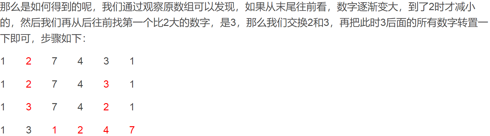

## 位运算

### 整数二进制有多少1 &

Q: 如3的二进制是11,有两个1

```
A1:如果不考虑负数,每次将这个数与1做&运算,就能知道这个数最右边是不是1.然后将这个数右移一位,直到为0
A2:负数右移时左边会填充1,所以可以每次将1左移1位.
A3:最优解.利用n = n&(n-1)去掉了n中最右侧的一个1.看这个运算能做多少次即可
A3的解法保证了n中有几个1,就执行多少步,时间复杂度最优
```

```
运用n = n&(n-1)还能做很多类似的题目
比如Q2:判断一个数是不是2的整数次方(二进制只有一个1)
	比较两个数m和n的二进制有多少位是不同的(统计m^n的二进制1的个数)
```

### 数组中只出现一次的数 ^

Q:数组中有两个数只出现一次,其他数都出现两次,求这两个数.如{11,22,22,33,44,44}中11和33只出现一次

````
如果求数组中一个只出现一次的数,可以将数组中所有数做异或,因为两个相同的数异或结果为0,0和任意数异或为本身,所以异或结果就是这个不同的数.
求两个不同的数,关键在于将这个数组分成两组,如果每组中只包含一个不同的数,那么就相当于把问题转换了.既然要把这两个数分到不同的组里,就要用他们不同的标准.它们肯定是不同的数,所以它们的二进制数从某一位开始一定是不同的,分析整个数组异或结果,找到第一个二进制位为1即为这两个数的不同位.根据二进制的不同位,将数组分为两组,再分别做异或运算,得出来的结果就是这两个数.
````

```
判断两个不同的数异或结果的二进制中,第一个1出现的位置.假如num的第一个1出现在第n位,那么
	num & (1<<(n-1)) == 1; 而不是  num & (1<<n) == 1;
```

### 不用加减乘除做加法

Q:给两个数字a,b.不用加减乘除得出a+b的结果

```
数字运算除了四则运算就剩下位运算.用位运算模拟加法的过程:
1.模拟两个数不管进位的加法: sum = a^b;
2.获取两个数相加的进位: carry = (a&b) << 1;
3.将sum和carry相加(重复1和2的步骤,直至没有进位)
```

````java
public static int imitatePlusByBinary(int a, int b){
    
    int sum = a ^ b;
    int carry = (a&b) << 1;
    while(carry != 0){
        int temp = sum;
        sum = sum^carry;
        carry = (temp&carry) << 1;
    }
    
    return sum;
}
````


## 字符串

### 正则表达式匹配

Q:给定字符串str和exp,str中不包含'.'和'*',exp中可能包含'.'和' *', 其中'.'可以匹配一个任意数量的字符,' X *'可以匹配0个或若干个X. *不能是exp的首字符,也不能有连续的两个 *. 给定str和exp,判断exp是否能匹配str

如: .*可以匹配任意字符串 `.a *`可以匹配至少含有一个字符的任意字符串

````
// 代码思想和书写技巧
递归方法,核心判断条件  ei位置后面是不是'*'!!!
如果不是 或 后面已经没有了: 那么必须让当前si位置能和ei位置匹配上,才能si++,ei++, 继续判断
	即满足这样的情况,就会提供一个返回值(base-case 或 递归)
如果是: 那么要考虑到这个*匹配的数量,取决于si和ei位置是否匹配,如果匹配就是一种可能:递归
	但是这个*匹配的所有可能如果一个true都没有,那只能继续往下:si跳到第一个和ei不匹配的位置,ei跳过这个*
	重新开始匹配. 可以注意到,递归时不用考虑太复杂的情况:*后是什么情况放到当前*匹配失败的下一次递归
	
第二种情况如下图:part1和part2匹配有5种可能:0~4个A都有可能
	part1中0个A和part2匹配, part1中从第一个A开始 与 part2后面的匹配 (1)
	part1中1个A和part2匹配, part1中从第二个A开始 与 part2后面的匹配
	part1中2个A和part2匹配, part1中从第三个A开始 与 part2后面的匹配
	part1中3个A和part2匹配, part1中从第四个A开始 与 part2后面的匹配
	part1中4个A和part2匹配, part1后从B开始 与 part2后面的匹配 (5)
````


```
// 动态规划思想
从这个递归中可以看到,其依赖与process(str, exp, si+1, ei+1) 和 process(str, exp, si, ei+2)
即以si和ei做一个二维结果表,(0,0)点是要求的结果点,其中所有的点都依赖于右下方的结果点
所以利用base-case从右下方开始求起,逐渐求到(0,0),就是一个动态规划
```

`````java
class Solution {
    public boolean isMatch(String s, String p) {
        if(s == null || p == null){
            return false;
        } 

        return process(s, p, 0, 0);
    }

    public static boolean process(String str, String exp, int si, int ei){
        if(ei == exp.length()){
            return si == str.length();
        }

        // ei位置没有后一个元素 或 后一个元素不是 '*'
        if(ei+1 == exp.length() || exp.charAt(ei+1) != '*'){ 
            return si != str.length() && (str.charAt(si)==exp.charAt(ei) || exp.charAt(ei)=='.') && process(str, exp, si+1, ei+1);
        }

        // 继续执行,表明ei位置不是最后一个元素 且 ei+1的位置是'*'
        // 然后根据str和exp的元素决定它能有多少种匹配可能
        while(si != str.length() && (str.charAt(si) == exp.charAt(ei) || exp.charAt(ei)=='.')){
            if(process(str, exp, si, ei+2)){
                return true;
            }
            si++;
        }

        // 走到这里说明*匹配的所有可能都失败了,这里包含了多种可能:
        // 1.ei+1位置是'*',但是ei位置的字符和si位置的字符不匹配,即这个*匹配数量为0
        // 2.ei+1位置是'*',将si位置开始所有与ei位置相等的值都匹配了,即这个*匹配数量达到了最大值
        // 3.si位置已经到了str.length(),但是因为ei一直是X*的模式,所以可以继续到这里
        return process(str, exp, si, ei+2); 

    }
}
`````

### 打印九宫格数字匹配的所有字符串

Q:给定一个字符串str,每个字符范围是'2'~'9',打印整个字符串所有可能匹配的字母组合

Example:

```
Input: "23"
Output: ["ad", "ae", "af", "bd", "be", "bf", "cd", "ce", "cf"].
```


`````
题目本身很简单,就是考察递归的写法.每个字符数字有3或4个选择的字母可以匹配,每个字符第一个可以匹配的字母由offset决定.(8对应了4个字母)
`````

`````java
class Solution {
    public List<String> letterCombinations(String digits) {
        
        List<String> list = new ArrayList<>();
        if(digits == null || digits.length() == 0){
            return list;
        }
        
        char[] charArr = new char[digits.length()];        
        process(0, charArr, digits, list);
        
        return list;
    }
    
    public static void process(int p, char[] charArr, String str, List<String> list){
        if(p == str.length()){
            list.add(new String(charArr));
            return;
        }
        
        int offset = str.charAt(p) >= '8' ? 1 : 0;
        int n = str.charAt(p) == '7' || str.charAt(p) == '9' ? 4 : 3;
        
        for(int i = 0; i < n; i++){
            charArr[p] = (char)((str.charAt(p)-'2')*3 + 'a' + i + offset);
            process(p+1, charArr, str, list);
        }      
    }
}
`````


## 数组

### 旋转有序数组的最小值求解

Q:将有序数组前面0~i位移动到原数组的末尾,称为数组的旋转.给一个旋转数组,求其最小值

```
遍历的代价是O(N),整个数组虽然不严格有序,但是部分有序,也可以用二分法
原旋转数组的第一位left肯定大于等于最后一位right,取其中间一位mid,如果mid对应的值大于等于left,表明left~mid之间是升序,所以最小值应该在mid~right之间.
同理,如果mid<=right,表明最小值在left~mid之间.

注意,以上推理都是建立在left>=right的基础上.如果left<right,表明整个序列是升序的,此时左边left即是最小值.(特例:有序数组旋转0位)

特例:left=mid=right时:无法利用这种二分法判断,此时只能使用遍历
```

```
// 注意
前提条件:left>=right才能使用规则
特例:left=mid=right. 只能使用遍历. 灵活组合
```

###  象棋皇后问题

Q:国际围棋有8*8方格,现在有8个皇后,要求它们摆放在棋盘上,互不攻击(不在同一行,不在同一列,不在同一条对角线),一共有多少种摆法

```
这里有三个限制条件:不在同一行,不在同一列和不在同一条对角线上.不是做数学题,没必要把三个限制条件全部考虑上,那样就可以直接得出答案了.即先满足一定条件,求出一些可能性,再从这些可能性中去筛选.
首先,只有8行,所以它们必都不在同一行(每行有且只有1个).因此可以用一个数组a[8]来表示每行的列号(16个未知数,用8个未知数表示),将数组初始为0~7,也就满足了第二个不在同一列的条件.只要对数组进行组合,就可以得到满足两个条件的所有可能,在这些组合中排除不在同一对角线上的可能数即是答案.

// 根据坐标判断两个点是否在一条对角线上
两个点的横坐标差 是否等于 两个点的纵坐标差或它的相反数
```

#### 拓展问题

```
本质是一个数组的排序问题
Q1:给一个a[8]的数组,将其放在正方体的各个顶点上,每组对面的两组顶点和要相等.问有多少种可能的放置方式?
A1:问的方式很炫酷,其实就是数组排列方式,假设长方体八个顶点固定为a1,a2,...,a8.那么本质就是怎么把8个数往这8个位置上填充,使得满足a1+a2+a3+a4 =  a5+a6+a7+a8(还有两个等式代表两组对面),只用把每种组合验证是否满足这三个式子即可 
```

### 找出数组中出现超过一半的数

Q:给定一个数组,假定这个数组中某个数的出现次数超过了数组长度的一半,找出这个数

```
用partition过程将数组分成三部分,最中间的一个数必定是它O(N),但是这种方法需要改动原数组
还有一种不需要改数组数据的抵消法:用两个变量num和count分别记录上一次出现的数,以及出现的次数.遍历数组第一个数时num=该数,count=1,遍历到一个数时,相同则num不变,count+1,不同,则count-1,如果count=0,则下下次遍历时,num设为该数,count=1,重新开始.

这样遍历下来,最后的num肯定是要找的数,因为即使数组中只有两类数,超过一半的数的count肯定不会被抵消完
```

### 连续子数组的最大和

Q:给一个数组,有正有负,求连续子数组的最大和

```
区别于求连续子数组和为定值的最大长度.因为需要和为定值,所以所有子数组(i~j)和为定值都可以等效于(0~j)和(0~i-1)的子数组和差,因此只用算所有以0开始的子数组和.

本题如果只算以0开头的子数组和,是没有意义的,它对其他子数组和是不是最大值没有指导.
从0开始求和时,用一个max记录当前最大的和,如果max+当前数的值还不比当前数大,则重新从当前数开始计数,并更新max.如果max+当前数增大,则继续往前走并更新max.如果max+当前数减小,则不更新max,继续往前走.

以上是顺序思路,还可以从结果f(i)分析,即逆序思路(动态规划)
如果f(i-1)<0,则f(i) = arr[i];反之f(i) = f(i-1) + arr[i].是递归的思路,但是很容易写成循环的顺序代码
```

### 第1500个丑数

Q:若一个数的因子只含有2,3,5三类,则这个数为丑数,求从小到大排序的第1500个丑数

```
遍历,对每个数进行判断是不是丑数是最直观的判断,但是效率低,会对很多非丑数进行无效计算
用辅助空间存储已经知道的丑数,用来加速判断后面的丑数.这类因子题要抓住一点:
	所有的丑数,都是由已经产生的丑数乘以2,3或5得到
那如何将它们按顺序排序?假设当前已经产生了一部分有序丑数,最后一个为M.那么相当于从丑数数组中去算一下,哪个数乘以2或3或5是大于M的最小值,则是下一个丑数.
求新的丑数如果需要遍历就同样降低了效率,因此可以用三个指针p2,p3,p5分别表示当前位置数对应乘以2或3或5恰好大于丑数数组中最后一个数.这样每次取下一个丑数时,就是在这三个位置中选一个乘以各自因子的最小值,然后再对这三个位置进行更新.

用p2,p3,p5辅助跟踪下一个丑数,实现顺序找丑数.
```

### 数字在排序数组中出现的次数

Q:给一个排序数组,问其中某个数在数组中出现的次数

````
如果是基于这个数的左右边界拓展搜索,复杂度是O(N).
可以用二分法分别搜索这个数的左边界和右边界,复杂度是O(logN)
````

```java
// 二分时的区间选择
传统的二分法,每次比较后,无论往左还是往右,都会舍弃中间的mid,这样它的区域最后一定会缩小为1个.所以它return的条件可以选择当前空间为1个时
寻找有序数组中某个相同数的左边界时,每次二分可能会舍弃中间值,可能不会.因此它的区域可能缩小到2个后就不会再缩,导致栈溢出.因此它的return要考虑到最后区域有2个或1个时就可以简单比较return了
```

### 2sum:和为s的两个数字

Q:在递增排序的数组中找两个数,其和为s,并打印.如果有多对数字和为s,输出任意一对即可.

```
本题就是找两个数拼成s,传统的遍历法是固定一个数,再从左往右找数判断其和是否为s.
这样就没有使用数组有序这个条件,对于有序数组的拼凑问题,用双指针是个很好的选择

指针p1在0位置,指针p2在数组最后的位置,当两个数的和大于s,p2往左移,当两个数和小于s,p1往右移动.达到O(N)
```

### 3sum

Q:给定一个数组,在数组中找到三个数的和为0的所有组合(不重复)

````
利用2sum的双指针思想,固定一个数,这个问题就变成了2sum问题. 
首先,对数组进行排序,然后遍历数组,第i个数固定,双指针开始分别指向i+1和arr.length-1的位置.这就是2sum问题
保证没有遗漏:三个数和为0的所有组合中,要么包括arr[i],要么不包括arr[i]. 包括arr[i]的情况在固定arr[i]的时候求出了所有情况,不包括arr[i]的情况在不固定arr[i]的时候求出了所有情况.(因为双指针在固定值的后面)
保证没有重复:
	固定arr[i]求出了所有情况后,固定arr[i+1]时要检查arr[i+1]==arr[i]是否成立,如果成立,则继续往后走,直到arr[i+j]!=arr[i].因为固定arr[i]的所有情况在第一次固定它的时候已经求完了.
	双指针在移动时,也遵循上面的规律.比如目前的sum等于0,(p1,p2)是一对满足的情况,然后p1++,p2--. 同时要保证p1++后的位置和之前的位置值不相等,p2同理,不然就可能会输出重复的可能组合.
````

````java
class Solution {
    public List<List<Integer>> threeSum(int[] nums) {
        
        List<List<Integer>> res = new LinkedList<List<Integer>>();
        if(nums == null || nums.length < 3){
            return res;
        }
        
        Arrays.sort(nums);
        
        for(int i = 0; i < nums.length-2; i++){ 
            if(i > 0 && nums[i] == nums[i-1]){ // 不重复的第一个保障
                continue;
            }
            int p1 = i + 1;
            int p2 = nums.length-1;
            int sum;
            List<Integer> shot;
            while(p1 < p2){ 
                sum = nums[i] + nums[p1] + nums[p2]; 
                if(sum > 0){
                    p2--; // 不重复的第二个保障
                    while(p2 > p1 && nums[p2] == nums[p2+1]) {
                        p2--;
                    }
                } else if(sum < 0){
                    p1++;
                    while(p1 < p2 && nums[p1] == nums[p1-1]){
                        p1++;
                    }
                } else {
                    shot = new ArrayList<Integer>();
                    shot.add(nums[i]);
                    shot.add(nums[p1]);
                    shot.add(nums[p2]);
                    res.add(shot);
                    p1++;
                    p2--;
                    while(p1 < p2 && nums[p1] == nums[p1-1]){
                        p1++;
                    }   
                    while(p2 > p1 && nums[p2] == nums[p2+1]) {
                        p2--;
                    }                    
                }
            }
        }        
        
        return res;
    }

}
````


### 数组中重复的数字

Q:已知数组中的元素大小范围是0~n-1,求找出这个数组中任意一个重复的数字.

```
桶排序:提供一个n长度的数组cnt,遍历一次数组,遇到i,对应cnt[i]++.最后只用看cnt数组中是否存在大于1的数
	时复O(N) 空复O(N)
hashset:遍历数组,并作为key存入,重复时会知道
	时复O(N) 空复O(N)
```

```
时复O(N) 空复O(1)
桶排序的方法不仅是对数组进行查重,还实现了数组的排序,但是题目并不需要排序.因此可以不需要桶排序的额外数组空间
而是使用数组本身的空间:遍历数组到i位置,遇到m,如果m==i,继续往下遍历;反之查看m位置的数,如果m位置的数不等于m,就将i位置与m位置的数交换位置,如果等于m就找到了重复的数.
```

### 构建乘积数组

Q:给定一个数组A[0,1,2,..,n-1],请构建一个数组B[0,1,2,..,n-1],其中B元素B[i]=A[0] * A[1] * ... A[i-1] * A[i+1] * ... *A[n-1],不能使用除法

````
基于直观的实现是两层for循环,时复O(N^2),空复O(1)
可以将B[i]通式中A[0] * A[1] * ... A[i-1]看做一个序列,用数组C[i]=C[i-1] * A[i-1]可在O(N)下求得
A[i+1] * ... *A[n-1]同样可在O(N)下求得,D[i] = D[i+1] * A[i-1]
所以B[i] = C[i] * D[i]

扣一下CD的边界,并且求B时可以和求C或D在一个遍历中使用,总共时间2O(N),时复O(N).用空间换时间
````

### 数组构造MaxTree-单调栈

Q:给定一个数组,要求构建一棵MaxTree,即树的每个子树,它的父节点都比左右孩子大

A:策略很重要;找左右最近比自己大的数方法也很重要

`````
策略是,每个数找左右两边比自己大的最近的两个数,这两个数的较小值,作为自己的父.
这个策略能构成树要证明的两个问题:
	1.不会构成森林
	2.所有的节点最多有两个孩子(证明节点的右边最多只有一个孩子)

子问题:怎么在时复O(N)下,找到所有数左右两边最近比自己大的数?
用栈遍历一次数组即可.规则如下:栈从栈底到栈顶保证从大到小排列,当准备压栈的数比栈顶小时,直接压栈;比栈顶大时,此时栈顶的数就可以确定左边最近比它大的数就是栈顶的下面一个元素,右边最近比它大的数就是让它弹出的数.所以栈顶弹出,也确定了它的左右两边最近比它大的数.然后将这个数和新的栈顶比较,也是一样的规则.
遍历完后,栈内剩下的元素依次弹出.栈底是最大的数,是树root;其他每个元素的父都是它下面的那个元素
`````

#### 子问题:找出数组中每个数,左右两边比自己大(小)的最近的数

### 最长不重复的子字符串

Q:Given a string, find the length of the **longest substring**without repeating characters.

````
Example:
Input: "abcabcbb"
Output: 3 
Explanation: The answer is "abc", with the length of 3
````

```
思路:初始化p1,p2两个指针在0位置,p2指针不断++,并且每次将它的字符和位置作为一个<k,v>对,存进map,p1则在目前的位置和map.get(str.charAt(p2))中取最大值,这样避免了对p2字符出现位置的讨论,直接一次遍历,即可求解.
```

`````java
class Solution {
    public int lengthOfLongestSubstring(String s) {
        if(s == null || s.length() == 0){
            return 0;
        }     
        HashMap<Character,Integer> map = new HashMap<Character,Integer>();
        int p1 = 0;
        int p2 = 1;
        int max = 1;
        map.put(s.charAt(0),0);
        while(p2 < s.length()){
            p1 = Math.max(p1, map.get(s.charAt(p2))==null ? p1 : map.get(s.charAt(p2))+1); // 考虑一下空指针异常的问题
            map.put(s.charAt(p2),p2);
            max = Math.max(max, p2-p1+1);
            p2++;
        }
        return max;
    }
}
`````

### 两个有序数组的中位数

#### 子问题:两个有序数组第k小的数

要求主问题的时间复杂度是O(log(M+N)).假设在子问题解决的基础上,调用子问题的函数就可以解决主问题.

```
m = 数组1长度;
n = 数组2长度;
找第(m+n+1)/2 和 (m+n+2)/2 小的数,它们的平均数就是中位数.无论两个有序数组总长度是奇数还是偶数
```

````
子问题解决思路:
1.异常情况:如果K>两个数组长度之和,返回null
2.一般情况:利用二分K的思想,找第K小的数,先分别去找两个数组第K/2小的数(假设分别为num1[p1],num2[p2]),如果num1[p1]<num2[p2],可以知道第k小的数一定不会出现在num的p1及它之前的位置,所以这些数据可以排除掉.等价于p1往右移动K/2个位置. 然后问题又变成了在两个有序数组中,寻找第K-K/2小的数.(寻找起点为p1和p2)
这里假设的是两个数组从它们的p位置开始,都能找到第K/2小的数,但是有可能有一个数组从p位置开始长度就没有K/2,此时直接让另一个较长数组的p位置往右移动K/2个位置,因为这些位置肯定不可能找到第K小的数.
3.base-case:注意,有两种base-case!!!
	1.递归到K==1时,直接return Math.min(num1[p1], num2[p2])
	2.可能某个数组刚好比较完一次后,往右移动K/2恰好出界,此时表明这个数组所有的数都被排除了
		因此,可以直接return另外一个数组的第K-K/2小的数

核心思路:利用递归,每次排除K/2个数,相当于对K做二分.排除策略有两种,注意理解.base-case也有两种,不要遗漏!
````

````java
public static double findMedianSortedArrays(int[] nums1, int[] nums2) {

    int m = nums1.length;
    int n = nums2.length;
    int a = findKOrderedNum(nums1, nums2, 0, 0, (m+n+1)/2);
    int b = findKOrderedNum(nums1, nums2, 0, 0, (m+n+2)/2);
    return (a+b)/2.0;

}

public static Integer findKOrderedNum(int[] num1, int[] num2, int p1, int p2, int K){

    if(num1 == null || num1.length == 0){ // 异常处理
        return findKOrderedNum(num2, p2, K);
    } else if(num2 == null || num2.length == 0) {
        return findKOrderedNum(num1, p1, K);
    }

    if(K == 1){ // base-case1
        return Math.min(num1[p1], num2[p2]);
    }

    if(num1.length - p1 < K/2){ // 排除策略1
        return findKOrderedNum(num1, num2, p1, p2+K/2, K-K/2);
    } else if(num2.length - p2 < K/2) {
        return findKOrderedNum(num1, num2, p1+K/2, p2, K-K/2);
    }

    if(num1[p1+K/2-1] > num2[p2+K/2-1]){ // 排除策略2
        p2 = p2+K/2;
        if(p2 == num2.length){ // base-case2
            return num1[p1+K-K/2-1];
        }
    } else {
        p1 = p1+K/2;
        if(p1 == num1.length){
            return num2[p2+K-K/2-1];
        }
    }

    return findKOrderedNum(num1, num2, p1, p2, K-K/2);

}

public static Integer findKOrderedNum(int[] num, int p, int K){
    if(num == null)
        return null;
    return p+K-1 >= num.length ? null : num[p+K-1];
}
````

### 蓄水池问题

Q:给一个int数组arr,数组中每个值代表,它的索引位置x=i处有一个高度为arr[i]的木桩,根据数组选择两个木桩,求其最大蓄水量.

E:比如arr = [1,8,6,2,5,4,8,3,7];它的最大蓄水量为49


````
假设选的位置分别是p1,p2.其蓄水量表达式为 (p2-p1) * Math.min(arr[p1], arr[p2])
即蓄水量取决于 他们的距离 和 他们其中较小的值
因此用双指针的思想,一开始就让p1指向第一个位置,p2指向最后一个位置. 每次让arr[p1], arr[p2]其中较小的一个值进行移动,比如arr[p1]<arr[p2],就让p1往右移动,移动过程中如果arr[cur]<=p1,那么一定不会比之前值还大,如果arr[cur]>p1,那么就可能取到新的最大蓄水量值.此时将p1移到cur的位置,重新开始前面的步骤.直到p1>=p2

关键点:双指针从两头开始找蓄水量最大值. 每次移动较小高度的索引位置
````

````java
class Solution {
    public int maxArea(int[] height) {
        if(height == null || height.length < 2){
            return 0;
        }
        
        int p1 = 0;
        int p2 = height.length - 1;
        int max = 0;           
        while(p1 < p2){            
            int smaller = Math.min(height[p1], height[p2]);
            max = Math.max(max, (p2-p1) * smaller);
            if(smaller == height[p1]){
                int cur = p1;
                while(cur < p2 && height[cur] <= height[p1]){
                    cur++;
                }
                p1 = cur;
            } else {
                int cur = p2;
                while(cur > p1 && height[cur] <= height[p2]){
                    cur--;
                }
                p2 = cur;
            }
        }
        
        return max;
    }
}
````

### 全排列的下一个排列

Q:给定一个int数组nums(元素范围0~9),求这个数组的全排列中,比它"数组值"大的下一个排列,将数组变成下一个排列. ("数组值"指的是将数组中所有的数看作一个整数的各个位,这个整数的值即"数组值")



````
逻辑:如果整个数组是倒序排列,表明该数组达到了最大值,它的下一个排列即是升序排列即最小值.所以从数组最后一位开始,往前寻找,直到发现第一个从后往前数不是升序的数a;再次从后往前遍历,找到第一个比a大的数b,交换a和b的位置.然乎把a后面的数都反转位置,得到的排列即是满足要求的排列
````

````java
class Solution {
    public void nextPermutation(int[] nums) {
        if(nums == null || nums.length < 2){
            return;
        }
        
        int index = nums.length - 1;
        while(index-1 >= 0 && nums[index-1] >= nums[index]){
            index--;
        }
        int start = index;
        if(start != 0){ // 如果整个数组都是倒序排列,就不用交换位置了
            index = nums.length-1;
            while(nums[start-1] >= nums[index]){
                index--;
            }
            swap(nums, start-1, index);
        }
        
        index = nums.length - 1;
        
        while(start < index){
            swap(nums, start++, index--);
        }
    }
    
    public static void swap(int[] nums, int i, int j){
        nums[i] = nums[i] ^ nums[j];
        nums[j] = nums[i] ^ nums[j];
        nums[i] = nums[i] ^ nums[j];
    }
}
````


## 二叉树

### 利用前序中序重建二叉树

Q:已知BT的前序遍历序列和中序遍历序列,重建这个二叉树(不含有重复数字)

```
序列中不含有null的标记,所以一个序列不能还原整个二叉树
前序第一个节点是头节点,找到中序序列这个头节点.左边是左子树中序序列,右边是右子树中序序列
递归的去求左子树和右子树即可(提供对应的前序和中序)
```

### 判断数组是否是一颗搜索二叉树的后序遍历

Q:给定一个整数数组,数组中没有重复的元素,判断这个数组是否可以作为一颗搜索二叉树的后序遍历

```
一棵搜索二叉树的后序遍历数组,能提供的信息:数组中最后一个元素是头节点,从第一个比头节点大的元素开始,后面所有元素都是右子树的部分(除了头节点),前面所有元素都是左子树的部分.要求:
	左子树不为空时,所有元素都比头小(这个在找第一个右子树节点的时候已经判断了)
	右子树不为空时,所有元素都比头大
	以上,即判断了当前子树是搜索二叉树;然后递归判断左子树部分和右子树部分
```

### 打印和为定值的路径

Q:打印和为定值的路径,路径:根节点到叶节点所经过的所有节点

```
其实就是遍历的过程,只是在遍历到叶节点时,需要验证是否和为定值,所以需要一个stack存储当前路径,当离开这个节点时,stack弹出这个节点.
即stack实时更新当前路径,当记录到叶节点时,统计路径和.决定是否打印
```

### 搜索二叉树变成有序双向链表

Q:输入一个搜索二叉树,将其转换成一个排序的双向链表,要求不能创建任何新的节点.

```
如果将双向链表看成单向,它就是搜索二叉树的一个中序遍历顺序构成的链表.
即将之前递归的中序打印行为变成添加链表关系行为.打印行为只是打印当前节点,而添加链表关系,根据中序,当前节点的last应该是左子树的最右节点(最后关系),next是其右子树的最左节点.
不能创建新节点,则要求在递归的时候就改变链关系,这种改变是从下往上传递的
```

```
// 注意
1. 双向链表的last和next制定是"成双成对"的
	即 node1.next = node2; 就要有 node2.last = node1;
2. 二叉树遍历时返回的都是根节点,但是最后需要的双向链表是根节点左子树的最左节点,因此还需要一个函数返回这个双向链表的头节点
```

### 判断对称二叉树

Q:如果一棵树它和它的镜像树(所有子树左右孩子互换)完全一样,则该树是对称树

```
判断依据:用前序(中左右)方式遍历一棵树和中右左方式遍历一棵树得到的顺序如果是完全一样的,即为对称树
```

### 按层多行打印二叉树

Q:将二叉树按高度分行,打印成一行一行的格式

```
其实就是层遍历,但是层遍历的时候要区分现在打印的层是否打印完,下一次开启新一层打印(换行)
用两个变量cur和next分别记录当前行剩余的打印数和下一行需要的打印数
在打印当前层时,会把当前层的左右孩子(下一层)存入队列,每存一个,next就要++;每打印一次,cur就要--
当cur==0时,表明这一层打印完毕,需要换行;并将cur设为next,next归零重新开始下一层打印和下下一层的节点计数
```

### 之字形打印二叉树

Q:在按层多行打印二叉树的基础上,要求每一层的打印顺序和上一层的打印顺序相反,即是之字形打印


```
因为按层打印时,打印下一层的顺序和上一层相反,比如打印3的时候,需要将6个7存入,如果用的是队列,无论先存6还是7,它们都会比4和5先打印,因为3在2前面打印.所以不能用队列,而是用栈存

stack1弹栈打印1时,存23入stack2(左右),stack2弹栈打印32时,存7654入stack1(右左),stack1弹栈打印4567时,存下面的数入stack2(左右)

规律:用两个stack存栈和弹栈,每一层打印完时,交换存栈和弹栈指向,并且每一层先存左孩子还是先存右孩子和上一层相反.这就需要cur和next来标志这一层是否打印完,flag来标志和上一层存左右孩子顺序相反以及stack1和stack2弹栈压栈角色互换
```

````java
public static void printBTOrderedByZig(Node head) {

    if(head == null) {
        System.out.println("head is null.");
        return;
    }

    Stack<Node> popStack = new Stack<Node>();
    Stack<Node> pushStack = new Stack<Node>();
    popStack.push(head);

    boolean flag = true; // 决定每层保存孩子的入栈顺序是左右还是右左
    int cur = 1;
    int next = 0;
    while(!popStack.isEmpty() || !pushStack.isEmpty()) {

        Node curNode = popStack.pop();
        System.out.print(curNode.value + " ");
        if(flag) {
            if(curNode.left != null) {
                pushStack.push(curNode.left);
                next++;
            }
            if(curNode.right != null) {
                pushStack.push(curNode.right);
                next++;
            }
        } else {
            if(curNode.right != null) {
                pushStack.push(curNode.right);
                next++;
            }
            if(curNode.left != null) {
                pushStack.push(curNode.left);
                next++;
            }
        }
        cur--;
        if(cur == 0) { // 到下一层时应该做的工作
            System.out.println(); // 换行
            cur = next;
            next = 0;
            flag = !flag;
            Stack<Node> temp = popStack;
            popStack = pushStack;
            pushStack = temp;
        }
    }
}
````

### 寻找两个节点的最近公共祖先

Q:给一个树的头节点,和两个节点,寻找这两个节点的最近公共祖先(可能有节点不在树中.节点只有left和right)

````
首先寻找这两个节点在树中的路径,并将路径用栈存储(只有栈才能顺序存储路径).然后将栈中元素弹出,就成了求两个链表的公共节点问题,可以用Set辅助空间,也可以用链表来解决.
````


## 递归

### 括号匹配

Q:给一个字符串,其中可以包含字符'()[]{}',试判断这个字符串是否满足符号匹配

````````
用栈的结构,判断的时候用switch() case,注意每个case都要break,不然一旦满足就会执行后面所有情况
逻辑:遇到左括号压栈,遇到右括号,栈顶如果不匹配直接return false;栈顶匹配就弹出栈顶,继续遍历
遍历完后,如果栈是空的,表明匹配
````````

### 括号组合

Q:给一个整数n,代表有n对'()',问给出所有符合括号匹配的组合字符串

`````java
// A1:递归思想,将'('看作+1,')'看作-1. 递归深度2*n,base-case:index到底&&sum==0就是符合要求的字符串
// 优点:只用了一个char数组,不用字符串拼接,避免了频繁创建字符串对象
class Solution {
    public List<String> generateParenthesis(int n) {
        List<String> list = new ArrayList<>();
        if( n == 0){
            return list;
        }
        
        int index = 0;
        int sum = 0;
        char[] res = new char[2*n];
        
        process(0, 0, res, list);
        
        return list;
    }
    
    public void process(int index, int sum, char[] res, List<String> list){
        if(index == res.length){
            if(sum == 0){
                list.add(new String(res));
            }
            return;
        }
        
        if(sum == 0){
            res[index] = '(';
            process(index+1, sum+1, res, list);
        } else { // 只可能是大于0的情况
            res[index] = '(';
            process(index+1, sum+1, res, list);
            res[index] = ')';
            process(index+1, sum-1, res, list);
        }
    }
}
`````

`````java
// A2:递归. left和right记录左括号和右括号剩余的数量. 如果左边剩余的多余右边,return false
// 优点:看起来很简洁, 缺点:拼接字符串产生很多多余内存
public class Solution{
    public static List<String> getList(int n){
        List<String> list = new ArrayList<>();
        if(n == 0){
            return null;
        }
        
        process(n, n, "", list);
        
        return list
    }
    
    public static void process(int left, int right, String str, List<String> list){
        if(left < 0 || right < 0 || left > right){
            return;
        }
        if(left == 0 && right == 0){
            list.add(str);
            return;
        }
        
        process(left-1, right, str+'(', list);
        process(left, right-1, str+')', list);
    }
}
`````


## 动态规划

### n个骰子所有和的次数统计

Q:投n个骰子,每个骰子的点数为1~6,求它们和的所有可能性,以及每种可能发生的次数

```
// 递归思想
n个骰子的点数是n-1个骰子的所有点数可能 + 当前筛子为1~6的可能性
base-case:当n为1时,点数可能值为1~6,每种可能性为1种

// 动态规划思想
dp[i][j] 表示i个骰子和为j的可能数
dp[i][j] = dp[i-1][j-1] + dp[i-1][j-2] + dp[i-1][j-3] + dp[i-1][j-4] + dp[i-1][j-5] + dp[i-1][j-6]
	即将递归的思想用递推的式子表示出来了,当然要保证这里的j >= i
初始值  dp[1][1]=dp[1][2]=dp[1][3]=dp[1][4]=dp[1][5]=dp[1][6]=1
```

#### 代码

````java
// 动态规划-空间复杂度O(N^2)
final int maxValue = 6;
public static int[] getSumTimes(int n){
    
    if(n <= 0){
        return null;
    }
    
    int maxNumber = maxValue*n;
    
    // 数组弄大一些是为了方便理解,写好程序后可以进行修改.
    // dp[x][y] x就表示x个骰子,y就表示骰子的点数和
    int[][] dp = new int[n+1][maxNumber+1]; 
    
    for(int i = 1; i <= maxValue; i++){ // base-case
        dp[1][i] = 1;
    }
    
    for(int i = 2; i <= n; i++){
        for(int j = i; j < maxValue*i; j++){
            for(int k = 1; k <= maxValue && (j-k >= i-1) ; k++){
                dp[i][j] += dp[i-1][j-k];
            }
        }
    }
    
    int[] res = new int[maxValue*n-n+1];
    for(int i = n; i <= maxNumber; i++){
        res[i-n] = dp[n][i];
    }
    
    return res;
}
````

##### 优化dp的空间复杂度

```
从递推关系式可以知道,每个dp值只与它的上一维度dp值有关,而上面的dp求出了所有的维度.所以是O(N^2)
可以通过旋转二维数组,将其降低到O(N),即只用一个2*n的二维数组.其中一行存现在的数,另一行存上次的数,记得每次存现在的数时得清除上上次的数,不然可能会影响正确结果值
```

`````java
public static int[] getSumTimes(int n){
    final int maxValue = 6;
    final int maxSum = maxValue*n;

    int[][] dp = new int[2][maxSum+1];

    int flag = 0; // 调整每次使用的行
    for(int i = 1; i <= maxValue; i++){ // 初始条件
        dp[flag][i] = 1;
    }

    for(int i = 2; i <= n; i++){
        flag = 1 - flag; 
        for(int j = 0; j < dp[0].length; j++){ // 清空另一行存放cur
            dp[flag][j] = 0; 
        }
        for(int j = i; j <= i*maxValue; j++){ // flag:cur 1-flag:pre
            for(int k = 1; k <= maxValue && (j - k >= i -1); k++){
                dp[flag][j] += dp[1-flag][j-k];
            }
        }
    }

    int[] res = new int[maxValue*n-n+1];
    for(int i = n; i <= maxSum; i++){
        res[i-n] = dp[flag][i];
    }

    return res;
}
`````

### 鸡蛋掉落问题

````
你将获得 K 个鸡蛋，并可以使用一栋从 1 到 N  共有 N 层楼的建筑。
每个蛋的功能都是一样的，如果一个蛋碎了，你就不能再把它掉下去。
你知道存在楼层 F ，满足 0 <= F <= N 任何从高于 F 的楼层落下的鸡蛋都会碎，从 F 楼层或比它低的楼层落下的鸡蛋都不会破。
每次移动，你可以取一个鸡蛋（如果你有完整的鸡蛋）并把它从任一楼层 X 扔下（满足 1 <= X <= N）。
你的目标是确切地知道 F 的值是多少。
无论 F 的初始值如何，你确定 F 的值的最小移动次数是多少？
````

`````
// 动态规划
假设K,N的最小移动次数为dp[k,n],在实际操作时,假设第一次在i层扔了一个鸡蛋,如果鸡蛋碎了,剩下i-1层和k-1个鸡蛋,如果鸡蛋没碎,剩下n-i层和k个鸡蛋.所以有:
	 dp[k,n] = min( max(dp[k-1,i-1], dp[k,n-i]) + 1)
	 这是一个三维的结果表,因为除了k和n,i的取值也是一个未定项,它可以取n层建筑中的任意一层.
	 而i取不同值时,可能有不同的结果,这些结果的最小值是满足条件的值.
因为是三维动态给规划,所以代码比较难写,可能有三层循环,至于i的选择,可能是有一定的贪心策略,但是无法证明
`````

````
// 递推式
将问题换一种思路,就可以用普通的递推得到答案.假设有k个鸡蛋,并且可以移动m次,dp[k][m]是最多能确定的层数.
那么假设第一次移动时,鸡蛋碎了,那么还可以确定的层数有dp[k-1][m-1];鸡蛋没碎,那么可以确定的层数有dp[k][m-1],所以有:
	dp[k][m] = dp[k-1][m-1] + dp[k][m-1] + 1;
base-case:dp[1][m] = m; dp[k][1] = 1
````


## 链表

### 圆圈中最后剩下的数-约瑟夫环问题

Q:对于0,1,2,...,n-1这n个数,从0开始每次删除第m个数,求最后剩下的一个数.比如[0,1,2,3],每次删除第2个数,删除顺序为1,3,2,最后剩下的数是0.

#### 环形链表解法

```
将这n个数存入一个环形链表(可以用单链表模拟环形链表),然后模拟删除的过程,每次删除后,cur位置变为删除后一个节点位置,并移动m-1次就是下一个被删除的数,直到链表中只剩下一个数.
java的LinkedList即可用.其实这道题用数组(模拟环形)存储数也是可以的,只是数组删除操作耗时多,因此链表最合适

因为每个数的删除都要进行m次遍历,所以时复是O(mn),空复是O(n)
```

#### 数学推递推公式解法

```
假设f(n,m)表示0~n-1中,从0开始每次删除第m个数最后剩下的数
第一个删除的数 k = (m-1) % n 
这个数删除后,序列变成了0,1,2,...,k-1,k+1,...n-1 因为是从k+1开始找下一个删除的数,所以这个问题变成了:
k+1,...n-1,0,1,2,...,k-1序列从0开始每次删除第m个数最后剩下的数,记做f'(n-1,m),它等于f(n,m)
如果这n-1个数是以下序列:0,1,2,...,n-1 则它的解应该是f(n-1,m)
因为是一样的规模,m也一样,所以f'(n-1,m) 和 f(n-1,m)肯定对应的是同一个位置,只是这个位置上的数不同

所以可以将0,1,2,...,n-1序列 映射到 k+1,...n-1,0,1,2,...,k-1序列,那么用同样的映射关系对f(n-1,m)映射的结果就是f'(n-1,m)

这个映射关系就是p(x) = (x+k+1) % n; 其中x表示0,1,2,...,n-1序列, p(x)表示k+1,...n-1,0,1,2,...,k-1序列

所以 (f(n-1,m)+ k+1) % n = f'(n-1,m); 而已有f'(n-1,m) = f(n,m)

所以得到递推关系式:f(n,m) = (f(n-1,m)+ k+1) % n;其中 k = (m-1) % n;
递推关系式进一步得到:f(n,m) = (f(n-1,m)+ m) % n

根据递推关系式可以用循环得到结果,时复O(N),空复O(1)
```

### 寻找单向链表入环节点

```
之前有一个结论性的方法,看算法-左神笔记-链表.这里介绍另一个方法,有合理推导

p1,p2指针刚开始都在链表的head,如果知道环的节点数k(等于从入环点出发又回到入环点的步数),让p2先走k步,再让p1和p2同时走,那么他们第一次相遇就在入环点.
	这个容易理解,因为p2回到入环点走的步数等于head到入环点的步数+入环点出发又回到入环点的步数k.
	p2先走了k步,p1走的恰好就是head到入环点的步数.因此它们会在入环点相遇

问题是怎么求环的节点数k?
准备快指针fast和慢指针slow,fast一次走两步,slow一次走一步,如果fast==null,说明无环,如果fast和slow相遇.那么从相遇点开始走,再次走到相遇点走的步数就是环的节点数k

因此步骤是:1.求环的节点数k;2.p2先走k步;3.p1和p2同时走,相遇点即为入环点
```

### 合并k个链表

Q:给一个List,其中每个元素是一个链表头节点,将这些链表合并成一个有序链表,然后返回新链表的头节点

`````
A1:通过merge排序递归的思想,首先遍历,将所有节点存到一个ArrayList中.然后对其进行merge排序
要注意的是,存进ArrayList中时,一定要将节点的next置为null,不然就乱了.全部排序完,再遍历ArrayList将next关系指定好

A2:通过堆排序的思想,首先遍历,建一个小根堆(节点存储的时候next最好置null,除非不想改变它们的节点关系),然后每次取出小根堆堆顶,得到一个新的链表
`````

`````java
class Solution {
    public ListNode mergeKLists(ListNode[] lists) {
        if(lists == null || lists.length == 0){
            return null;
        }
        List<ListNode> list = new ArrayList<>();
        for(int i = 0; i < lists.length; i++){ // 存储非空节点(next置null)
            ListNode head = lists[i];
            while(head != null){
                ListNode next = head.next;
                head.next = null;
                list.add(head);
                head = next;
            }
        }
        
        if(list.size() == 0){
            return null;
        }
        
        process(list, 0, list.size()-1); // 排序
        
        int index = 1; // 排序完成后,建立节点关系
        ListNode head = list.get(0);
        ListNode cur = head;
        while(index < list.size()){
            cur.next = list.get(index++);
            cur = cur.next;
        }
        return head;
    }
    
    public static void process(List<ListNode> list, int left, int right){
        if(list.size() < 2 || left >= right){
            return ;
        }
        
        int mid = (left + right) >> 1;
        process(list, left, mid);
        process(list, mid+1, right);
        merge(list, left, mid, right);
    }
    
    public static void merge(List<ListNode> list, int left, int mid, int right){
        int p1 = left;
        int p2 = mid+1;
        ListNode[] temp = new ListNode[right-left+1];
        
        int index = 0;
        while(p1 <= mid && p2 <= right){
            temp[index++] = list.get(p1).val <= list.get(p2).val ? list.get(p1++) : list.get(p2++);
        }
        
        while(p1 <= mid){
            temp[index++] = list.get(p1++);
        }
        while(p2 <= right){
            temp[index++] = list.get(p2++);
        }        
        
        index = 0;
        while(index < temp.length){
            list.set(left++, temp[index++]);
        }
    }
}
`````


## 栈

### 辅助空间O(1)反转栈

```
不能用辅助栈,那么就用递归实现.有两个递归函数,第一个实现弹出栈种最后一个元素,第二个递归函数调用第一个递归函数,每次弹出最后一个元素,后面再压栈,所以最先被压栈的是栈顶,最后被压栈的是第一个弹出来的栈底,实现了逆序
```

````java
// 递归1:弹出栈底元素,而栈顺序保持不变
public static int getLast(Stack<Integer> stack) {

    int result = stack.pop();
    if(stack.isEmpty()) {
        return result;
    }

    int last = getLast(stack);
    stack.push(result);

    return last;
}

// 递归2:不断弹出最后一个元素,弹完开始存入
public static void reverse(Stack<Integer> stack) {

    if(stack.isEmpty()) {
        return;
    }

    int last = getLast(stack);
    reverse(stack);
    stack.push(last);
}
````

### 升级汉诺塔

Q:针对汉诺塔问题只能小压大,不能大压小的基础上,再增加一个条件:不能从左边直接移动到右边,或者从右边直接移动到左边,而必须经过中间(用栈来解决)求移动过程和总的步数

````
问题相当于有三个栈,ls,ms,rs.ls中的数从栈底到栈顶是依次减小的.如何将ls中的数通过ms,移动到ls.
操作步骤只有4种: l->m m->l r->m m->r
经过简单分析,可以知道当上一次进行了l->m或m->l,那么下一次必须是r->m或m->r中的一种,因为不能违反小压大,并且不能走回头路(比如上一步l->m,这一步m->l就没有意义).因此每一步都只有一种选择,按规则走,走到rs.size()满足要求即可.
第一步肯定是l->m

因为只是求移动过程和步数,所以可以让三个stack在最开始都push(Integer.MAX_VALUE),不为空,方便比较栈顶大小
````

### 最长匹配括号子字符串

Q:给定一个字符串,其中字符只有'('和')',求符合符号匹配规则最长子串的长度

`````
如果只判断字符串是否是符号匹配的,用栈遍历时,遇到'('压栈,遇到')'弹栈.如果在弹栈前发现栈是空,则提前发现不匹配.遍历结束后,如果发现栈不为空,则符号也是不匹配的.
找最长匹配子串,也是遍历压栈,压栈规则也是一样,但是栈内压的内容是索引,并且当准备弹栈发现栈是空时,表明要重新开始寻找子串.
用start记录栈底的位置,如果准备弹栈发现栈为空,表明start需要更新.如果弹栈成功,弹完栈栈为空,则max需要和cur-start+1比较取较大;弹完栈栈不为空,max需要和cur-栈顶比较取最大.

1.栈压的是索引    2.最长子串在每次弹栈时都要更新(都有可能找到最大值)
`````

`````java
class Solution {
    public int longestValidParentheses(String s) {
        if(s == null || s.length() < 2){
            return 0;
        }
        
        Stack<Integer> stack = new Stack<>();
        
        int max = 0;
        int start = 0;
        int cur = 0;
        while(cur < s.length()){
            if(s.charAt(cur) == '('){
                stack.push(cur++);
            } else if(stack.isEmpty()) { // 出现了不匹配,start更新
                start = ++cur;
            } else { // 没有出现不匹配,但是不代表栈内元素都是有效的
                stack.pop();
                max = Math.max(max, stack.isEmpty() ? cur-start+1 : cur - stack.peek());
                cur++;
            }
        }
        
        return max;
    }
}
`````


## 其他

### 求1~n中1出现的个数

````java
public int NumberOf1Between1AndN_Solution(int n) {
    int cnt = 0;
    for (int m = 1; m <= n; m *= 10) {
        int a = n / m, b = n % m;
        cnt += (a + 8) / 10 * m + (a % 10 == 1 ? b + 1 : 0);
    }
    return cnt;
}
````

```
这种解法是以每一位中1出现的次数作为分类的.当考虑某一位中1出现的次数时,其实就是一个排列组合问题,需要考虑到这一位前面的数,后面的数,以及它自己.比如下面的317256, 当考虑百位1出现的次数时,即将百位设为1.它前面的数可以设置的范围是0~317,它后面的数可以设置的范围是0~99(100个).所以百位1出现的次数就是(317+1)*100.
100恰好是它的位数,317则是将这个数/100得到的.那为什么有a/8呢

因为还要考虑百位本身的情况.设想一下,如果百位恰好就是1,那么左边的数可以设置的范围是0~316,在这个范围时,右边每个数的设置范围还是100种.但是当左边的数设置为317时,右边的数就只有0~56种,不然就超过了当前数的大小.所以此时就用到了右边的数

当百位数是0时,那么左边的数设置为0~316时,右边的数还是可以设置0~99(100种)而不越界.设置为317时,百位就不能为1了.

所以一共有三种情况:百位数 =1, =0, >1
	=0 只有a/10*m
	=1 a/10*m + b+1
	>1 (a/10+1)*m
以上这三种情况合并成: (a + 8) / 10 * m + (a % 10 == 1 ? b + 1 : 0)
```


### 左旋(翻转)字符串

Q:左旋操作是指将字符串前n位移动到字符串的后面,如将字符串abcdefg翻转成cdefgab

```
定义一个函数翻转字符串,用p1指向字符串的开头,p2指向字符串的结尾,每次将p1和p2指向的字符交换位置,直到p1右移和p2重合或者超过了p2.
这样的翻转是将整个字符串的前后位置和顺序全部翻转了.如果再对字符串执行一次这个函数,字符串又变回原样

因此观察ab和cdefg是位置前后变了,因此可以将其做两部分,第一次对整个字符串翻转(调位置),第二次单独翻转字符串的两个部分(调顺序)
```


### 判断一个字符串是不是数字

```
只涉及到简单的业务逻辑:用p指针表示正在查看的字符位置,如果第一个是"+"或"-",跳到下一个,接下来判断是不是整数(不能为空),直到遇到"."(小数) 或e/E(科学计数法)
	.后面的所有字符必须是整数(不能为空)
	e/E后面的第一个字符可以是"+"或"-",后面的字符也必须是整数(不能为空)
```

### 字符流中第一个不重复的字符

```
只涉及到简单的业务逻辑:利用一个长度为256的数组存放各个字符的位置,数组初始值都为-1,如果是第一次出现,存放它的位置,如果是第二次出现将对应的数组值设为-2. 最后对字符串遍历,找其对应256长度的数组的值,找出第一个>=0的位置,即是字符串中第一个只出现一次的字符

因为ascii有限,可以用数组模拟hashmap.时复O(N),空复O(N)
```

### 矩阵中的路径

Q:给定一个字符二维矩阵和一个字符串,判断这个字符串是不是矩阵中的一条路径,上下左右都可以走,走过的路不能重复走

```
回朔法的业务逻辑:遍历矩阵中的点,当遇到和字符串第一个字符匹配的时候,开启匹配方法:从第一个位置上下左右走,如果可以走继续走,如果不可以走,准备回退. 这种回溯需要一个和矩阵大小一样的boolean数组,标志着已经走过的路,不能回走.并且在行走时,需要用stack将路线压栈,回退时,要将栈顶的坐标做一个标记,让它知道回退后不能再往相同方向走.
```

````java
// Q1
public static boolean isStrPathInMatrix(char[][] mat, String str) {

    if(mat == null || mat[0] == null || mat[0].length == 0 || str == null || str.length() == 0) {
        return false;
    }

    int row = mat.length;
    int column = mat[0].length;

    for(int i = 0; i < row; i++) {
        for(int j = 0; j < column; j++) {
            if(mat[i][j] == str.charAt(0) && findRightPath(mat, i, j, row, column, str)) 
                    return true;
        }
    }

    return false;
}

private static boolean findRightPath(char[][] mat, int i, int j, int row, int column, String str) {

    boolean[][] isTraversed = new boolean[row][column];
    isTraversed[i][j] = true;

    Stack<Coordinate> stack = new Stack<Coordinate>();
    stack.push(new Coordinate(i, j));
    int index = 1; // 表示下一个正在匹配的字符
    while(!stack.isEmpty() && index < str.length()) {
        int curRow = stack.peek().row;
        int curColumn = stack.peek().column;
        if(curRow + 1 < row && mat[curRow+1][curColumn] == str.charAt(index) && stack.peek().down && !isTraversed[curRow+1][curColumn]) { // 表示和当前点的右边第一次匹配上
            stack.peek().down = false; // 如果第一次匹配上,没走成功,就不会再走这一条路
            index++;
            stack.push(new Coordinate(curRow + 1, curColumn));
            isTraversed[curRow + 1][curColumn] = true; // 下一步不能回头走
            continue;
        }
        if(curRow - 1 >= 0 && mat[curRow-1][curColumn] == str.charAt(index) && stack.peek().up && !isTraversed[curRow-1][curColumn]) {
            stack.peek().up = false; 
            index++;
            stack.push(new Coordinate(curRow - 1, curColumn));
            isTraversed[curRow - 1][curColumn] = true;
            continue;
        }
        if(curColumn + 1 < column && mat[curRow][curColumn+1] == str.charAt(index) && stack.peek().right && !isTraversed[curRow][curColumn+1]) {
            stack.peek().right = false; 
            index++;
            stack.push(new Coordinate(curRow, curColumn+1));
            isTraversed[curRow][curColumn + 1] = true;
            continue;
        }
        if(curColumn - 1 >= 0 && mat[curRow][curColumn-1] == str.charAt(index) && stack.peek().left && !isTraversed[curRow][curColumn-1]) {
            stack.peek().left = false; 
            index++;
            stack.push(new Coordinate(curRow, curColumn-1));
            isTraversed[curRow][curColumn - 1] = true;
            continue;
        }

        // 上下左右都寻找失败,需要回退
        curRow = stack.peek().row;
        curColumn = stack.peek().column;
        isTraversed[curRow][curColumn] = false; // 回退之后可以有可能再走这条路
        stack.pop();
    }

    if(stack.isEmpty()) {
        return false;
    } else {
        return true;
    }

}

// stack压栈时的坐标,对回退的路线设置false标志,以便回退后不再尝试失败过的路线
public static class Coordinate{
    int row;
    int column;

    // 表示当前节点的上下左右是否能走,true表示可以走
    boolean up = true;
    boolean down = true;
    boolean left = true;
    boolean right = true;
    public Coordinate(int row, int column) {
        super();
        this.row = row;
        this.column = column;
    }
}
````

