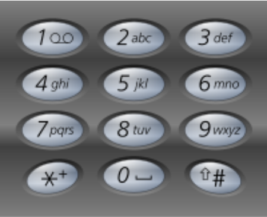

## 字符串

### 目录

* [正则表达式匹配](#正则表达式匹配)
* [打印九宫格数字匹配的所有字符串](#打印九宫格数字匹配的所有字符串)
* [最长不重复的子字符串](#最长不重复的子字符串)
* [左旋(翻转)字符串](#左旋(翻转)字符串)
* [判断一个字符串是不是数字](#判断一个字符串是不是数字)


### 正则表达式匹配

[回到目录](#目录)

Q:给定字符串str和exp,str中不包含'.'和'*',exp中可能包含'.'和' *', 其中'.'可以匹配一个任意数量的字符,' X *'可以匹配0个或若干个X. *不能是exp的首字符,也不能有连续的两个 *. 给定str和exp,判断exp是否能匹配str

如: .*可以匹配任意字符串 `.a *`可以匹配至少含有一个字符的任意字符串

```
// 代码思想和书写技巧
递归方法,核心判断条件  ei位置后面是不是'*'!!!
如果不是 或 后面已经没有了: 那么必须让当前si位置能和ei位置匹配上,才能si++,ei++, 继续判断
	即满足这样的情况,就会提供一个返回值(base-case 或 递归)
如果是: 那么要考虑到这个*匹配的数量,取决于si和ei位置是否匹配,如果匹配就是一种可能:递归
	但是这个*匹配的所有可能如果一个true都没有,那只能继续往下:si跳到第一个和ei不匹配的位置,ei跳过这个*
	重新开始匹配. 可以注意到,递归时不用考虑太复杂的情况:*后是什么情况放到当前*匹配失败的下一次递归
	
第二种情况如下图:part1和part2匹配有5种可能:0~4个A都有可能
	part1中0个A和part2匹配, part1中从第一个A开始 与 part2后面的匹配 (1)
	part1中1个A和part2匹配, part1中从第二个A开始 与 part2后面的匹配
	part1中2个A和part2匹配, part1中从第三个A开始 与 part2后面的匹配
	part1中3个A和part2匹配, part1中从第四个A开始 与 part2后面的匹配
	part1中4个A和part2匹配, part1后从B开始 与 part2后面的匹配 (5)
```


```
// 动态规划思想
从这个递归中可以看到,其依赖与process(str, exp, si+1, ei+1) 和 process(str, exp, si, ei+2)
即以si和ei做一个二维结果表,(0,0)点是要求的结果点,其中所有的点都依赖于右下方的结果点
所以利用base-case从右下方开始求起,逐渐求到(0,0),就是一个动态规划
```

```java
class Solution {
    public boolean isMatch(String s, String p) {
        if(s == null || p == null){
            return false;
        } 

        return process(s, p, 0, 0);
    }

    public static boolean process(String str, String exp, int si, int ei){
        if(ei == exp.length()){
            return si == str.length();
        }

        // ei位置没有后一个元素 或 后一个元素不是 '*'
        if(ei+1 == exp.length() || exp.charAt(ei+1) != '*'){ 
            return si != str.length() && (str.charAt(si)==exp.charAt(ei) || exp.charAt(ei)=='.') && process(str, exp, si+1, ei+1);
        }

        // 继续执行,表明ei位置不是最后一个元素 且 ei+1的位置是'*'
        // 然后根据str和exp的元素决定它能有多少种匹配可能
        while(si != str.length() && (str.charAt(si) == exp.charAt(ei) || exp.charAt(ei)=='.')){
            if(process(str, exp, si, ei+2)){
                return true;
            }
            si++;
        }

        // 走到这里说明*匹配的所有可能都失败了,这里包含了多种可能:
        // 1.ei+1位置是'*',但是ei位置的字符和si位置的字符不匹配,即这个*匹配数量为0
        // 2.ei+1位置是'*',将si位置开始所有与ei位置相等的值都匹配了,即这个*匹配数量达到了最大值
        // 3.si位置已经到了str.length(),但是因为ei一直是X*的模式,所以可以继续到这里
        return process(str, exp, si, ei+2); 

    }
}
```


### 打印九宫格数字匹配的所有字符串

[回到目录](#目录)

Q:给定一个字符串str,每个字符范围是'2'~'9',打印整个字符串所有可能匹配的字母组合

Example:

```
Input: "23"
Output: ["ad", "ae", "af", "bd", "be", "bf", "cd", "ce", "cf"].
```



```
题目本身很简单,就是考察递归的写法.每个字符数字有3或4个选择的字母可以匹配,每个字符第一个可以匹配的字母由offset决定.(8对应了4个字母)
```

```java
class Solution {
    public List<String> letterCombinations(String digits) {
        
        List<String> list = new ArrayList<>();
        if(digits == null || digits.length() == 0){
            return list;
        }
        
        char[] charArr = new char[digits.length()];        
        process(0, charArr, digits, list);
        
        return list;
    }
    
    public static void process(int p, char[] charArr, String str, List<String> list){
        if(p == str.length()){
            list.add(new String(charArr));
            return;
        }
        
        int offset = str.charAt(p) >= '8' ? 1 : 0;
        int n = str.charAt(p) == '7' || str.charAt(p) == '9' ? 4 : 3;
        
        for(int i = 0; i < n; i++){
            charArr[p] = (char)((str.charAt(p)-'2')*3 + 'a' + i + offset);
            process(p+1, charArr, str, list);
        }      
    }
}
```


### 最长不重复的子字符串

[回到目录](#目录)

Q:Given a string, find the length of the **longest substring**without repeating characters.

```
Example:
Input: "abcabcbb"
Output: 3 
Explanation: The answer is "abc", with the length of 3
```

```
思路:初始化p1,p2两个指针在0位置,p2指针不断++,并且每次将它的字符和位置作为一个<k,v>对,存进map,p1则在目前的位置和map.get(str.charAt(p2))中取最大值,这样避免了对p2字符出现位置的讨论,直接一次遍历,即可求解.
```

```java
class Solution {
    public int lengthOfLongestSubstring(String s) {
        if(s == null || s.length() == 0){
            return 0;
        }     
        HashMap<Character,Integer> map = new HashMap<Character,Integer>();
        int p1 = 0;
        int p2 = 1;
        int max = 1;
        map.put(s.charAt(0),0);
        while(p2 < s.length()){
            p1 = Math.max(p1, map.get(s.charAt(p2))==null ? p1 : map.get(s.charAt(p2))+1); // 考虑一下空指针异常的问题
            map.put(s.charAt(p2),p2);
            max = Math.max(max, p2-p1+1);
            p2++;
        }
        return max;
    }
}
```


### 左旋(翻转)字符串

[回到目录](#目录)

Q:左旋操作是指将字符串前n位移动到字符串的后面,如将字符串abcdefg翻转成cdefgab

```
定义一个函数翻转字符串,用p1指向字符串的开头,p2指向字符串的结尾,每次将p1和p2指向的字符交换位置,直到p1右移和p2重合或者超过了p2.
这样的翻转是将整个字符串的前后位置和顺序全部翻转了.如果再对字符串执行一次这个函数,字符串又变回原样

因此观察ab和cdefg是位置前后变了,因此可以将其做两部分,第一次对整个字符串翻转(调位置),第二次单独翻转字符串的两个部分(调顺序)
```


### 判断一个字符串是不是数字

[回到目录](#目录)

```
只涉及到简单的业务逻辑:用p指针表示正在查看的字符位置,如果第一个是"+"或"-",跳到下一个,接下来判断是不是整数(不能为空),直到遇到"."(小数) 或e/E(科学计数法)
	.后面的所有字符必须是整数(不能为空)
	e/E后面的第一个字符可以是"+"或"-",后面的字符也必须是整数(不能为空)
```

