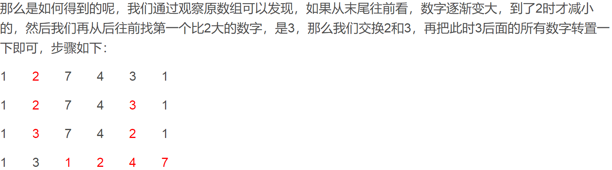

## 数组与矩阵

### 目录

**打印问题**:

* [转圈打印矩阵](#转圈打印矩阵)
* [旋转正方形矩阵](#旋转正方形矩阵)
* [之字形打印矩阵](#之字形打印矩阵)

**搜索问题:**

* [某数是否在行列有序的矩阵中](#某数是否在行列有序的矩阵中)

**其它:**

* [旋转有序数组的最小值求解](#旋转有序数组的最小值求解)
* [找出数组中出现超过一半的数](#找出数组中出现超过一半的数)
* [连续子数组的最大和](#连续子数组的最大和)
* [第1500个丑数](#第1500个丑数)
* [数字在排序数组中出现的次数](#数字在排序数组中出现的次数)
* [数组中重复的数字](#数组中重复的数字)
* [构建乘积数组](#构建乘积数组)
* [数组全排列的下一个排列](#数组全排列的下一个排列)
* [一组整数对能构成的最长递增链](#一组整数对能构成的最长递增链)


-----

### 转圈打印矩阵

[数组与矩阵目录](#目录)

Q:给一个矩阵(二维数组),要求顺时针从外到内转圈打印这个矩阵

A:顺时针打印一个"口"字型只用知道它的左上,右下坐标即可.转圈打印就相当于从外到内,若干个"口"子边框的打印,对于一行或一列要单独列出打印情况.

```java
public static void printByBorders(int[][] arr){
    if(arr == null || arr.length == 0 || arr[0] == null || arr[0].length == 0){
        return;
    }
    
    int row = arr.length;
    int col = arr[0].length;
    process(arr, 0, 0, row-1, col-1);
}

public static void process(int[][] arr, int LUX, int LUY, int RDX, int RDY){
    if(LUX > RDX || LUY > RDY){
        return;
    }
    if(LUX == RDX){
        while(LUY <= RDY){
            System.out.print(arr[LUX][LUY++] + " ");
        }
        return;
    }
    if(LUY == RDY){
        while(LUX <= RDX){
            System.out.print(arr[LUX++][LUY] + " ");
        }
        return;
    }    
    
    int startX = LUX, startY = LUY;
    while(startY < RDY){
        System.out.print(arr[startX][startY++] + " ");
    }
    while(startX < RDX){
        System.out.print(arr[startX++][startY] + " ");
    }   
    while(startY > LUY){
        System.out.print(arr[startX][startY--] + " ");
    }
    while(startX > LUX){
        System.out.print(arr[startX--][startY] + " ");
    }    
    
    process(arr, LUX+1, LUY+1, RDX-1, RDY-1); // 递归打印
}
```


### 旋转正方形矩阵

[数组与矩阵目录](#目录)

Q:给一个方阵(二维数组arr),将其顺时针旋转90°

A:从外边框ABCD考虑,顺时针旋转90°首先是4个端点交换位置:A->B,B->C,C->D,D->A. 然后将A,B,C,D四个点分别在其边上往前走一步,再进行这样的步骤即可.  因此分别将各个边框这样交换即可

```java
public static void printByROtatingOrder(int[] arr){
    if(arr == null || arr.length == 0 || arr[0] == null || arr[0].length == 0){
        return;
    }
    
    int row = arr.length;
    int col = arr[0].length;
    process(arr, 0, 0, row-1, col-1);    
}

public static void process(int[][] arr, int LUX, int LUY, int RDX, int RDY){
    if(LUX > RDX || LUY > RDY){
        return;
    }
    
    int i = 0;
    while(LUY + i < RDY){
        int temp = arr[LUX, LUY+i];
        arr[LUX, LUY+i] = arr[RDX-i][LUY]; // D->A
        arr[RDX-i][LUY] = arr[RDX][RDY-i]; // C->D
        arr[RDX][RDY-i] = arr[LUX+i][RDY]; // B->C
        arr[LUX+i][RDY] = temp; // A->B
		i++;
    }
    
    process(arr, LUX+1, LUY+1, RDX-1, RDY-1);
}
```


### 之字形打印矩阵

[数组与矩阵目录](#目录)

Q:给定一个矩阵(二维数组arr),从矩阵的左上角开始,之字形绕着打印

A:用两个辅助点,去标记之字形的两个端点.由于之字形特点,打印顺序注意每次要调换

```java
public static void printByZigOrder(int[][] arr){
    if(arr == null || arr.length == 0 || arr[0] == null || arr[0].length == 0){
        return;
    }
    
    int row = arr.length;
    int col = arr[0].length;
    int p1X = 0, p1Y = 0, p2X = 0, p2Y = 0;
    boolean flag = true;
    while(p1X < row){
        print(arr, p1X, p1Y, p2X, p2Y, flag);
        flag = !flag;
        if(p1Y == col-1){
            p1X++;
        } else {
            p1Y++;
        }  
        if(p2X == row-1){
            p2Y++;
        } else {
            p2X++;
        }        
    }    
}

public static void print(int[][] arr, int p1X, int p1Y, int p2X, int p2Y, boolean flag){
    if(flag){ // p1 -> p2
        while(p1Y >= p2Y){
            System.out.print(arr[p1X++][p1Y--]);
        }
    } else { // p2 -> p1
        while(p2Y <= p2Y){
            System.out.print(arr[p2X--][p2Y++]);
        }        
    }
}
```


### 某数是否在行列有序的矩阵中

[数组与矩阵目录](#目录)

Q:给一个矩阵arr和一个数num,arr每行每列都是升序,试判断num是在num中

A:利用有序性搜索.首先将num与右上角对比,如果比右上角大,则往下搜索;反之往左搜索.因此这样搜索只能往左走或往下走,时间复杂度是O(M+N)

```java
public static boolean hasNum(int[][] arr, int num){
    if(arr == null || arr.length == 0 || arr[0] == null || arr[0].length == 0){
        return false;
    }    
    
    int x = 0;
    int y = arr[0].length-1;
    
    while(x < arr.length && y > -1){
        if(arr[x][y] > num){
            y--;
        } else if(arr[x][y] < num) {
            x++;
        } else {
            return true;
        }
    }
    
    return false;
}
```


### 旋转有序数组的最小值求解

[数组与矩阵目录](#目录)

Q: 将有序数组前面0~i位移动到原数组的末尾,称为数组的旋转.给一个旋转数组,求其最小值

```
遍历的代价是O(N),整个数组虽然不严格有序,但是部分有序,也可以用二分法
原旋转数组的第一位left肯定大于等于最后一位right,取其中间一位mid,如果mid对应的值大于等于left,表明left~mid之间是升序,所以最小值应该在mid~right之间.
同理,如果mid<=right,表明最小值在left~mid之间.

注意,以上推理都是建立在left>=right的基础上.如果left<right,表明整个序列是升序的,此时左边left即是最小值.(特例:有序数组旋转0位)

特例:left=mid=right时:无法利用这种二分法判断,此时只能使用遍历
```

```
// 注意
前提条件:left>=right才能使用规则
特例:left=mid=right. 只能使用遍历. 灵活组合
```


### 找出数组中出现超过一半的数

[数组与矩阵目录](#目录)

Q:给定一个数组,假定这个数组中某个数的出现次数超过了数组长度的一半,找出这个数

```
用partition过程将数组分成三部分,最中间的一个数必定是它O(N),但是这种方法需要改动原数组
还有一种不需要改数组数据的抵消法:用两个变量num和count分别记录上一次出现的数,以及出现的次数.遍历数组第一个数时num=该数,count=1,遍历到一个数时,相同则num不变,count+1,不同,则count-1,如果count=0,则下下次遍历时,num设为该数,count=1,重新开始.

这样遍历下来,最后的num肯定是要找的数,因为即使数组中只有两类数,超过一半的数的count肯定不会被抵消完
```


### 连续子数组的最大和

[数组与矩阵目录](#目录)

Q:给一个数组,有正有负,求连续子数组的最大和

```
区别于求连续子数组和为定值的最大长度.因为需要和为定值,所以所有子数组(i~j)和为定值都可以等效于(0~j)和(0~i-1)的子数组和差,因此只用算所有以0开始的子数组和.

本题如果只算以0开头的子数组和,是没有意义的,它对其他子数组和是不是最大值没有指导.
从0开始求和时,用一个max记录当前最大的和,如果max+当前数的值还不比当前数大,则重新从当前数开始计数,并更新max.如果max+当前数增大,则继续往前走并更新max.如果max+当前数减小,则不更新max,继续往前走.

以上是顺序思路,还可以从结果f(i)分析,即逆序思路(动态规划)
如果f(i-1)<0,则f(i) = arr[i];反之f(i) = f(i-1) + arr[i].是递归的思路,但是很容易写成循环的顺序代码
```


### 第1500个丑数

[数组与矩阵目录](#目录)

Q:若一个数的因子只含有2,3,5三类,则这个数为丑数,求从小到大排序的第1500个丑数

```
遍历,对每个数进行判断是不是丑数是最直观的判断,但是效率低,会对很多非丑数进行无效计算
用辅助空间存储已经知道的丑数,用来加速判断后面的丑数.这类因子题要抓住一点:
	所有的丑数,都是由已经产生的丑数乘以2,3或5得到
那如何将它们按顺序排序?假设当前已经产生了一部分有序丑数,最后一个为M.那么相当于从丑数数组中去算一下,哪个数乘以2或3或5是大于M的最小值,则是下一个丑数.
求新的丑数如果需要遍历就同样降低了效率,因此可以用三个指针p2,p3,p5分别表示当前位置数对应乘以2或3或5恰好大于丑数数组中最后一个数.这样每次取下一个丑数时,就是在这三个位置中选一个乘以各自因子的最小值,然后再对这三个位置进行更新.

用p2,p3,p5辅助跟踪下一个丑数,实现顺序找丑数.
```


### 数字在排序数组中出现的次数

[数组与矩阵目录](#目录)

Q:给一个排序数组,问其中某个数在数组中出现的次数

```
如果是基于这个数的左右边界拓展搜索,复杂度是O(N).
可以用二分法分别搜索这个数的左边界和右边界,复杂度是O(logN)
```

```java
// 二分时的区间选择
传统的二分法,每次比较后,无论往左还是往右,都会舍弃中间的mid,这样它的区域最后一定会缩小为1个.所以它return的条件可以选择当前空间为1个时
寻找有序数组中某个相同数的左边界时,每次二分可能会舍弃中间值,可能不会.因此它的区域可能缩小到2个后就不会再缩,导致栈溢出.因此它的return要考虑到最后区域有2个或1个时就可以简单比较return了
```


### 数组中重复的数字

[数组与矩阵目录](#目录)

Q:已知数组中的元素大小范围是0~n-1,求找出这个数组中任意一个重复的数字.

```
桶排序:提供一个n长度的数组cnt,遍历一次数组,遇到i,对应cnt[i]++.最后只用看cnt数组中是否存在大于1的数
	时复O(N) 空复O(N)
hashset:遍历数组,并作为key存入,重复时会知道
	时复O(N) 空复O(N)
```

```
时复O(N) 空复O(1)
桶排序的方法不仅是对数组进行查重,还实现了数组的排序,但是题目并不需要排序.因此可以不需要桶排序的额外数组空间
而是使用数组本身的空间:遍历数组到i位置,遇到m,如果m==i,继续往下遍历;反之查看m位置的数,如果m位置的数不等于m,就将i位置与m位置的数交换位置,如果等于m就找到了重复的数.
```


### 构建乘积数组

[数组与矩阵目录](#目录)

Q:给定一个数组A[0,1,2,..,n-1],请构建一个数组B[0,1,2,..,n-1],其中B元素B[i]=A[0] * A[1] * ... A[i-1] * A[i+1] * ... *A[n-1],不能使用除法

```
基于直观的实现是两层for循环,时复O(N^2),空复O(1)
可以将B[i]通式中A[0] * A[1] * ... A[i-1]看做一个序列,用数组C[i]=C[i-1] * A[i-1]可在O(N)下求得
A[i+1] * ... *A[n-1]同样可在O(N)下求得,D[i] = D[i+1] * A[i-1]
所以B[i] = C[i] * D[i]

扣一下CD的边界,并且求B时可以和求C或D在一个遍历中使用,总共时间2O(N),时复O(N).用空间换时间
```


### 数组全排列的下一个排列

[数组与矩阵目录](#目录)

Q:给定一个int数组nums(元素范围0~9),求这个数组的全排列中,比它"数组值"大的下一个排列,将数组变成下一个排列. ("数组值"指的是将数组中所有的数看作一个整数的各个位,这个整数的值即"数组值")



```
逻辑:如果整个数组是倒序排列,表明该数组达到了最大值,它的下一个排列即是升序排列即最小值.所以从数组最后一位开始,往前寻找,直到发现第一个从后往前数不是升序的数a;再次从后往前遍历,找到第一个比a大的数b,交换a和b的位置.然乎把a后面的数都反转位置,得到的排列即是满足要求的排列
```

```java
class Solution {
    public void nextPermutation(int[] nums) {
        if(nums == null || nums.length < 2){
            return;
        }
        
        int index = nums.length - 1;
        while(index-1 >= 0 && nums[index-1] >= nums[index]){
            index--;
        }
        int start = index;
        if(start != 0){ // 如果整个数组都是倒序排列,就不用交换位置了
            index = nums.length-1;
            while(nums[start-1] >= nums[index]){
                index--;
            }
            swap(nums, start-1, index);
        }
        
        index = nums.length - 1;
        
        while(start < index){
            swap(nums, start++, index--);
        }
    }
    
    public static void swap(int[] nums, int i, int j){
        nums[i] = nums[i] ^ nums[j];
        nums[j] = nums[i] ^ nums[j];
        nums[i] = nums[i] ^ nums[j];
    }
}
```


### 一组整数对能构成的最长递增链

[数组与矩阵目录](#目录)

[646. Maximum Length of Pair Chain(Medium)](https://leetcode.com/problems/maximum-length-of-pair-chain/description/)

Q: 给一个二维数组pairs, 数组中每行是一对整数, 且`pairs[i][0] < pairs[i][1]`, 如果`pairs[i][1] < pairs[j][0]`, 那么第j行就可以接在第i行后成为一个递增链, 求最长的递增链长度.

```
Input: [[1,2], [2,3], [3,4]]
Output: 2
Explanation: The longest chain is [1,2] -> [3,4]
```

A: 首先对二维数组进行排序, 排序的依据是根据二维数组的第二列从小到大排序, 那么从第一行作为最长的递增链头开始, 后面只用遍历行, 找到某一行的第一列比当前递增链的链尾大, 则更新链尾, 并且递增链长度+1.

````java
class Solution {
    public int findLongestChain(int[][] pairs) {
        if (pairs == null || pairs.length == 0) return 0;
        Arrays.sort(pairs, (a, b) -> (a[1] - b[1])); // 正则表达式
        int curRight = pairs[0][1];
        int res = 1;
        int i = 1;
        while(i < pairs.length){
            if(pairs[i][0] > curRight){
                res++;
                curRight = pairs[i][1];
            }
            i++;
        }
        return res;
    }
}
````

S: 这里用正则表达式代替了Comparable的子类对象, 简化了代码.

