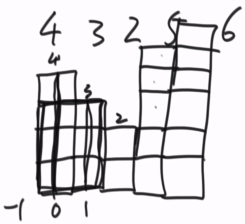
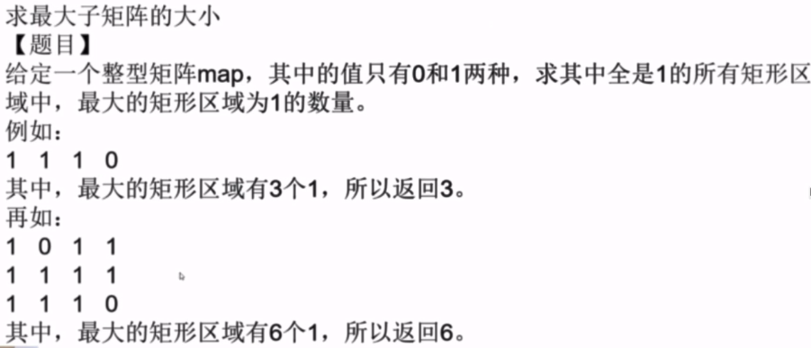
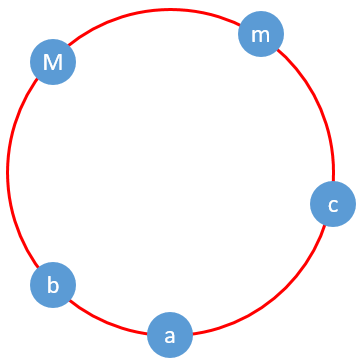

## 栈与队列

### 实现栈与队列结构

#### 数组实现队列和栈

```java
public class MyStack{ // 数组实现栈
    int[] arr = new int[10];
    int size = 0;
    
    public void push(int num){
        if(size < arr.length){
            arr[size++] = num;
        } else {
            System.out.println("stack is full.");
        }
    }
    
    public Integer pop(){
        if(size > 0){            
            return arr[--size];
        } else {
            System.out.println("stack is empty.");
            return null;
        }
    }
    
    public int peek(){
        if(size > 0){            
            return arr[size-1];
        } else {
            System.out.println("stack is empty.");
            return null;
        }        
    }
}
```

```java
public class MyQueue{ // 数组实现循环队列
    int[] arr = new arr[10];
    int start = 0;
    int end = 0;
    int size = 0;
    
    public void offer(int num){
        if(size < arr.length){
            arr[end] = num;
            end = end+1 == arr.length ? 0 : end+1;     
            size++;
        } else {
            System.out.println("stack is full.");
        }        
    }

    public Integer poll(){
        if(size > 0){            
            int temp = arr[start];
            start = start+1 == arr.length ? 0 : start+1;
            size--;
            return temp;
        } else {
            System.out.println("stack is empty.");
            return null;
        }
    }  
    
    public int peek(){
        if(size > 0){            
            return arr[start];
        } else {
            System.out.println("stack is empty.");
            return null;
        }        
    }    
}
```

#### 队列实现栈

Q:用队列实现栈的结构

A:两个队列storage和help实现栈,push时往storage存;pop时将storage元素往help中存,最后一个元素弹出,然后将storage和help交换引用;peek时和pop操作一样,只是不弹出

```java
public class MyStack{
    Queue<Integer> storage = new LinkedList<>();
    Queue<Integer> help = new LinkedList<>();
    
    public void push(Integer num){
        storage.offer(num);
    }
    
    public Integer pop(){
        if(storage.isEmpty()){
            return null;
        }
        while(storage.size() > 1){
            help.offer(storage.poll());
        }
        Queue<Integer> temp = storage;
        storage = help;
        help = temp;
        return temp.poll();        
    }
    
    public Integer peek(){
        if(storage.isEmpty()){
            return null;
        }
        while(storage.size() > 1){
            help.offer(storage.poll());
        }
        Queue<Integer> temp = storage;
        storage = help;
        help = temp;
        storage.offer(help.peek());
        return help.poll();          
    }
}
```

#### 栈实现队列结构

Q:用栈实现队列结构

A:两个栈stack1和stack2,stack1用于存数据,stack2用于取数据;offer时,直接存入stack1中;poll时,如果stack2非空,则stack2直接取数据,如果stack2是空,就将stack1中所有数据都弹出压栈到stack2中,再从stack2中取数据

```java
public class MyQueue{
    private Stack<Integer> stack1 = new Stack<>();
    private Stack<Integer> stack2 = new Stack<>();
    
    public void offer(Integer num){
        stack1.push(num);
    }
    
    public Integer poll(){
        if(!stack2.isEmpty()){
            return stack2.pop();
        } else {
            while(!stack1.isEmpty()){
                stack2.push(stack1.pop());
            }
            return stack2.isEmpty() ? null : stack2.pop();
        }
    }
    
    public Integer peek(){
        if(!stack2.isEmpty()){
            return stack2.peek();
        } else {
            while(!stack1.isEmpty()){
                stack2.push(stack1.pop());
            }
            return stack2.isEmpty() ? null : stack2.peek();
        }        
    }
}
```

### 双向队列（最值队列）

即头部可以进出,尾部也可以进出.不一定按照FIFO的规则,要看使用者具体怎么使用.在Java中实现为LinkedList

#### 窗口实时最值

Q:窗口:在数组中有left和right两个指针维护的区域,right>=left,且两个指针只能往右移动.给一个数组arr,其长度>=3,求长度为3的窗口从最左端,移动到最右端过程中,它们的最大值和最小值数组.

A:窗口在移动过程中,left和right每次同步往右移动一步,用两个双端队列list1,list2,记录它的最大值和最小值.list1和list2都是从尾部存数据,如果当前要存的数据违反了它的单调性,则先将原尾部弹出,直到不违反单调性时将数据存入;从头部淘汰数据,当left往右移动一位时,会将list头部过期数据(索引小于头部)弹出.list1从头到尾单调性是递的;list2从头到尾单调性是递增的.取最值时都是从list头部取.

S:队列存储的是索引值. 存数据需要弹出的原因是,后进入的数据索引过期晚,比如求最大值时,它如果比原尾部数据大,那么原尾部数据存着就没有了意义,并且这样的弹出机制保障了出现新的最大值时,它会插到队列的头部.

```java
public static int[] getWindowsMaxValue(int[] arr){
    int[] maxValue = new int[arr.length-2];
    Queue<Integer> queue = new LinkedList<>();
    if(arr[1] < arr[0]){
        queue.addLast(0);
    } else {
        queue.addLast(1);
    }
    
    for(int i=2; i<arr.length; i++){
        while(!queue.isEmpty() && arr[queue.getLast()]<=arr[i]){
            queue.pollLast();
        }
        queue.addLast(i); // 从尾部开始找位置存i
        if(queue.getFirst() < i-2){ // 去除头部的过期元素
            queue.pollFirst();
        }
        maxValue[i-2] = queue.getFirst(); // 得到当前窗口有效的最大值
    }
    
    return maxValue;
}
```

#### 最值差不大于num的子数组数量

Q：给一个数组arr和一个正整数num，求其所有子数组中，满足最大值与最小值差不大于num的子数组数量

A：这类子数组有一个特点，如果某个子数组满足这个要求，那么这个子数组的所有子数组都满足这个要求；如果某个子数组不满足这个要求，那么包含这个子数组的所有子数组都不满足这个要求。利用这个特点，使用窗口结构，p1在0的位置，p2指针从1的位置开始遍历，假设p2遍历到k位置时开始不满足这个要求，那么以p1=0为左端，满足条件的子数组数量为k-0。此时p1往右移动到1位置，p2从k位置开始继续遍历，到m位置不满足条件，那么以p1=1为左端，满足条件的子数组数量为m-1。依次类推，可以求出以数组每个元素为左端时满足条件的子数组，而不会有多余或遗漏。p1和p2的移动过程就是一个窗口，因此它们的最值通过双端队列实时获取。

```java
public static int getNumbers(int[] arr, int num){
    if(arr==null || arr.length==0){
        return 0;
    }
    
    int p1 = 0;
    int p2 = 1;
    int res = 0;
    Queue<Integer> max = new LinkedList<>();
    Queue<Integer> min = new LinkedList<>();
    max.addLast(0);
    min.addLast(0);
    while(p1 < arr.length){
        while(p2<arr.length && max.getFirst()-min.getFirst() <= num ){
            p2++;
            while(!max.isEmpty() && arr[max.getLast()] <= arr[p2]){ // 更新最值
                max.pollLast();
            }
            max.addLast(p2);
            while(!min.isEmpty() && arr[min.getLast()] >= arr[p2]){
                min.pollLast();
            }
            min.addLast(p2);        
        } 
        res += p2-p1;        
        if(max.getFirst() == p1){ // 去除过期头部
            max.pollFirst();
        }
        if(min.getFirst() == p1){
            min.pollFirst();
        }  
        p1++;
    }
    
    return res;
}
```

### 最值栈

Q：设计一个结构，其满足栈的FILO规则，并且能够随时获取栈内元素的最值

A1：用三个栈来作为最值栈结构，stack是存取的作用；max栈在每次存数据时，如果存入的数据不小于max栈栈顶则该数据也存入max栈，反之不存入max栈，在弹出数据时，如果弹出的数据和max栈栈顶值相同，则max栈也弹出，反之不弹出。min栈同理

A2：存数据时，如果当前存入数据>=max栈栈顶，则当前数据也存入max栈，反之将max栈栈顶元素再压栈一遍；弹出数据时，max栈同步弹出即可。

A1方法中，max和min栈中的数据量是小于等于stack栈的，节约了空间，但是每次取数据时都要比较，多了时间。A2方法取数据时直接同步弹出，不用比较，节约了时间，多了空间。

```java
public class MyStack{ // A2
    Stack<Integer> stack = new Stack<>();
    Stack<Integer> max = new Stack<>();
    Stack<Integer> min = new Stack<>();
    
    public void push(Integer num){
        stack.push(num);
        if(num > max.peek()){
            max.push(num);
        } else {
            max.push(max.peek());
        }
        if(num < min.peek()){
            min.push(num);
        } else {
            min.push(min.peek());
        }        
    }
    
    public Integer pop(){
        max.pop();
        min.pop();
        return stack.pop();
    }
    
    public Integer peek(){
        return stack.peek();
    }
    
    public Integer getMax(){
        return max.peek();
    }

    public Integer getMin(){
        return min.peek();
    }
}
```

### 单调栈

#### 数组元素最近较大（小）值

Q：给一个数组arr（无重复元素），求数组中每个元素左右两边离他最近，比他大的数。

A：遍历这个数组，使用单调栈去存元素，要求栈从底到顶是递减的，如果待压栈元素违背了这个单调性，那么此时栈顶左右两边离他最近比它大数就找到了，分别是栈顶的相邻下方和待压栈的元素。

```java
public static void getCloestBiggerNum(int[] arr){
    if(arr==null || arr.length==0){
        return;
    }
    
    Stack<Integer> stack = new Stack<>();
    for(int i=0; i<arr.length; i++){
        while(!stack.isEmpty() && arr[i]>arr[stack.peek()]){
            int index = stack.pop();
            if(stack.isEmpty()){
                System.out.print(index + ":left closet bigger number:null; ");
            } else {
                System.out.print(index + ":left closet bigger number:" + stack.peek());
            }
            System.out.println(";right closet bigger number:" + i + ".");
        }
        stack.push(i);
    }
    
    while(stack.size() > 1){ // 栈内剩下所有元素都没有右边比它大的数
        int index = stack.pop();
        System.out.print(index + ":left closet bigger number:" + stack.peek());
        System.out.println(";right closet bigger number:null.");
    }
    int index = stack.pop(); // 栈底元素左右两边都没有比它大的数
    System.out.print(index + ":left closet bigger number:null");
    System.out.println(";right closet bigger number:null.");    
 
}
```

#### 数组"直方图"的最大长方形

Q：将数组(正整数)中每个元素作为正方形的快数,这个数组就可以对应一个类似直方图(如图),求这个直方图中由小正方形组成的最大长方形包含多少小正方形 

A：本质就是求数组中每个数左右两边离它最近，比他小的数的索引。通过单调栈可以一次遍历达到要求。



```java
public static int getMaxArea(int[] arr){
    if(arr==null || arr.length==0){
        return 0;
    }
        
    Stack<Integer> stack = new Stack<>();
    stack.push(0);
    int max = 0;
    for(int i=1; i<arr.length; i++){ // 遍历压栈弹栈的过程
        if(arr[stack.peek()]==arr[index]){ // 相同值，栈存较大索引
            stack.pop();
            stack.push(index); 
            continue;
        }
        while(!stack.isEmpty() && arr[stack.peek()]>arr[index]){ 
            int top = stack.pop();
            int left = stack.peek()==null ? -1 : stack.peek();
            max = Math.max(max, arr[top] * (index-left-1) );
        }
        stack.push(index);
    }
    while(stack.size() > 1){ // 一次遍历结束后，栈内至少剩余一个元素
        int top = stack.pop();
        max = Math.max(max, arr[top] * (arr.length-stack.peek()-1) );
    }    
    max = Math.max(max, arr[stack.pop()] * arr.length); // 最小的元素肯定在栈底
    
    return max;
}
```

#### 最大子矩阵



A：这个问题是上一个问题的拓展，从第一行开始，以每一行为底的上部分矩阵即是一个直方图问题，以当前行为底时，当前行某个元素如果是0，则这个点的高度就是0，如果是非0，则这个点的高度是上一行这个点的高度+1。针对每个底的直方图求一次最大子矩阵即可。

```java
public static int getMaxMartrix(int[][] arr){
    if(arr==null || arr.length==0 || arr[0]==null || arr[0].length==0){
        return 0;
    }
    
    int row = arr.length;
    int col = arr[0].length;
    int[] help = arr[0];
    int max = getMaxArea(help); // 调用了子函数
    for(int i=1; i<row; i++){ // 以每一行做底
        for(int j=0; j<col; j++){
            help[j] = arr[i][j]==0 ? 0 : help[j]+1;
        }
        max = Math.max(max, getMaxArea(help));
    }
    
    return max;
}
```

#### 环形数组烽火对

Q:给一个数组arr，将所有数字看作山峰,整个数组看作一个环形山峰，数字越大山峰越高.假设每个山峰都有狼烟,规定相邻的山峰彼此一定能看到彼此的狼烟,不相邻的两个山峰a,b之间如果不存在比min{a,b}高的山峰,也认为双方能看到彼此的狼烟.其他情况都认为看不到. 求所有能看到彼此狼烟的山峰对个数. (a,b) 和 (b,a)算一个

A-1：如果这个数组中没有重复元素，那么可以直接得到烽火对的个数



统计烽火对（A，B）的时候为了避免重复，要求A<B。如图，假设M和m是这个数组中最大的数和次大的数，在数组任意找一个非M和m的数a，在它左右两侧一定能找到比它大的数：假设b和c是它左右两边离他最近比它大的数，那么以a为A的烽火对中，只有（a，b）和（a，c）。其他所有非M，m的元素和a是一样的情况。假设数组长度为n，那么烽火对的个数是2*（n-2）+1 （1的（m，M）组成的烽火对）

A2：但是数组有重复元素时，以上分析就失效了。首先遍历数组，找到一个最大值的索引，将其压栈到单调栈的栈底（单调栈从下往上递减）。栈中存的是元素大小以及它出现的个数，相等的数压栈在同一个位置。然后从最大值索引下一个位置开始遍历（环形遍历直到再次到这个索引位置遍历完成），遇到比栈顶小的数，直接压栈；遇到等于栈顶的数，栈顶位置元素个数+1；遇到比栈顶大的数弹栈，假设这个弹栈元素出现的次数是k，那么它弹栈时增加的烽火对个数为C(k,2)+2。遍历结束后要处理栈内剩余的元素，对于倒数第二个元素以上的元素，因为数组认为是循环的，所以这些元素仍然可以认为左右两边都有比它大的数，右边比他大的数就是栈底，所以它们在弹栈时，增加的烽火对个数也为C(k,2)+2。但是对于倒数第二个元素，它的底下就是最大元素，所以它弹栈时增加的烽火对个数也为C(k,2)+1。对于栈底元素，因为没有比它更大的元素，所以它弹栈时增加的烽火对个数为C(k,2)。一开始用最大值作为栈底是为了保障其他所有元素左右两边都有比它大的数。

```java
public static int getFirePairs(int[] arr){
    if(arr==null || arr.length<2){
        return 0;
    }
    
    int maxPos = 0;
    int max = arr[0];
    for(int i=1; i<arr.length; i++){
        if(arr[i] > max){
            max = arr[i];
            maxPos = i;
        }
    }
    
    Stack<Node> stack = new Stack<>(); // Node有两个变量：val表示值，cnt表示个数
    stack.push(new Node(max)); // Node构造方法初始化cnt为1
    int pairs = 0;
    for(int i=maxPos+1; i!=maxPos; i = i+1==arr.length ? 0 : i+1){
        while(arr[i] > stack.peek().val()){
            Node node = stack.pop();
            pairs += countCK(node.cnt, 2) + 2; // countCK是一个函数，计算C(k,2)
        }
        if(arr[i] == stack.peek().val()){ // 出现重复元素，记录栈顶个数+1
            stack.peek().cnt++;
            continue;
        }
        stack.push(new Node(arr[i]));
    }
    
    while(stack.size() > 2){ // 倒数第二个元素以上的元素增加的烽火对计算方式相同
        Node node = stack.pop();
        pairs += countCK(node.cnt, 2) + 2;
    }
    if(stack.size() == 2){ // 单独计算倒数第二个元素
        Node node = stack.pop();
        pairs += countCK(node.cnt, 2) + 1;        
    }
    pairs += countCK(stack.pop().cnt, 2); // 栈底元素一定存在
}
```

### 辅助空间O(1)反转栈

```
不能用辅助栈,那么就用递归实现.有两个递归函数,第一个实现弹出栈种最后一个元素,第二个递归函数调用第一个递归函数,每次弹出最后一个元素,后面再压栈,所以最先被压栈的是栈顶,最后被压栈的是第一个弹出来的栈底,实现了逆序
```

```java
// 递归1:弹出栈底元素,而栈顺序保持不变
public static int getLast(Stack<Integer> stack) {

    int result = stack.pop();
    if(stack.isEmpty()) {
        return result;
    }

    int last = getLast(stack);
    stack.push(result);

    return last;
}

// 递归2:不断弹出最后一个元素,弹完开始存入
public static void reverse(Stack<Integer> stack) {

    if(stack.isEmpty()) {
        return;
    }

    int last = getLast(stack);
    reverse(stack);
    stack.push(last);
}
```

### 升级汉诺塔

Q:针对汉诺塔问题只能小压大,不能大压小的基础上,再增加一个条件:不能从左边直接移动到右边,或者从右边直接移动到左边,而必须经过中间(用栈来解决)求移动过程和总的步数

```
问题相当于有三个栈,ls,ms,rs.ls中的数从栈底到栈顶是依次减小的.如何将ls中的数通过ms,移动到ls.
操作步骤只有4种: l->m m->l r->m m->r
经过简单分析,可以知道当上一次进行了l->m或m->l,那么下一次必须是r->m或m->r中的一种,因为不能违反小压大,并且不能走回头路(比如上一步l->m,这一步m->l就没有意义).因此每一步都只有一种选择,按规则走,走到rs.size()满足要求即可.
第一步肯定是l->m

因为只是求移动过程和步数,所以可以让三个stack在最开始都push(Integer.MAX_VALUE),不为空,方便比较栈顶大小
```

### 最长匹配括号子字符串

Q:给定一个字符串,其中字符只有'('和')',求符合符号匹配规则最长子串的长度

```
如果只判断字符串是否是符号匹配的,用栈遍历时,遇到'('压栈,遇到')'弹栈.如果在弹栈前发现栈是空,则提前发现不匹配.遍历结束后,如果发现栈不为空,则符号也是不匹配的.
找最长匹配子串,也是遍历压栈,压栈规则也是一样,但是栈内压的内容是索引,并且当准备弹栈发现栈是空时,表明要重新开始寻找子串.
用start记录栈底的位置,如果准备弹栈发现栈为空,表明start需要更新.如果弹栈成功,弹完栈栈为空,则max需要和cur-start+1比较取较大;弹完栈栈不为空,max需要和cur-栈顶比较取最大.

1.栈压的是索引    2.最长子串在每次弹栈时都要更新(都有可能找到最大值)
```

```java
class Solution {
    public int longestValidParentheses(String s) {
        if(s == null || s.length() < 2){
            return 0;
        }
        
        Stack<Integer> stack = new Stack<>();
        
        int max = 0;
        int start = 0;
        int cur = 0;
        while(cur < s.length()){
            if(s.charAt(cur) == '('){
                stack.push(cur++);
            } else if(stack.isEmpty()) { // 出现了不匹配,start更新
                start = ++cur;
            } else { // 没有出现不匹配,但是不代表栈内元素都是有效的
                stack.pop();
                max = Math.max(max, stack.isEmpty() ? cur-start+1 : cur - stack.peek());
                cur++;
            }
        }
        
        return max;
    }
}
```


