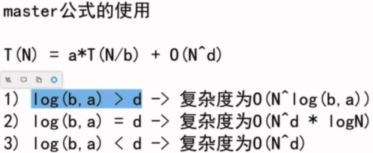
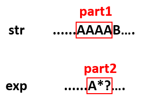

## 递归

### 目录

**概念:**

* [Master公式](#Master公式)

**其它:**

* [汉诺塔问题](#汉诺塔问题)
* [打印九宫格数字匹配的所有字符串](#打印九宫格数字匹配的所有字符串)
* [打印字符串的所有子序列](#打印字符串的所有子序列)
* [打印字符串的所有全排列](#打印字符串的所有全排列)
* [括号组合](#括号组合)
* [Combination Sum](#Combination Sum)
* [复制粘贴字符串](#复制粘贴字符串)
* [正则表达式匹配](#正则表达式匹配)
* [打印和为定值的二叉树路径](#打印和为定值的二叉树路径)
* [辅助空间O(1)反转栈](#辅助空间O(1)反转栈)


### Master公式

[回到目录](#目录)

master公式是一个时间复杂度的递推公式,指的是当前规模(N)的任务拆分成若干个(a)**相同规模**(N/b)的子任务,每次任务还需进行一个复杂度为O(N^d^)的操作.




### 汉诺塔问题

[回到目录](#目录)

Q: 三个杆,有n个盘(小压大的顺序),要求将这n个盘从最左杆移动到最右杆(保持相同的顺序),要求移动过程中所有杆上的盘都只能小压大,不能大压小

A: 记三个杆为left, mid, right. 首先将left的n-1个盘移动到mid上, 这个操作和原问题的条件是一模一样的, 只是规模从n变成了n-1; 然后将left的最大盘移动到right上, 这一步是可以直接操作的; 最后将mid上n-1个盘移动到right上, 和原问题也是一样的条件, 只是规模变成了n-1.

```java
// 汉诺塔的递归非常美 -> 打印移动方法,返回总的移动步数
public static int movePlates(int N, String from, String help, String to) {
    if(N == 1) {
        System.out.println(from + "->" + to);
        return 1;
    }
    int step1 = movePlates(N-1, from, to, help);
    System.out.println(from + "->" + to);
    int step2 = movePlates(N-1, help, from, to);
    return step1 + 1 + step2;
}
```


### 打印九宫格数字匹配的所有字符串

[回到目录](#目录)

Q: 给定一个字符串str,每个字符范围是'2'~'9',打印整个字符串所有可能匹配的字母组合

A: 题目本身很简单,就是考察递归的写法.每个字符数字有3或4个选择的字母可以匹配,每个字符第一个可以匹配的字母由offset决定.(8对应了4个字母)

Example:

```
Input: "23"
Output: ["ad", "ae", "af", "bd", "be", "bf", "cd", "ce", "cf"].
```


```java
class Solution {
    public List<String> letterCombinations(String digits) {
        
        List<String> list = new ArrayList<>();
        if(digits == null || digits.length() == 0){
            return list;
        }
        
        char[] charArr = new char[digits.length()];        
        process(0, charArr, digits, list);
        
        return list;
    }
    
    public static void process(int p, char[] charArr, String str, List<String> list){
        if(p == str.length()){
            list.add(new String(charArr));
            return;
        }
        
        int offset = str.charAt(p) >= '8' ? 1 : 0;
        int n = str.charAt(p) == '7' || str.charAt(p) == '9' ? 4 : 3;
        
        for(int i = 0; i < n; i++){
            charArr[p] = (char)((str.charAt(p)-'2')*3 + 'a' + i + offset);
            process(p+1, charArr, str, list);
        }      
    }
}
```


### 打印字符串的所有子序列

[回到目录](#目录)

Q：子序列不是子串，不用保证原字符串中连续的字符在子序列中还保持连续

A：2^n^的递归实现。假设字符串长度为N,则相当于有N个空位,每个位置都有两个选项,即打印或者不打印该位置的字符,所以知道它的子字符串有2^N种,因为每一种都需要打印,所以这个时间复杂度是优化不了的.

```java
private static void print(String str, int index, String res) {
    if(index == str.length()) {
        if(!res.equals("")) {
            System.out.println(res);
        }
        return;
    }
    print(str, index + 1, res);
    print(str, index + 1, res + str.charAt(index));
}
```


### 打印字符串的所有全排列

[回到目录](#目录)

Q：子序列可以不包含字符串中的某些字符，而全排列则是包含所有的字符，只是顺序不一样

A：有N!种可能排列. 相当于N个位置, N个字符依次填充.

```java
// 解法1: 用了字符串拼接,会产生很多字符串
public static int print(String resource, int index, String rest, String last) {
    if(resource == null || resource.length() == 0) {
        return 0;
    }
    int res = 0;
    if(index == resource.length()) {
        System.out.println(last);
        res++;
        return res;
    }

    int l_rest = rest.length();
    String rest_temp;
    String last_temp;
    for(int i = 0; i < l_rest; i++) {
        rest_temp = rest.substring(0,i) + rest.substring(i+1,l_rest);
        last_temp = last + String.valueOf(rest.charAt(i));
        res += print(resource, index + 1, rest_temp, last_temp);
    }

    return res;

}
```

```java
// 解法2:递归传递下去的索引list每次都要重新创建,也消耗了大量的空间
public int printStringPermutations(String str) {
    if (null == str || str.length() == 0) {
        return 0;
    }
    List<Integer> list = new ArrayList<>();
    // 填充索引
    for (int i = 0; i < str.length(); i++) {
        list.add(i);
    }
    char[] son = new char[str.length()];
    return printStringPermutations(str, son, list, 0);
}

private int printStringPermutations(String str, char[] son, List<Integer> indexList, int cur) {
    if (cur == str.length()) {
        System.out.println(new String(son));
        return 1;
    }
    int count = 0;
    for(int i = 0; i < indexList.size(); i++) {
        son[cur] = str.charAt(indexList.get(i));
        List<Integer> newIndexList = getNextIndexList(indexList, i);
        count += printStringPermutations(str, son, newIndexList, cur+1);
    }
    return count;
}
private List<Integer> getNextIndexList(List<Integer> indexList, int i) {
    List<Integer> list = new ArrayList<>(indexList);
    list.remove(i);
    return list;
}
```


### 括号组合

[回到目录](#目录)

Q: 给一个整数n,代表有n对'()',问给出所有符合括号匹配的组合字符串

A1: 有2n个位置, 从左往右填充字符, 每个位置只能填充'('或')'. 假设在填cur位置时, cur之前所有已填充的字符中, '('比')'多, 那么cur位置可以填充 '('或')', 但是如果'('和')'一样多, 那么cur位置只能填'(', 如果'('比')'少, 则说明此次填充不可能匹配, 应该舍弃. 并且如果cur之前已填充了n个'(', 那么cur及以后的所有位置就只能填')', 所以此时不用继续递归, 因为已经知道后面只有一种可能.

A2: 根据A1的描述, 用left和right记录'(' 和 ')'剩下的数量, 它们的初始值都是n, 正确递归结束是它们都变成了0, 它们在递减过程中, 错误递归结束是left或right提前变成了0, 或者left > right. 使用char数组记录填充过程(不要使用字符串拼接, 会产生很多多余字符串)

```java
// A1:正向思考,逻辑更缜密
public static int getNPairBrackets(int n) {
    return getNPairBrackets(0, 0, n);
}
// left:继续填充之前已填充的'('个数; right:继续填充之前已填充的')'个数
private static int getNPairBrackets(int left, int right, int n) {
    if (n < 0 || left < right) {
        return 0;
    } else if (left == n) {
        return 1;
    } else if (left == right) {
        return getNPairBrackets(left + 1, right, n);
    }
    // 普通情况:该位置既可以填充'('又可以填充')'
    return getNPairBrackets(left + 1, right, n) + getNPairBrackets(left, right + 1, n);
}
```

```java
// A2:反向思考,代码更简洁
public class Solution{
    public static List<String> getList(int n){
        List<String> list = new ArrayList<>();
        if(n == 0){
            return null;
        }
        char[] res = new cahr[2*n];
        process(n, n, res, list);
        
        return list
    }
    public static void process(int left, int right, char[] res, List<String> list){
        if(left < 0 || right < 0 || left > right){
            return;
        }
        if(left == 0 && right == 0){
            list.add(new String(res));
            return;
        }
        int cur = 2 * n - left - right;
        res[cur] = '(';
        process(left-1, right, res, list);
        res[cur] = ')';
        process(left, right-1, res, list);
    }
}
```


### Combination Sum

[回到目录](#目录)

Q：给一个数组arr，数组内无重复的数字，再给一个整数num，求所有能构成num的数字组合，数组中同一个数可以重复使用。

E：arr=[2,3,6,7]，num=7。输出为[[7], [2,2,3]]

A：首先对arr排序, 然后倒序讨论arr[i]在组合num中出现的可能次数(记为K), 最少0次, 最多num/arr[i]次(也可能为0); 次数确定后, 问题就变成了组合num-K*arr[i], 一样的逻辑, 但是新组合只能从arr[i-1]开始倒序遍历, 讨论arr[i-1]在组合中出现的次数, 因为arr[i]出现的次数已经在上次递归中固定了, 因此本次递归不能再从arr[i]开始讨论, 保证了这样递归求法不会有重复.

````java
public static int getConbinationSum(int[] arr, int num) {
    if (null == arr || arr.length == 0) {
        return 0;
    }
    Arrays.sort(arr);
    return getConbinationSum(arr, num, arr.length - 1);
}
private static int getConbinationSum(int[] arr, int num, int curIndex) {
    // 递归成功返回
    if (num == 0) {
        return 1;
    }
    // 递归失败返回
    if (curIndex < 0 || num < 0) {
        return 0;
    }
    int count = 0;
    // arr[curIndex]最少出现0次,最多出现num/arr[curIndex]次(可能为0)
    int maxTime = num / arr[curIndex];
    for (int i = 0; i <= maxTime; i++) {
        // 后面递归的curIndex必须要-1,因为已经规定了当前arr[curIndex]这个数在组合中出现i次
        // 后面递归中不应该再出现arr[curIndex]
        count += getConbinationSum(arr, num - i * arr[curIndex], curIndex - 1);
    }
    return count;
}
````


### 复制粘贴字符串

[回到目录](#目录)

[650. 2 Keys Keyboard](https://leetcode.com/problems/2-keys-keyboard/description/)

Q: 最开始只有一个字符 A，问需要多少次操作能够得到 n 个字符 A，每次操作可以复制当前所有的字符，或者粘贴

```
Input: 3
Output: 3
Explanation:
Intitally, we have one character 'A'.
In step 1, we use Copy All operation.
In step 2, we use Paste operation to get 'AA'.
In step 3, we use Paste operation to get 'AAA'.
```

A: 粘贴本质就是翻倍, 所以对于素数, 没有因子, 它只能一直复制粘贴, 它的次数就是素数本身. 对于非素数, 假设`n = i * j` 使i取最小, 则j最大, 将j个A复制i次, 即可得到n个A, 这样的次数是最少的(贪心, 为什么这样是最少的, 没有严格的证明)

根据贪心结论, 得到递推式: `dp[n] = i + dp[j]` 求n最小的因子i: i从2开始递增, n%i==0即得到最小因子

这里的动态规划虽然用了递归, 但是没有重复计算

````java
class Solution {
    public int minStepsOfCopyString(int n) {
        if(n == 1){
            return 0;
        }
        // 注意求n因子时,遍历到根号n而不是n
        for(int i = 2; i <= Math.sqrt(n); i++){
            if(n % i == 0){
                return minStepsOfCopyString(n / i) + i; 
            }
        }
        // 素数
        return n; 
    }
}
````


### 正则表达式匹配

[递归目录](#目录)

Q: 给定字符串str和exp, str中不包含'.'和'*', exp中可能包含'.'和' *', 其中'.'可以匹配一个任意数量的字符,' X *'可以匹配0个或若干个X. *不能是exp的首字符,也不能有连续的两个 *. 给定str和exp,判断exp是否能匹配str

如: .*可以匹配任意字符串 `.a *`可以匹配至少含有一个字符的任意字符串

```
核心判断条件  ei位置后面是不是'*'!!!
如果没有*: 那么必须让当前si位置能和ei位置匹配上,才能si++,ei++, 继续判断
如果有*: 只要si位置能和ei位置匹配，就有多了一种匹配的可能（si++）。如果这个*匹配的所有可能如果都失败,那只能继续往下:si跳到第一个和ei不匹配的位置,ei跳过这个*，然后重新开始匹配. 
	
第二种情况如下图:part1和part2匹配有5种可能:0~4个A都有可能
	part1中0个A和part2匹配, part1中从第一个A开始 与 part2后面的匹配 (1)
	part1中1个A和part2匹配, part1中从第二个A开始 与 part2后面的匹配
	part1中2个A和part2匹配, part1中从第三个A开始 与 part2后面的匹配
	part1中3个A和part2匹配, part1中从第四个A开始 与 part2后面的匹配
	part1中4个A和part2匹配, part1后从B开始 与 part2后面的匹配 (5)
```



```
// 动态规划思想
从这个递归中可以看到,其依赖与process(str, exp, si+1, ei+1) 和 process(str, exp, si, ei+2)
即以si和ei做一个二维结果表,(0,0)点是要求的结果点,其中所有的点都依赖于右下方的结果点
所以利用base-case从右下方开始求起,逐渐求到(0,0),就是一个动态规划
```

```java
class Solution {
    public boolean isMatch(String s, String p) {
        if(s == null || p == null){
            return false;
        } 

        return process(s, p, 0, 0);
    }

    public static boolean process(String str, String exp, int si, int ei){
        if(ei == exp.length()){
            return si == str.length();
        }

        // ei位置没有后一个元素 或 后一个元素不是 '*'
        if(ei+1 == exp.length() || exp.charAt(ei+1) != '*'){ 
            return si != str.length() && (str.charAt(si)==exp.charAt(ei) || exp.charAt(ei)=='.') && process(str, exp, si+1, ei+1);
        }

        // 继续执行,表明ei位置不是最后一个元素 且 ei+1的位置是'*'
        // 然后根据str和exp的元素决定它能有多少种匹配可能
        while(si != str.length() && (str.charAt(si) == exp.charAt(ei) || exp.charAt(ei)=='.')){
            if(process(str, exp, si, ei+2)){
                return true;
            }
            si++;
        }

        // 走到这里说明*匹配的所有可能都失败了,这里包含了多种可能:
        // 1.ei+1位置是'*',但是ei位置的字符和si位置的字符不匹配,即这个*匹配数量为0
        // 2.ei+1位置是'*',将si位置开始所有与ei位置相等的值都匹配了,即这个*匹配数量达到了最大值
        // 3.si位置已经到了str.length(),但是因为ei一直是X*的模式,所以可以继续到这里
        return process(str, exp, si, ei+2); 

    }
}
```


### 打印和为定值的二叉树路径

[回到目录](#目录)

Q: 打印和为定值的路径, 路径:根节点到叶节点所经过的所有节点

A: 其实就是遍历寻找二叉树所有路径的过程, 只是在遍历到叶节点时, 需要验证是否和为定值, 所以需要一个stack存储当前路径, 当离开这个节点时, stack弹出这个节点.
即stack实时更新当前路径,当记录到叶节点时,统计路径和.决定是否打印

```java
public void printAllPathInBT(Node head, int target) {
    if (null == head) {
        return;
    }
    Stack<Node> stack = new Stack<>();
    printAllPathInBT(head, stack, target);
}
private void printAllPathInBT(Node head, Stack<Node> stack, int left) {
    if (null == head) {
        return;
    }
    stack.push(head);
    left -= head.val;
    // 到达了叶子节点,且和为指定值,需要打印当前路径
    if (null == head.left && null == head.right && left == 0) {
        Stack<Node> temp = new Stack<>();
        while (!stack.isEmpty()) {
            temp.push(stack.pop());
        }
        while (!temp.isEmpty()) {
            // 打印并还原stack
            System.out.println(temp.peek().val + " ");
            stack.push(temp.pop());
        }
    }
    // 没达到叶子节点,继续往左孩子遍历
    if (null != head.left) {
        printAllPathInBT(head.left, stack, left);
    }
    // 没达到叶子节点,继续往右孩子遍历
    if (null != head.right) {
        printAllPathInBT(head.right, stack, left);
    }
    // 递归出节点时还原进节点前的状态
    stack.pop();
    left += head.val;
}
```


### 辅助空间O(1)反转栈

[回到目录](#目录)

Q: 将栈的元素顺序反转, 要求空间复杂度为O(1)

A: 不能用辅助栈,那么就用递归实现. 本质是利用了虚拟机帮你压栈

```java
// 递归:不断弹出最后一个元素,弹完开始存入
public static void reverse(Stack<Integer> stack) {
    if(stack.isEmpty()) {
        return;
    }
    int last = getLast(stack);
    reverse(stack);
    stack.push(last);
}
```

