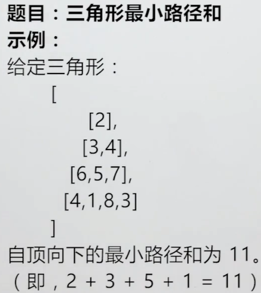
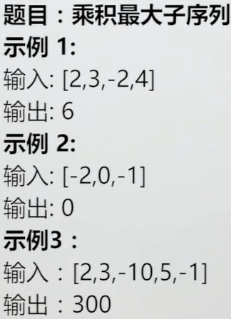

<!-- GFM-TOC -->

- [数组左上->右下的最短路径和](#数组左上->右下的最短路径和)

<!-- GFM-TOC -->

## 动态规划

递归和动态规划的特点都是，将大问题化成小问题去求解，只不过动态规划会存储中间的过程结果，因此避免了很多的重复计算，时间复杂度大大降低。


### 母牛生牛问题-一维动态规划

Q:已知有一头成熟母牛,每年都可以生一头小牛,小牛从出生那年开始算,第四年开始也会每年生一头牛.求N年后有多少头牛

A：f(n) = f(n-1) + f(n-3)	f(n-1)表示去年的牛数量 f(n-3)表示去年新生的牛数量

```java
// 递归写法
int[] init = new int{1,2,3};
public static int getCattles(int n){
    if(n < 4){
        return init[n];
    }
    
    return getCattles(n-1) + getCattles(n-3);
}

// 动态规划的顺序代码
int[] values = new int[N];
values[0] = 1;
values[1] = 2;
values[2] = 3;
for(int i = 0; i < N; i++){
    values[i] = values[i-1] + values[i-3]; // 区别于前面的递推,这里是按顺序求,不用递归
}
return values[i-1];
```

### 数组左上->右下的最短路径和

Q：给一个二维数组,一个点从左上角移动到右下角,从起点开始,每经过一个点就将这个位置的值累加,一直到终点,求最小累加值.

A：递归求解时会有很多重复计算，使用动态规划，从右下角往左上角方向去求，顺序求解避免了重复计算

```java
// 最短路径-动态规划版
public static int findMinPath(int[][] arr){
    
    if(arr == null || arr[0] == null){
        return 0;
    }
    
    int row = arr.length;
    int column = arr[0].length;
    
    int[][] res = new int[row][column];
    res[row-1][column-1] = arr[row-1][column-1];
    for(int i = column-2 >=0 ; i++){ // 确定结果表中最后一行的值
        res[row-1][i] = arr[row-1][i] + res[row-1][i+1];
    }
    for(int i = row-2 >=0 ; i++){ // 确定结果表中最后一列的值
        res[i][column-1] = arr[i][column-1] + res[i+1][column-1];
    }
    for(int i = row-2; i >=0; i--){ // 从右往左
        for(int j = column -2; j >= 0; j--){ // 从下往上计算
            // 找出当前格点的最小结果,不用递归,节省了时间开销
            res[i][j] = arr[i][j] + Math.min(res[i+1][j],res[i][j+1]); 
        }
    }
    return res[0][0]; // 00格点即是我们要求的结果,最终在循环中也会得到
    
}
```

### 异或和为0的最多子数组

Q：给一个数组,将其分为若干个不相容的子数组,求最多能分多少个异或和为0的子数组.
不相容子数组:数组中每个元素最多只能在一个子数组中出现
异或运算: 满足交换律和结合律. 0 和 任意数异或不变,任意数和自己异或是0
A：假设`0~i`个元素,已经分成异或和最多的子数组.那么i作为最后一个元素位置,它所在的最后一个子数组有两种可能状态:异或和为0,和异或和不为0
如果最后一个子数组的异或和不为0,那么这种分法和`0~i-1`得到的最优解肯定是一样的
如果最后一个子数组的异或和为0,记0-i的异或和为a,假设0-k(k<i)的异或和也为a,那么k+1-a的异或和一定为0.所以这种分法它的最优解相当于是0-k的最优解+1.其中k是在i左边离i最近的满足0~k的异或和也为a的数.
所以有dp(i) = max(dp(i-1), dp(k)+1);

```java
public static int getMostSubArrayXOrSum(int[] arr) {

    if(arr == null || arr.length == 0) {
        return 0;
    }

    int sum = 0;
    int res = 0; 
    int[] dp = new int[arr.length];
    HashMap<Integer, Integer> sumAppearedLast = new HashMap<Integer, Integer>();
    sumAppearedLast.put(0, -1); // 0第一次存map的时候标志这个位置的dp就是1
    for(int i = 0; i < arr.length; i++) {

        sum ^= arr[i];
        if(sumAppearedLast.containsKey(sum)) {

            int prePos = sumAppearedLast.get(sum);
            dp[i] = prePos == -1 ? 1 : dp[prePos] + 1;
        }
        sumAppearedLast.put(sum, i); // 更新sum的最后一个位置

        if(i > 0) {
            dp[i] = Math.max(dp[i], dp[i-1]); // 根据dp,它每一步有两种选择,选最大值
        }

        res = Math.max(res, dp[i]);
    }

    return res;
}

// Q1:checkMehod
public static int checkMthodQ1(int[] arr) {

    if(arr == null || arr.length == 0) {
        return 0;
    }

    int l = arr.length;
    int res = 0;
    for(int i = 0; i < l; i++) {
        for(int j = i; j < l; j++) {
            if(xOrSumIsZero(arr, i, j)) {
                res++;
            }
        }
    }

    return res;
}

private static boolean xOrSumIsZero(int[] arr, int i, int j) {

    int sum = arr[i];
    int index = i;
    while(++index <= j) {
        sum ^= arr[index];
    }

    return sum == 0;

}
```

### n个骰子所有和的次数统计

Q:投n个骰子,每个骰子的点数为1~6,求它们和的所有可能性,以及每种可能发生的次数

```
// 递归思想
n个骰子的点数是n-1个骰子的所有点数可能 + 当前筛子为1~6的可能性
base-case:当n为1时,点数可能值为1~6,每种可能性为1种

// 动态规划思想
dp[i][j] 表示i个骰子和为j的可能数
dp[i][j] = dp[i-1][j-1] + dp[i-1][j-2] + dp[i-1][j-3] + dp[i-1][j-4] + dp[i-1][j-5] + dp[i-1][j-6]
	即将递归的思想用递推的式子表示出来了,当然要保证这里的j >= i
初始值  dp[1][1]=dp[1][2]=dp[1][3]=dp[1][4]=dp[1][5]=dp[1][6]=1
```

```java
// 动态规划-空间复杂度O(N^2)
final int maxValue = 6;
public static int[] getSumTimes(int n){
    
    if(n <= 0){
        return null;
    }
    
    int maxNumber = maxValue*n;
    
    // 数组弄大一些是为了方便理解,写好程序后可以进行修改.
    // dp[x][y] x就表示x个骰子,y就表示骰子的点数和
    int[][] dp = new int[n+1][maxNumber+1]; 
    
    for(int i = 1; i <= maxValue; i++){ // base-case
        dp[1][i] = 1;
    }
    
    for(int i = 2; i <= n; i++){
        for(int j = i; j < maxValue*i; j++){
            for(int k = 1; k <= maxValue && (j-k >= i-1) ; k++){
                dp[i][j] += dp[i-1][j-k];
            }
        }
    }
    
    int[] res = new int[maxValue*n-n+1];
    for(int i = n; i <= maxNumber; i++){
        res[i-n] = dp[n][i];
    }
    
    return res;
}
```

**优化dp的空间复杂度**

```
从递推关系式可以知道,每个dp值只与它的上一维度dp值有关,而上面的dp求出了所有的维度.所以是O(N^2)
可以通过旋转二维数组,将其降低到O(N),即只用一个2*n的二维数组.其中一行存现在的数,另一行存上次的数,记得每次存现在的数时得清除上上次的数,不然可能会影响正确结果值
```

```java
public static int[] getSumTimes(int n){
    final int maxValue = 6;
    final int maxSum = maxValue*n;

    int[][] dp = new int[2][maxSum+1];

    int flag = 0; // 调整每次使用的行
    for(int i = 1; i <= maxValue; i++){ // 初始条件
        dp[flag][i] = 1;
    }

    for(int i = 2; i <= n; i++){
        flag = 1 - flag; 
        for(int j = 0; j < dp[0].length; j++){ // 清空另一行存放cur
            dp[flag][j] = 0; 
        }
        for(int j = i; j <= i*maxValue; j++){ // flag:cur 1-flag:pre
            for(int k = 1; k <= maxValue && (j - k >= i -1); k++){
                dp[flag][j] += dp[1-flag][j-k];
            }
        }
    }

    int[] res = new int[maxValue*n-n+1];
    for(int i = n; i <= maxSum; i++){
        res[i-n] = dp[flag][i];
    }

    return res;
}
```

### 鸡蛋掉落问题

```
你将获得 K 个鸡蛋，并可以使用一栋从 1 到 N  共有 N 层楼的建筑。
每个蛋的功能都是一样的，如果一个蛋碎了，你就不能再把它掉下去。
你知道存在楼层 F ，满足 0 <= F <= N 任何从高于 F 的楼层落下的鸡蛋都会碎，从 F 楼层或比它低的楼层落下的鸡蛋都不会破。
每次移动，你可以取一个鸡蛋（如果你有完整的鸡蛋）并把它从任一楼层 X 扔下（满足 1 <= X <= N）。
你的目标是确切地知道 F 的值是多少。
无论 F 的初始值如何，你确定 F 的值的最小移动次数是多少？
```

```
// 动态规划
假设K,N的最小移动次数为dp[k,n],在实际操作时,假设第一次在i层扔了一个鸡蛋,如果鸡蛋碎了,剩下i-1层和k-1个鸡蛋,如果鸡蛋没碎,剩下n-i层和k个鸡蛋.所以有:
	 dp[k,n] = min( max(dp[k-1,i-1], dp[k,n-i]) + 1)
	 这是一个三维的结果表,因为除了k和n,i的取值也是一个未定项,它可以取n层建筑中的任意一层.
	 而i取不同值时,可能有不同的结果,这些结果的最小值是满足条件的值.
因为是三维动态给规划,所以代码比较难写,可能有三层循环,至于i的选择,可能是有一定的贪心策略,但是无法证明
```

```
// 递推式
将问题换一种思路,就可以用普通的递推得到答案.假设有k个鸡蛋,并且可以移动m次,dp[k][m]是最多能确定的层数.
那么假设第一次移动时,鸡蛋碎了,那么还可以确定的层数有dp[k-1][m-1];鸡蛋没碎,那么可以确定的层数有dp[k][m-1],所以有:
	dp[k][m] = dp[k-1][m-1] + dp[k][m-1] + 1;
base-case:dp[1][m] = m; dp[k][1] = 1
```

120.Triangle三角形的最小路径

Q：给一个二维数组arr，可以认为其是一个满二叉树构成的数组(无对应节点的位置值为0)，求从“满二叉树”的头节点遍历到叶节点的所有路径中，路径经过节点的最小和值。如图，6和5就是3能走的两个路径，5和7是4能做走的两个路径。



A：由题意，很容易想到递推式：dp(i, j) = min(dp(i+1, j), dp(i+1, j+1) + arr(i, j)  即从当前节点往下走的路径最小值取决于它走左边和走右边两种情况的较小值+当前节点的值。如果从上往下看这个递推式，它就是一个递归；从下往上看，它就是一个递推。最后一行的所有dp值都为其本身，然后从倒数第二行开始往上层求，最终的答案是dp(0,0)

````java
class Solution {
    public int minimumTotal(List<List<Integer>> triangle) {
        if(triangle==null || triangle.size()==0 || triangle.get(0)==null || triangle.get(0).size()==0){
            return 0;
        }
        
        int row = triangle.size();
        List<Integer> tempLast = triangle.get(row-1);
        int col = tempLast.size();
        int[][] dp = new int[row][col];
        
        int i = 0;
        for(Integer each:tempLast){
            dp[row-1][i++] = each;
        }
        
        i = row-2;
        while(i >= 0){
            List<Integer> tempList = triangle.get(i);
            for(int j=0; j<(i+1); j++){
                dp[i][j] = Math.min(dp[i+1][j], dp[i+1][j+1]) + tempList.get(j);
            }
            i--;
        }

        return dp[0][0];
    }
}
````

### 152.Maximum product subarray最大子序列乘积

Q：给一个int数组arr，包括正数，负数和0，求这个数组的最大子序列乘积



A：假设dp[i]表示包含arr[i]的子序列的最大乘积，用min[i]表示arr[i]子序列的最小乘积，那么dp[i]只可能在dp[i-1]xarr[i]，min[i-1]xarr[i]和arr[i]中取，同样min[i]，也只能在这三者之中取。这个递推关系的含义是：包含当前子序列的最大乘积只有三种情况，一种是本身，第二种是包含前一个元素的最大乘积x本身，第三种是包含前一个元素的最小乘积x本身。这是由于本身可能是负数或0导致的。
同时注意，dp[i]求出来的最大乘积并不一定是dp[n-1]，而是所有dp中的最大值。并且dp[i]的值并不一定是从第一个元素开始累乘的。

````java
class Solution {
    public int maxProduct(int[] nums) {
        if(nums==null || nums.length==0){
            return 0;
        }

        int[] dp = new int[nums.length];
        int[] min = new int[nums.length];
        dp[0] = nums[0];
        min[0] = nums[0];

        int res = nums[0];
        int i = 1;
        while(i < nums.length){
            dp[i] = Math.max(nums[i], Math.max(nums[i]*dp[i-1], nums[i]*min[i-1]));
            min[i] = Math.min(nums[i], Math.min(nums[i]*dp[i-1], nums[i]*min[i-1]));
            res = Math.max(res, dp[i]);
            i++;
        }

        return res;
    }
}
````

### 股票交易系列问题

[股票交易系列问题](../经典题型/买卖股票系列问题.md)