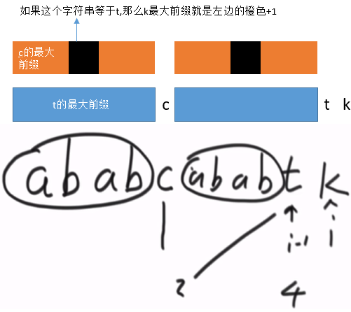
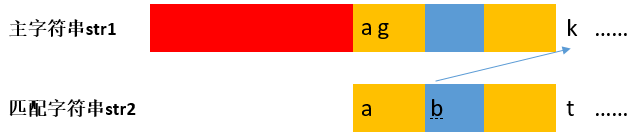
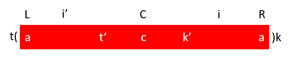
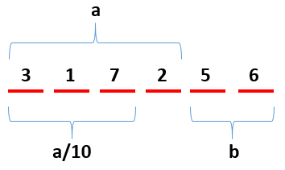

## 数学算法

### 辅助空间

#### 累加和为定值的最长子数组

Q:给定一个数组arr,和一个数num,求数组中累加和为num子数组最长的长度

A:用一个辅助数组sumArr去记录arr中每个元素从0位置开始的累加和,并将sumArr的结果存为一个map,key是累加和,value是这个累加和最早出现的位置.然后再遍历去寻找每个sum对应的num-sum在map中是否存在.注意map中还要存一个(0,-1).即认为第一个累加和为0的位置是-1.

```java
public static int getLongestSubArr(int[] arr, int num){
    if(arr == null || arr.length == 0){
        return 0;
    }
    
    int[] sumArr = new int[arr.length];
    HashMap<Integer, Integer> map = new Hashmap<>();
    map.put(0, -1);
    int sum = 0;
    int index = 0;
    
    while(index < arr.length){
        sum += arr[index];
        sumArr[index] = sum;
        if(map.get(sum) == null){ // map只存sum第一次出现的位置
            map.put(sum, index);
        }        
        index++;
    }
    index = 0;
    int res = 0;
    while(index < arr.length){
        int subSum = num - sumArr[index];
        if(map.get(subSum) != null){
            res = Math.max(res, index - map.get(subSum));
        }
        index++;
    }
    
    return res;
}
```

##### 子问题1:奇偶个数相同的最长子数组

##### 子问题2:0与1个数相同的最长子数组

##### 子问题3:数组只含有0,1,2;包含1和2个数相同的最长子数组

A:这三个子问题的特点是子数组包含的元素个数相同,可以把奇数看作-1,偶数看作1;0看作-1;2看作-1;那么这三个问题都变成了求子数组和为0的最长子数组.

即求最长子数组问题,看看能不能把问题转化为求和为定值的最长子数组.

### KMP-字符串匹配

> KMP算法的关键是利用匹配失败后的信息，尽量减少模式串与主串的匹配次数以达到快速匹配的目的。具体实现就是实现一个next()函数，函数本身包含了模式串的局部匹配信息
>
> 时间复杂度O(m+n)

#### 概念

##### 最大相等前缀

```
// 定义
abcabct
如上,字符t的最大相等前缀等于3,即在t前面的字符串中,从头开始最多有三位,等于从末尾开始同样找三位的子串
如第二个b的最大相等前缀等于1,第二个c的最大相等前缀等于2

规定:字符串的第一个字符串最大相等前缀等于-1,第二个字符最大相等前缀等于0

注意到,一个字符的最大相等前缀数值,等于这个字符真实最大相等前缀的下一个位置索引.
```

```
// 求next数组:递推思想
将一个字符串每一位字符的最大相等前缀求出来,按序组成的数组即next数组.它可以用来加速字符串匹配过程
递推:如下图,求k的最大相等前缀,假设已知k的前一位t的最大相等前缀为4已求,则首先比较c == t?即比较前一位是否等于它最大相等前缀的索引位置字符,如果不相等,则继续看c的最大相等前缀索引位置(2:a)是否等于t,如果还不相等,继续看a的最大相等前缀索引位置(0:a)是否等于t,如果最大索引位置到了0,还是找不到与t相等的字符,则k的最大前缀为0

以上递推思想不停找最大前缀索引位置进行比较,是因为t是k前面字符串的最后一个字符,找k的最大前缀一定会涉及到t的比较,而t前面相等字符的比较,t的最大索引已经给出了信息,所以只用不停去找左边的"abab"中有没有一部分它的下一个字符等于t,这样k的最大前缀就是这一部分的字符数量+1.
```



```java
public static int[] getNext(String str) {

    if(str == null || str.length() == 0) {
        return null;
    }

    int l = str.length();
    int[] next = new int[l];
    next[0] = -1;
    next[1] = 0;

    int i = 2;
    int cur = next[i-1]; // 目前用到的最大前缀数对应的位置
    while(i < l) {
        if(str.charAt(i-1) == str.charAt(cur)) { // 看上一个字符等不等于它最大相等前缀位置字符
            next[i++] = ++cur;
        } else {
            if(cur != 0) { // 
                cur = next[cur]; // 如果不等于就往上一个最大相等前缀跳
            } else {
                next[i++] = 0; // 如果最大相等前缀位置跳到了0还不相等,当前最大相等前缀就是0
            }
        }
    }

    return next;

}
```

##### 字符串模式匹配

```
// 暴力匹配
假设主字符串是str1,要找str2是否是str1的子串,暴力方法就是遍历str1,首先从0位置和str2匹配,不匹配再从1位置和str2匹配,...
这样的问题是有大量的重复匹配消耗时间,上一次的匹配失败对下一次匹配没有提供信息
```

```
// next数组加速匹配
假设匹配字符串str2的所有最大前缀已求得.那么在上一次匹配失败后,可以指导下一次匹配
如图,str2和str1匹配到k的时候不匹配了,暴力匹配是让str2再从0开始和str1的橙色下一个位置比较.但是有了最大前缀数组信息,如图就可以让str2橙色下一个字符b继续和k比较,即使还是不匹配,又可以让b的最大前缀位置字符(a,因为b的最大前缀为0)和k比较,如果还是不匹配,则让k移到下一位与a重新开始比较.

str1的上一次匹配是在a,经过next数组的指导,最坏情况也是让str1的k下一个位置和str2重新开始比较.这其中就相当于直接跳过了a~k范围,极大优化了暴力匹配,减少了无效匹配
```



```java
// 核心就是根据next数组调整两个字符串指针位置的移动,如果移动到头了就退出
public static boolean isChildStr(String str1, String str2) {

    if(str1 == null || str2 == null || str1.length() < str2.length()) {
        return false;
    }

    int p1 = 0; // str1中当前正在比对的指针位置,等于str1.length()时代表比对完了 
    int p2 = 0; // str2中当前正在比对的指针位置,等于str2.length()时代表匹配上了
    int[] next = getNext(str2); // next数组 
    int cur = 0; // 代表最大前缀位置

    while(p1 < str1.length() && p2 < str2.length()) {

        if(str1.charAt(p1) == str2.charAt(p2)) {
            p1++;
            p2++;
        } else if(p2 == 0) {
            p1++;
        } else {
            p2 = next[p2];
        }

    }

    return p2 == str2.length();

}
```

##### 时间复杂度

```
用p1指针和p2指针分别指示str1和str2正在比较的位置,可以知道p1只会往后走,不回头.因此复杂度是O(M+N)级别
```

#### 尾部追加最短字符串获得两个子串

> O(N)

Q:给定一个字符串,在这个字符串后添加字符串,使得新字符串包含两个老字符串的子串,求添加字符串最短的情况

```
就是利用了KMP算法求next数组的过程,比next数组多求一位,到最后一个字符的后面,即可以知道包含最后一个字符的最大前缀.然后将最大前缀位置到最后一个字符位置之间所有字符复制到原字符的末尾,即是要求结果
```

#### 判断一颗树是否是另一颗树的子树

```
从树结构上判断子树是非常复杂的.而一棵树的结构是可以由它序列化的字符串唯一对应的.
因此将两棵树都序列化成字符串,比较两个字符串是否有子串关系即可
```

### Manacher-最长回文子串

> O(N)

#### 概念

##### 字符预处理

```
对于奇数串,比如"12321",寻找回文子串就是遍历每一个字符,以当前字符为中心往两边寻找,即可得到当前中心的最长回文子串
但是对于偶数串,比如"1221",这个方法就行不通了,所以要做字符串的预处理

在字符串的首尾和每两个字符串之间都添加一个字符(任意字符,即使是字符串中的字符也没关系),比如"#1#2#2#1#".预处理之后,字符串都变成了奇数串,再遍历寻找回文子串,对求得长度/2即是正确结果
注意,在求回文子串时,#只会和#匹配,所以即使将#换成1,它也只会和换的1匹配,因此添加的字符可以是任意字符
```

##### r[] C R

```
r[]:回文半径,以当前字符为中心时,回文字符往右到达的最大长度(不包括当前字符). 每一个字符的回文半径都要记录
R:回文右边界(在遍历当前字符串的回文子串时,所有已知回文子串的最右字符位置
C:回文右边界中心,第一次获得当前回文右边界的位置
	C只有当R更新到更右边时才会更新
```

##### r[] C和R对暴力求解的加速



```
如果当前遍历到的位置i在R的外边,那当前就直接暴力扩(往两边看)
如果当前遍历到的位置i在R的里边,如图,可以做i关于C位置的对称位置i',因为i'的回文子串已经求过了,所以可以利用i'的回文子串对i求回文子串的过程进行加速, 即是之前的信息对后面的指导. 分为三种情况:
	1.当i'的回文子串范围不超过左边的位置L,那么说明i的回文子串就等于i'的回文子串
	2.当i'的回文子串范围超过了左边的位置L,那么说明i的回文子串半径就等于(L-i'),或者说(R-i).
		为什么i不能扩到R的右边?假设i此时扩到了R的右边,即k=k'.而i'由于扩过了L,所以t=t'
		就导致了t'!=k',这是矛盾的,因为C是回文右边界中心,红色部分都是回文子串
    3.当i'的回文子串范围刚好到左边的位置L,此时2中的约束就没有了,i可以扩过右边界R不存在矛盾
```

```
因此,当i在R的外边时,前面的信息没有指导作用,直接暴力扩
当i在R的里边时,有两种情况都是可以直接求得i的回文子串长度的(O1).有一种情况可以让i直接在R的右边开始扩(也可以节省一些时间成本),此时前面的信息有效的指导了后面的求解过程

在实际编程时,关于i在R的里边时的三种情况不用详细去ifelse讨论,(L-i')和i'回文子串半径中较小的一个即是i处的最小回文子串半径,然后在这个基础上再暴力扩,此时即使是情况1和情况2,在暴力扩一次后就会失败(这一步的时间成本差不多和ifelse抵消),情况3刚好也是从这个位置开始暴力扩的
```

```
代码思路和技巧:
0.求回文串,要填充辅助字符,将原字符串变成一个奇数位;所以结果也要再还原
	填充:奇数位填充,不要忘了最后一位也要填充辅助字符串!!
	还原:结果的字符串中奇数位舍去:用一个boolean变量控制隔一取一
1.每到一个位置无论是上面讨论的哪种情况,都需要暴力扩;只是不同情况的暴力扩起始半径不一样
	int tempR = cur > rightR ? 1 : Math.min(r[2*C-cur], rightR - cur);
	通过上面一句,统一了不同情况的暴力扩半径
2.暴力扩完,记录r[cur]; 然后判断是否要更新rightR,maxR以及它们的位置

0.while(index++ < n-1)适用的情况:index初始值不用执行while中语句;此时注意上限不是n而是n-1,避免越界
  while(index<n)使用的情况:index初始值要执行while中语句:此时上限是n
```

```java
class Solution {
    public String longestPalindrome(String s) {
        
        if(s == null || s.length() == 0){
            return s;
        }
        
        // 加工字符串:奇数位被'#',偶数位是原字符串
        int n = s.length();
        char[] starChar = new char[2*n + 1];
        for(int i = 0; i < n; i++){
            starChar[2*i] = '#';
            starChar[2*i+1] = s.charAt(i);
        }
        starChar[2*n] = '#'; // 不要忘了最后还有一个
        s = new String(starChar);
        n = s.length();
        
        int cur = 0, C = 0, rightR = 0, maxR = 0, maxPos = 0;
        int[] r = new int[n];
        r[0] = 0;
        
        while(cur++ < n-1){

                int tempR = cur > rightR ? 1 : Math.min(r[2*C-cur], rightR - cur);
                while(cur-tempR >= 0 && cur+tempR < n && s.charAt(cur-tempR) == s.charAt(cur+tempR)){
                    tempR++;
                }
                r[cur] = --tempR;
                
                if(cur + tempR > rightR){ // 更新maxR
                    C = cur;
                    rightR = cur + tempR;
                }
  
                if(maxR < tempR){ // 更新 tempR
                    maxPos = cur;
                    maxR = tempR;
                } 
        }
        
        char[] resChar = new char[(2*maxR + 1)/2]; // 还原字符串,取偶数位
        int index = 0;
        boolean flag = false;
        for(int i = maxPos-maxR; i <= maxPos+maxR; i++){
            if(flag){
                resChar[index++] = s.charAt(i);
            }
            flag = !flag;
        }
        
        return new String(resChar);  
    }
}
```

#### 尾部追加最短字符串获得回文串

Q:给一个字符串,在尾部添加最短的字符串,使其成为回文串

```
也是Manacher的过程,但是提前结束.当R第一次来到最后一个字符位置时,将回文左边界的字符串逆序加在尾部,即得到了最短的回文串.
```

### BFPRT-第k小的数

> 严格的O(N)

Q:寻找数组中第k小(大)的数

A1:荷兰国旗不停选随机数分区,根据等于区的区间索引范围,选择继续分区或者击中返回,长期期望是O(N),因为每次递归只用排一边

#### BFPRT过程

```
参数:int[] arr, int k_pos
1. 将数组每5个数一组,进行分组.
2. 对每组的5个数进行排序,并选出它们的中位数组成一个新的数组(奇数选中间,偶数选左中位数)
3. 求这个中位数数组的中位数(递归使用以上BFPRT的流程,求第中间小的数)
4. 根据第3步的出来的中位数,对数组进行partition过程
	如果k在partition过程结果的等于区,直接ruturn,如果不在第5步
5. partition过程中如果需要继续分区间partition,则将这个新区间重新从第1步开始
```

#### 时间复杂度分析

```
BFPRT相对比于普通的partition过程核心是选择出了一个数进行分区间.选的是所有分组中位数构成的数组的中位数.
假设原数组N,分成了N/5组,所以这些组中位数构成的数组规模也是N/5,我们选的是这个数组中的中位数num.那么说明在这个中位数数组中有一半(10/N)比num大,而这10/N的数在各自的小数组中又是中位数(5个数中的第三个),所以每个小数组又有两个数比这个数大,那么总共有3N/10的数比num大,同理也至少有3N/10的数比num小,有4N/10的数与num的大小关系是不确定的.
num的选择表明在分区的时候最坏情况也是将区间分成了7:3,那么第5步的过程规模最大也就是7N/10

根据以上5个步骤,时间复杂度有以下递推式:T(N) = O(1) + O(N/5) + T(N/5) + O(N) + O(7N/10)
	化简为:T(N) = T(N/5) + T(7N/10) + O(N) 
	递归调用在估计时间复杂度时,就看递归问题是原问题的什么规模
	以上递推式根据数学证明,严格为T(N) = O(N),而不是一个概率的长期期望值
	如果不是每5个数化成一组,而是6/7/8个数化成一个,也可以算出递推公式,但是不一定得到T(N) = O(N)
```


### 求1~n中1出现的个数

```java
public int NumberOf1Between1AndN_Solution(int n) {
    int cnt = 0;
    for (int m = 1; m <= n; m *= 10) {
        int a = n / m, b = n % m;
        cnt += (a + 8) / 10 * m + (a % 10 == 1 ? b + 1 : 0);
    }
    return cnt;
}
```

```
这种解法是以每一位中1出现的次数作为分类的.当考虑某一位中1出现的次数时,其实就是一个排列组合问题,需要考虑到这一位前面的数,后面的数,以及它自己.比如下面的317256, 当考虑百位1出现的次数时,即将百位设为1.它前面的数可以设置的范围是0~317,它后面的数可以设置的范围是0~99(100个).所以百位1出现的次数就是(317+1)*100.
100恰好是它的位数,317则是将这个数/100得到的.那为什么有a/8呢

因为还要考虑百位本身的情况.设想一下,如果百位恰好就是1,那么左边的数可以设置的范围是0~316,在这个范围时,右边每个数的设置范围还是100种.但是当左边的数设置为317时,右边的数就只有0~56种,不然就超过了当前数的大小.所以此时就用到了右边的数

当百位数是0时,那么左边的数设置为0~316时,右边的数还是可以设置0~99(100种)而不越界.设置为317时,百位就不能为1了.

所以一共有三种情况:百位数 =1, =0, >1
	=0 只有a/10*m
	=1 a/10*m + b+1
	>1 (a/10+1)*m
以上这三种情况合并成: (a + 8) / 10 * m + (a % 10 == 1 ? b + 1 : 0)
```

