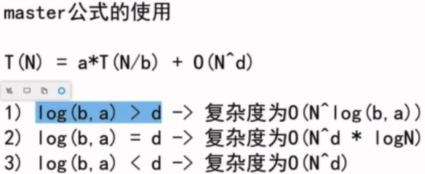

## 递归

### Master公式

master公式是一个时间复杂度的递推公式,指的是当前规模(N)的任务拆分成若干个(a)**相同规模**(N/b)的子任务,每次任务还需进行一个复杂度为O(N^d^)的操作.



### 递归问题

#### 汉诺塔问题

Q：三个杆,有n个盘(小压大的顺序),要求将这n个盘从最左杆移动到最右杆(保持相同的顺序),要求移动过程中所有杆上的盘都只能小压大,不能大压小

```java
// 汉诺塔的递归非常美 -> 打印移动方法,返回总的移动步数
public static int movePlates(int N, String from, String help, String to) {

    if(N == 1) {
        System.out.println(from + "->" + to);
        return 1;
    }

    int step1 = movePlates(N-1, from, to, help);
    System.out.println(from + "->" + to);
    int step2 = movePlates(N-1, help, from, to);

    return step1 + 1 + step2;
}

public static void main(String[] args) {

    int step = movePlates(10, "A", "B", "C");
    System.out.println("steps: " + step);

}
```

#### 打印字符串的所有子序列

Q：子序列不是子串，不用保证原字符串中连续的字符在子序列中还保持连续

A：2^n^的递归实现。假设字符串长度为N,则相当于有N个空位,每个位置都有两个选项,即打印或者不打印该位置的字符,所以知道它的子字符串有2^N种,因为每一种都需要打印,所以这个时间复杂度是优化不了的.

```java
private static void print(String str, int index, String res) {

    if(index == str.length()) {
        if(!res.equals("")) {
            System.out.println(res);
        }
        return;
    }

    print(str, index + 1, res);
    print(str, index + 1, res + str.charAt(index));
}
```

#### 打印字符串的所有全排列

Q：子序列可以不包含字符串中的某些字符，而全排列则是包含所有的字符，只是顺序不一样

A：有N!种可能排列

```java
// n!的递归写法
public static int print(String resource, int index, String rest, String last) {

    if(resource == null || resource.length() == 0) {
        return 0;
    }

    int res = 0;
    if(index == resource.length()) {
        System.out.println(last);
        res++;
        return res;
    }

    int l_rest = rest.length();
    String rest_temp;
    String last_temp;
    for(int i = 0; i < l_rest; i++) {
        rest_temp = rest.substring(0,i) + rest.substring(i+1,l_rest);
        last_temp = last + String.valueOf(rest.charAt(i));
        res += print(resource, index + 1, rest_temp, last_temp);
    }

    return res;

}
```

#### 括号匹配

Q:给一个字符串,其中可以包含字符'()[]{}',试判断这个字符串是否满足符号匹配

```
用栈的结构,判断的时候用switch() case,注意每个case都要break,不然一旦满足就会执行后面所有情况
逻辑:遇到左括号压栈,遇到右括号,栈顶如果不匹配直接return false;栈顶匹配就弹出栈顶,继续遍历
遍历完后,如果栈是空的,表明匹配
```

#### 括号组合

Q:给一个整数n,代表有n对'()',问给出所有符合括号匹配的组合字符串

```java
// A1:递归思想,将'('看作+1,')'看作-1. 递归深度2*n,base-case:index到底&&sum==0就是符合要求的字符串
// 优点:只用了一个char数组,不用字符串拼接,避免了频繁创建字符串对象
class Solution {
    public List<String> generateParenthesis(int n) {
        List<String> list = new ArrayList<>();
        if( n == 0){
            return list;
        }
        
        int index = 0;
        int sum = 0;
        char[] res = new char[2*n];
        
        process(0, 0, res, list);
        
        return list;
    }
    
    public void process(int index, int sum, char[] res, List<String> list){
        if(index == res.length){
            if(sum == 0){
                list.add(new String(res));
            }
            return;
        }
        
        if(sum == 0){
            res[index] = '(';
            process(index+1, sum+1, res, list);
        } else { // 只可能是大于0的情况
            res[index] = '(';
            process(index+1, sum+1, res, list);
            res[index] = ')';
            process(index+1, sum-1, res, list);
        }
    }
}
```

```java
// A2:递归. left和right记录左括号和右括号剩余的数量. 如果左边剩余的多余右边,return false
// 优点:看起来很简洁, 缺点:拼接字符串产生很多多余内存
public class Solution{
    public static List<String> getList(int n){
        List<String> list = new ArrayList<>();
        if(n == 0){
            return null;
        }
        
        process(n, n, "", list);
        
        return list
    }
    
    public static void process(int left, int right, String str, List<String> list){
        if(left < 0 || right < 0 || left > right){
            return;
        }
        if(left == 0 && right == 0){
            list.add(str);
            return;
        }
        
        process(left-1, right, str+'(', list);
        process(left, right-1, str+')', list);
    }
}
```

#### Combination Sum

Q：给一个数组arr，数组内无重复的数字，再给一个整数num，求所有能构成num的数字组合，数组中同一个数可以重复使用。

E：arr=[2,3,6,7]，num=7。输出为[[7], [2,2,3]]

A：首先将数组排序，然后从最大的数开始遍历，大于num的数可以直接跳过。每个数再进行递归遍历，遍历次数是0~num/arr[index]次，即这个数在组合中最少出现0次，最多出现num/arr[index]次。如下，可以用num进行减的形式，就节约了一个变量sum。

````java
class Solution {
    public List<List<Integer>> combinationSum(int[] candidates, int target) {
        if(candidates==null || candidates.length==0){
            return null;
        }
        
        List<List<Integer>> list = new ArrayList<>();
        Arrays.sort(candidates);     
        List<Integer> son = new ArrayList<>();
        process(candidates, target, candidates.length-1, 0, list, son);
        return list;
    }
    
    private static void process(int[] arr, int num, int index, int sum, List<List<Integer>> list, List<Integer> son){
        if(sum == num){
            List<Integer> temp = new ArrayList<Integer>(son);
            // Collections.sort(temp);
            list.add(temp);
            return;
        } else if(sum>num || index==-1){
            return;
        }
        
        int times = num / arr[index];
        for(int i=0; i<=times; i++){
            int j = i;
            while(j-- > 0){
                son.add(arr[index]);                
            }
            process(arr, num, index-1, sum+i*arr[index], list, son);
            j = i;
            while(j-- > 0){
                son.remove(son.size()-1);                
            }
        }
    }
}
````

